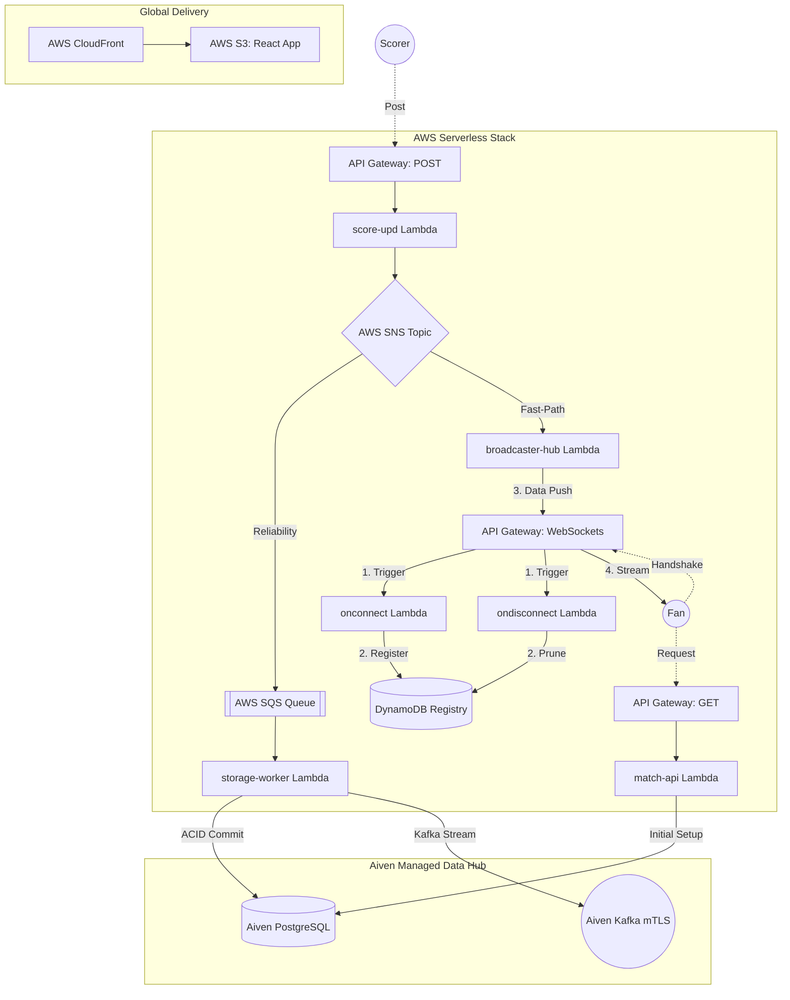

# 🏏 CricScore: Real-Time Cricket Match Engine
### 🏏 High-Performance, Event-Driven Cricket Engine

[](https://aiven.io)
[](https://aws.amazon.com)
[](https://aws.amazon.com/sns/)
[](./docs/changelog.md)

CricScore is a highly performant, serverless cricket engine designed for sub-100ms match updates. It leverages a decoupled, hybrid-cloud event-driven stack (AWS SNS/SQS + Aiven Kafka) for global real-time broadcasting.

🚀 **Live Production:** **https://cricscore.venkateshsingamsetty.site**

---

## 🔄 System Architecture (v2.0.0 Fan-Out)


---

## 🗄️ Aiven Managed Services & AWS Fan-Out
CricScore utilizes the **Aiven Lifecycle Management** platform combined with **AWS SNS/SQS** to provide professional-grade, high-availability data integrity:

- **AWS SNS & SQS (v2.0.0)**: The **Fast-Path Event Hub** and **Reliability Buffer** fan-out pattern ensures sub-100ms ultra-low-latency UI broadcasts while synchronously protecting Aiven from traffic spikes.
- **AWS DynamoDB**: The **Connection Registry** tracking all active spectator WebSocket tunnels in real-time.
- **Aiven for PostgreSQL**: The **System of Record** for all historical match data, innings, and ball-by-ball archives.
- **Aiven for Apache Kafka**: The **Enterprise Event Bus** providing persistent, replayable data streams for sub-second global propagation.
- **Mutual TLS (mTLS)**: Hardened, certificate-based encryption for all Kafka traffic using serverless certificate injection.

📖 **[Detailed Aiven & Infrastructure Breakdown](./docs/aiven.md)**

---


## ⚡ Getting Started
- **Local Developer Preview**: Run the frontend locally (Requires **Node.js 18.x+**).
    - **Step 1:** Install frontend dependencies:
      ```bash
      npm install --prefix frontend
      ```
      *(Alternatively, run `npm install` inside the `frontend/` directory)*
    - **Step 2:** Copy the environment config:
      ```bash
      cp frontend/.env.example frontend/.env
      ```
    - **Step 3:** Start the local development server:
      ```bash
      npm run dev
      ```
- **Full Deployment Guide:** **🚀 [How to Clone and Deploy Your Own Infrastructure](./docs/deployment.md)**

---

## 👥 Platform Access Roles
- **Viewer 🌍**: Single-click access to global match discovery and real-time spectator hub (Public/No Auth).
- **Scorer 🎮**: Secure multi-tenant isolation for official ball-by-ball match scoring (Secure/Email Auth).
- **Admin ⚡**: Enterprise-grade persistence governance and match record purging (Protected/Admin PIN).

---

## 🏗️ System Architecture & Technical Portal
CricScore implements a high-performance **Event-Driven Architecture (EDA)** using 100% serverless and managed services.

### 📖 Technical Guides & Documentation
- **[Full Deployment & Infrastructure](./docs/deployment.md)**: Local preview, bootstrap foundations, and AWS/Aiven Setup.
- **[Aiven Managed Services](./docs/aiven.md)**: PostgreSQL & Kafka mTLS configuration.
- **[Detailed Architecture](./docs/architecture.md)**: System design, sequence flows, and EDA logic.
- **[API Guide](./docs/api.md)**: REST & WebSocket contract specifications.
- **[Cost & Performance](./docs/cost_management.md)**: Aiven & AWS Free-tier monitoring strategy.
- **[Full Project Log](./docs/changelog.md)**: Release records and development timeline.
- **[Troubleshooting](./docs/troubleshooting.md)**: Setup fixes and identity verification help.

---
© 2026 CricScore Engine. Designed for the Serverless Generation.
