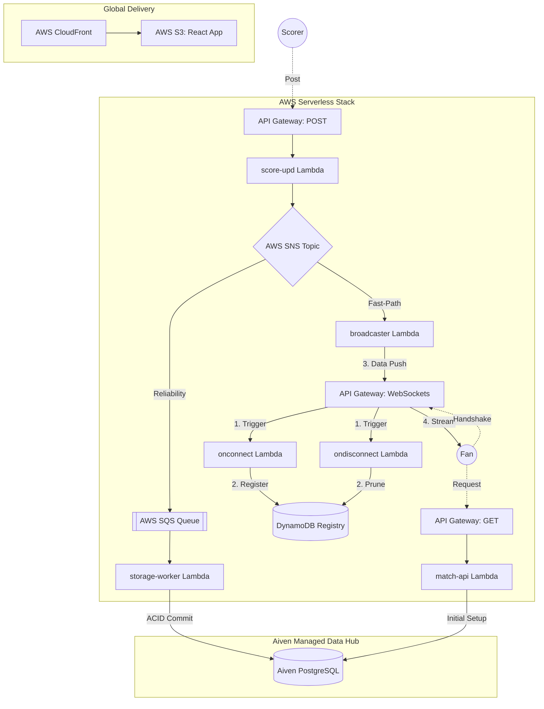

# 🏏 CricScore: Real-Time Cricket Match Engine

🚀 **Live Production:** **https://cricscore.venkateshsingamsetty.site**
👉 **Deployment Details:** **[Full Deployment Guide](./docs/deployment.md)**

## 🎯 Project Vision

CricScore demonstrates how a production-style real-time sports platform
can be designed using modern cloud-native, DevOps, security, and
reliability engineering practices while maintaining a cost-optimized
architecture.

The platform simulates a real-world cricket scoring ecosystem:

- Global viewers consuming live match updates
- Authorized scorers submitting ball-by-ball events
- Event-driven processing pipelines
- Infrastructure provisioning using Infrastructure as Code
- Automated security validation
- Observability and operational monitoring
- Fully automated CI/CD workflows

The goal is not only to build a cricket application, but to demonstrate
enterprise engineering practices applied to a real-world workload.

---

## 🔄 System Architecture (Fan-Out)



---

# 🛠️ Technology Stack

## Frontend

| Technology   | Purpose                                       |
| ------------ | --------------------------------------------- |
| React        | User interface framework                      |
| TypeScript   | Type-safe application development             |
| Vite         | Frontend build tooling and development server |
| HTML5 / CSS3 | UI structure and styling                      |

---

## Backend & APIs

| Technology         | Purpose                              |
| ------------------ | ------------------------------------ |
| AWS Lambda         | Serverless backend execution         |
| Amazon API Gateway | REST API and WebSocket communication |
| Amazon SNS         | Event fan-out messaging              |
| Amazon SQS         | Reliable asynchronous processing     |
| Amazon SES         | Email notifications                  |

---

## Database

| Technology       | Purpose                                          |
| ---------------- | ------------------------------------------------ |
| Aiven PostgreSQL | Managed relational database                      |
| PostgreSQL       | Match, player, score, and tournament persistence |

---

## Infrastructure & Cloud

| Technology | Purpose                        |
| ---------- | ------------------------------ |
| Terraform  | Infrastructure as Code         |
| AWS Cloud  | Cloud infrastructure platform  |
| CloudFront | Global content delivery        |
| S3         | Static website hosting         |
| Route53    | DNS management                 |
| ACM        | SSL/TLS certificate management |

---

## DevSecOps & Security

| Tool            | Purpose                               |
| --------------- | ------------------------------------- |
| GitHub Actions  | CI/CD automation                      |
| Checkov         | Terraform security scanning           |
| GitLeaks        | Secret detection                      |
| Trivy           | Dependency and vulnerability scanning |
| OWASP ZAP       | Dynamic application security testing  |
| Dependabot      | Dependency vulnerability monitoring   |
| SBOM Generation | Software supply chain visibility      |

---

## Testing

| Tool                  | Purpose                       |
| --------------------- | ----------------------------- |
| Vitest                | Unit testing framework        |
| React Testing Library | Frontend component testing    |
| Playwright            | End-to-end browser automation |

---

# 🏢 Enterprise-Grade Standards & Technical Documentation

CricScore is engineered to demonstrate production-readiness across 6 core pillars of enterprise architecture. All technical decisions, tradeoffs, and deep-dives are documented in their respective guides below.

### 1. 🛡️ DevSecOps & Security

**Zero-Trust Identity & Automated Scanning**
We enforce a strict security posture using AWS IAM least-privilege policies, API Gateway WAF protections, and multi-tenant data isolation. The CI/CD pipeline acts as an automated gatekeeper, blocking PRs that fail GitLeaks, Trivy, Checkov, CodeQL, or OWASP ZAP.

- 📖 **[Security Posture & Tradeoffs](./docs/security_posture.md)**: Defense in depth strategy, multi-tenant isolation, and encryption layers.
- 📖 **[Branch Protection & Governance](./docs/branch_protection.md)**: Required status checks, CI/CD pipeline blockers, and administrator enforcement.

### 2. 🔭 Observability & Logging

**Total System Visibility**
All Lambda executions stream structured JSON logs to CloudWatch. We employ AWS X-Ray for distributed tracing across API Gateway, SNS, SQS, and Lambda, allowing us to pinpoint latency bottlenecks. Critical failure metrics trigger automated SNS alerts.

- 📖 **[Observability Suite](./docs/observability.md)**: CloudWatch Dashboards, X-Ray Tracing, Sentry Crash Reporting, and Uptime monitors.
- 📖 **[Cost & Performance](./docs/cost_management.md)**: Free-tier monitoring strategy and architecture scale limits.

### 3. ✅ Rigorous Testing

**Multi-Layer Test Pyramid**
Code is validated at every tier: Unit tests evaluate isolated Lambda functions, API tests validate REST contracts, and Playwright executes E2E User Journey tests against the staging environment.

- 📖 **[Testing Guide](./docs/testing.md)**: Vitest and Playwright test commands, Availability Testing (Chaos/DR), and E2E structures.
- 📖 **[Toolchain & Security Stack](./docs/tools.md)**: Master list of all CI/CD, IaC, and AppSec tools used in the pipeline.

### 4. ♾️ High Availability & Reliability

**Fault-Tolerant Event-Driven Design**
The architecture decouples the frontend from backend persistence using SNS fan-out and SQS queuing. If the database experiences downtime, SQS retains messages and retries automatically via dead-letter queues (DLQs).

- 📖 **[Detailed Architecture](./docs/architecture.md)**: System design, sequence flows, and EDA logic.
- 📖 **[API Guide](./docs/api.md)**: REST & WebSocket contract specifications.
- 📖 **[Aiven Managed Services](./docs/aiven.md)**: PostgreSQL database configuration and keep-alive strategy.
- 📖 **[Node.js Guide](./docs/nodejs_guide.md)**: ESM vs CommonJS standardizations.

### 5. 🏗️ Infrastructure as Code (IaC)

**Immutable & Reproducible Environments**
100% of the AWS infrastructure is codified in Terraform. Changes are planned, validated for security drift by Checkov, and applied automatically via GitHub Actions, eliminating manual click-ops errors.

- 📖 **[Full Deployment & Infrastructure](./docs/deployment.md)**: Local preview, bootstrap foundations, and AWS/Aiven Setup.
- 📖 **[Troubleshooting](./docs/troubleshooting.md)**: Setup fixes and identity verification help.

### 6. 🚀 CI/CD Automation

**Aggressive Pipeline Governance**
Merge requests to `main` require 8 passing status checks. The deployment pipeline automatically builds the Vite frontend, synchronizes S3 buckets, invalidates CloudFront caches, packages Lambdas, and executes semantic version releases entirely hands-free.

- 📖 **[GitHub Actions Architecture](./docs/github_actions.md)**: CI/CD Directory structure constraints and pipeline organization.
- 📖 **[Automated Releases](./docs/release_process.md)**: Semantic release and Conventional Commit specifications.
- 📖 **[Full Project Log](./docs/changelog.md)**: Release records and development timeline.

---

# 🤖 AI Assisted Development

AI tools were used as productivity accelerators for:

- Code suggestions
- Documentation generation
- Test creation assistance
- Troubleshooting
- Architecture brainstorming

Engineering decisions were reviewed manually including:

- Cloud architecture
- Security controls
- Infrastructure design
- Deployment strategy
- Reliability patterns

```

```
