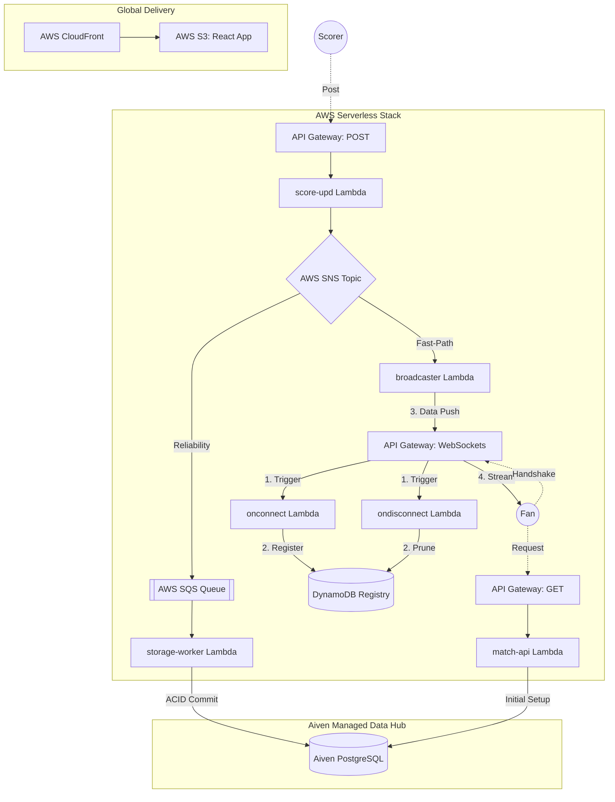

# 🏏 CricScore: Real-Time Cricket Match Engine
### 🏏 High-Performance, Event-Driven Cricket Engine

[](https://aws.amazon.com)
[](https://aws.amazon.com/sns/)
[](https://aiven.io)
[](./docs/changelog.md)

CricScore is a highly performant, serverless cricket engine designed for sub-100ms match updates. It leverages a decoupled, serverless event-driven stack (AWS SNS/SQS) for global real-time broadcasting.

🚀 **Live Production:** **https://cricscore.venkateshsingamsetty.site**

---

## 🔄 System Architecture (Fan-Out)


---

## 👥 Platform Access Roles
- **Viewer 🌍**: Single-click access to global match discovery and real-time spectator hub (Public/No Auth).
- **Scorer 🎮**: Secure multi-tenant isolation for official ball-by-ball match scoring (Secure/Email Auth).
- **Admin ⚡**: Enterprise-grade persistence governance and match record purging (Protected/Admin PIN).

---

## ⚡ Getting Started & Local Environment

To run or deploy CricScore locally, you must create and manage two specific environment files. **Do not commit either of these files to version control.**

### 1. Frontend Development (`frontend/.env`)
Create a `frontend/.env` file to manually manage your frontend URLs during local development. 
*Note: If you run `./deploy.sh`, this file is automatically overwritten with the live Terraform URLs.*
- `VITE_API_URL`: Your REST API Gateway URL.
- `VITE_WS_URL`: Your WebSocket API Gateway URL.
- `VITE_ADMIN_PIN`: The secret PIN required to access the scorer dashboard.

**To run the frontend locally:**
```bash
nvm use        # ensure Node.js 24
npm install --prefix frontend
npm run dev --prefix frontend
```

### 2. Local Infrastructure Deployment (`.env.local`)
To deploy the full AWS infrastructure from your own machine, create a `.env.local` file at the root of the project. This acts as your master local configuration.
- `AWS_ACCESS_KEY_ID`: (Optional) IAM access key if not using `~/.aws/credentials`.
- `AWS_SECRET_ACCESS_KEY`: (Optional) IAM secret key.
- `AWS_REGION` / `AWS_DEFAULT_REGION`: AWS deployment region (e.g., `us-east-1`).
- `TF_DATABASE_URL`: Your Aiven PostgreSQL connection string.
- `TF_SES_SOURCE_EMAIL`: A verified AWS SES email address for notifications.
- `DOMAIN_NAME`: Your full app domain.
- `ZONE_DOMAIN`: Your Route53 root domain.
- `SUBDOMAIN_PREFIX`: Project namespace (e.g., `cricscore`).
- `PROJECT_NAME`: Project namespace (e.g., `cricscore`).

**To deploy the infrastructure locally:**
Ensure you have your AWS credentials configured, then run:
```bash
./deploy.sh --use-local-env
```
👉 For comprehensive instructions, see the **[Full Deployment Guide](./docs/deployment.md)**.

---

## 🔐 GitHub Actions (Production CI/CD)
To enable the automated deployment pipelines, configure the following in your GitHub repository settings (**Settings → Secrets and variables → Actions**).

**Repository Secrets (Sensitive):**
- `AWS_ACCESS_KEY_ID`: IAM user access key for Terraform provisioning (Best practice secret).
- `AWS_SECRET_ACCESS_KEY`: IAM user secret key (Highly Sensitive).
- `TF_DATABASE_URL`: Aiven PostgreSQL connection string (Highly Sensitive).
- `TF_SES_SOURCE_EMAIL`: Verified Amazon SES sender email (Best practice secret).
- `VITE_ADMIN_PIN`: The secret PIN to protect the scorer dashboard (Highly Sensitive).

**Repository Variables (Non-Sensitive):**
- `AWS_REGION` / `AWS_DEFAULT_REGION`: The AWS region for deployment (e.g., `us-east-1`).
- `DOMAIN_NAME`: Your full app domain (e.g., `cricscore.example.com`).
- `ZONE_DOMAIN`: Your Route53 root domain (e.g., `example.com`).
- `SUBDOMAIN_PREFIX`: Project namespace (e.g., `cricscore`).
- `PROJECT_NAME`: Project namespace (e.g., `cricscore`).
- `API_GATEWAY_ID`: The REST API Gateway ID (generated by Terraform).
- `WS_API_GATEWAY_ID`: The WebSocket API Gateway ID (generated by Terraform).
- `S3_BUCKET`: The name of your S3 bucket (e.g., `cricscore-app-12345`).
- `CLOUDFRONT_DISTRIBUTION_ID`: The CloudFront ID for cache invalidations (e.g., `EIXAGLEK1KNCP`).

If these variables are not set, the workflow will emit a warning during the `Validate repository Variables` step. For sensitive values keep using repository Secrets.

---

## 🛡️ Hardened CI/CD & Security Stack
CricScore implements a robust, enterprise-grade CI/CD and security auditing lifecycle powered by GitHub Actions:

* **Dependabot (Automated updates)**: Performs daily updates for npm packages and Terraform providers, raising automated pull requests for security updates.
* **Branch Isolation & Safety**: Deployment workflows to AWS only trigger automatically on pushes/merges to the `main` branch, ensuring development branches never overwrite the live production environment.
* **Concurrency Optimization**: Cancel-in-progress concurrency groups automatically prune older, redundant pipeline runs, saving run minutes.
* **CodeQL (SAST scanning)**: Runs native GitHub CodeQL static analysis to check the JavaScript/TypeScript code for coding logic bugs and vulnerabilities.
* **Trivy (Dependency & filesystem scanning)**: Scans package locks and directories for `HIGH` and `CRITICAL` severity vulnerability alerts during frontend validation and backend lambda packing steps.
* **Checkov (Infrastructure-as-Code auditing)**: Performs static security audits on the Terraform configuration directory to catch AWS misconfigurations before provisioning.

---

## 📖 Technical Documentation
- **[Full Deployment & Infrastructure](./docs/deployment.md)**: Local preview, bootstrap foundations, and AWS/Aiven Setup.
- **[Aiven Managed Services](./docs/aiven.md)**: PostgreSQL configuration.
- **[Detailed Architecture](./docs/architecture.md)**: System design, sequence flows, and EDA logic.
- **[API Guide](./docs/api.md)**: REST & WebSocket contract specifications.
- **[Cost & Performance](./docs/cost_management.md)**: Aiven & AWS Free-tier monitoring strategy.
- **[Full Project Log](./docs/changelog.md)**: Release records and development timeline.
- **[Troubleshooting](./docs/troubleshooting.md)**: Setup fixes and identity verification help.
