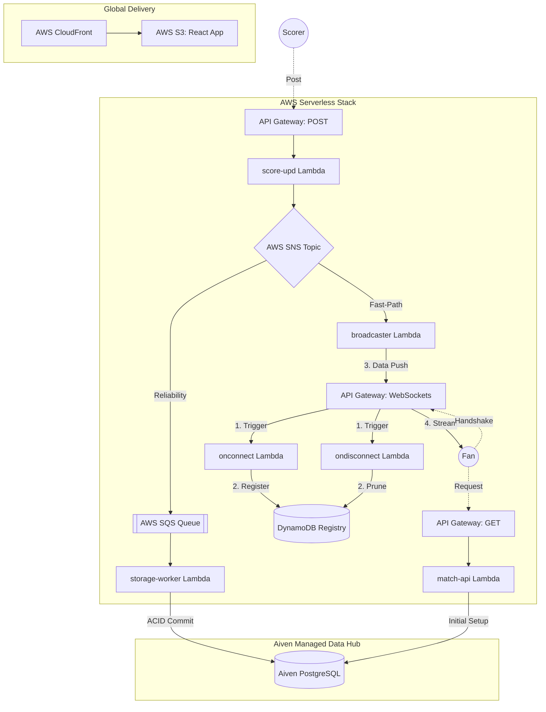

# 🏏 CricScore: Real-Time Cricket Match Engine

## 🎯 Project Vision

CricScore demonstrates how a production-style real-time sports platform
can be designed using modern cloud-native, DevOps, security, and
reliability engineering practices while maintaining a cost-optimized
architecture.

The platform simulates a real-world cricket scoring ecosystem:

- Global viewers consuming live match updates
- Authorized scorers submitting ball-by-ball events
- Event-driven processing pipelines
- Infrastructure provisioning using Infrastructure as Code
- Automated security validation
- Observability and operational monitoring
- Fully automated CI/CD workflows

The goal is not only to build a cricket application, but to demonstrate
enterprise engineering practices applied to a real-world workload.

---

## 🔄 System Architecture (Fan-Out)



------------+-------------+
| |
v v
Lambda Live Updates
|
v
SNS Topic
|
v
SQS Queue
|
v
Lambda Processor
|
v
Aiven PostgreSQL Database

CI/CD Pipeline

Developer
|
v
GitHub
|
v
GitHub Actions
|
+---- Tests
|
+---- Security Scans
|
+---- Terraform Validation
|
+---- Deployment
|
v
AWS Production Environment

```

---

# 🛠️ Technology Stack

## Frontend

| Technology   | Purpose                                       |
| ------------ | --------------------------------------------- |
| React        | User interface framework                      |
| TypeScript   | Type-safe application development             |
| Vite         | Frontend build tooling and development server |
| HTML5 / CSS3 | UI structure and styling                      |

---

## Backend & APIs

| Technology         | Purpose                              |
| ------------------ | ------------------------------------ |
| AWS Lambda         | Serverless backend execution         |
| Amazon API Gateway | REST API and WebSocket communication |
| Amazon SNS         | Event fan-out messaging              |
| Amazon SQS         | Reliable asynchronous processing     |
| Amazon SES         | Email notifications                  |

---

## Database

| Technology       | Purpose                                          |
| ---------------- | ------------------------------------------------ |
| Aiven PostgreSQL | Managed relational database                      |
| PostgreSQL       | Match, player, score, and tournament persistence |

---

## Infrastructure & Cloud

| Technology | Purpose                        |
| ---------- | ------------------------------ |
| Terraform  | Infrastructure as Code         |
| AWS Cloud  | Cloud infrastructure platform  |
| CloudFront | Global content delivery        |
| S3         | Static website hosting         |
| Route53    | DNS management                 |
| ACM        | SSL/TLS certificate management |

---

## DevSecOps & Security

| Tool            | Purpose                               |
| --------------- | ------------------------------------- |
| GitHub Actions  | CI/CD automation                      |
| Checkov         | Terraform security scanning           |
| GitLeaks        | Secret detection                      |
| Trivy           | Dependency and vulnerability scanning |
| OWASP ZAP       | Dynamic application security testing  |
| Dependabot      | Dependency vulnerability monitoring   |
| SBOM Generation | Software supply chain visibility      |

---

## Testing

| Tool                  | Purpose                       |
| --------------------- | ----------------------------- |
| Vitest                | Unit testing framework        |
| React Testing Library | Frontend component testing    |
| Playwright            | End-to-end browser automation |

---

# 🏢 Enterprise-Inspired Engineering Practices

## DevOps & CI/CD

Implemented:

- Git-based development workflow
- Automated CI/CD pipelines
- Automated build and deployment processes
- Infrastructure provisioning using Terraform
- Environment-based deployment strategy
- Deployment automation and release workflows

## DevSecOps

Implemented:

- Terraform security scanning
- Secret detection
- Dependency scanning
- DAST testing
- SBOM generation

## Reliability Engineering

Implemented:

- SNS/SQS event decoupling
- Dead Letter Queue handling
- CloudWatch monitoring
- Automated alerts

## Software Engineering

Implemented:

- Unit testing
- End-to-end testing
- Semantic releases
- Automated deployments

---

# 🤖 AI Assisted Development

AI tools were used as productivity accelerators for:

- Code suggestions
- Documentation generation
- Test creation assistance
- Troubleshooting
- Architecture brainstorming

Engineering decisions were reviewed manually including:

- Cloud architecture
- Security controls
- Infrastructure design
- Deployment strategy
- Reliability patterns

---

# 🧠 Key Engineering Decisions

## Event Driven Architecture

Decision: Use AWS SNS and SQS for asynchronous processing.

Reason: - Cricket traffic is burst based - Match popularity creates
unpredictable spikes - Viewer traffic should not directly impact scoring
operations

Benefits: - Loose coupling - Scalability - Fault isolation - Retry
capability

Trade-off: Additional messaging components increase complexity.

Future: Kafka / Amazon MSK for large-scale streaming workloads.

---

## Serverless Compute

Decision: Use AWS Lambda instead of always-running containers.

Benefits: - Pay-per-use execution - Automatic scaling - Reduced
operational overhead

Trade-off: - Cold starts - Execution limits

Future: Move heavy workloads to ECS/EKS.

---

## PostgreSQL Database

Decision: Use managed PostgreSQL through Aiven.

Reason: Cricket data is relational:

- Matches
- Teams
- Players
- Innings
- Overs
- Deliveries
- Scorecards

Benefits: - Strong consistency - Transactions - Reporting capability

---

## Infrastructure as Code

Decision: Manage cloud infrastructure using Terraform.

Benefits: - Repeatable deployments - Version controlled infrastructure -
Reduced manual errors - Environment consistency

---

# 📈 Resume Highlights

- Architected a real-time cricket scoring platform using AWS
  serverless and event-driven architecture.
- Designed CI/CD automation with security gates, infrastructure
  validation, and automated deployments.
- Implemented DevSecOps practices using Terraform, Checkov, GitLeaks,
  Trivy, and OWASP ZAP.
- Built scalable asynchronous processing using SNS/SQS messaging
  patterns.
- Applied enterprise cloud engineering practices to a production-style
  application.


---

## 📖 Technical Documentation

### 1. 🛡️ Security & Identity

- **[Security Posture](./docs/security_posture.md)**: Defense in depth strategy, multi-tenant isolation, and encryption layers.
- **[Branch Protection & Governance](./docs/branch_protection.md)**: Required status checks, CI/CD pipeline blockers, and administrator enforcement.

### 2. 🔭 Observability & Monitoring

- **[Observability Suite](./docs/observability.md)**: CloudWatch Dashboards, X-Ray Tracing, Sentry Crash Reporting, and Uptime monitors.

### 3. 🏗️ Architecture & Engineering

- **[Detailed Architecture](./docs/architecture.md)**: System design, sequence flows, and EDA logic.
- **[API Guide](./docs/api.md)**: REST & WebSocket contract specifications.
- **[Aiven Managed Services](./docs/aiven.md)**: PostgreSQL database configuration and keep-alive strategy.
- **[Node.js Guide](./docs/nodejs_guide.md)**: ESM vs CommonJS standardizations.

### 4. 💰 Cost Optimization

- **[Cost & Performance](./docs/cost_management.md)**: Free-tier monitoring strategy and architecture scale limits.

### 5. ✅ Quality & Validation

- **[Testing Guide](./docs/testing.md)**: Vitest and Playwright test commands and E2E structures.
- **[Toolchain & Security Stack](./docs/tools.md)**: Master list of all CI/CD, IaC, and AppSec tools used in the pipeline.

### 6. ⚙️ Operations & DevOps

- **[GitHub Actions Architecture](./docs/github_actions.md)**: CI/CD Directory structure constraints and pipeline organization.
- **[Full Deployment & Infrastructure](./docs/deployment.md)**: Local preview, bootstrap foundations, and AWS/Aiven Setup.
- **[Automated Releases](./docs/release_process.md)**: Semantic release and Conventional Commit specifications.
- **[Full Project Log](./docs/changelog.md)**: Release records and development timeline.
- **[Troubleshooting](./docs/troubleshooting.md)**: Setup fixes and identity verification help.
```
