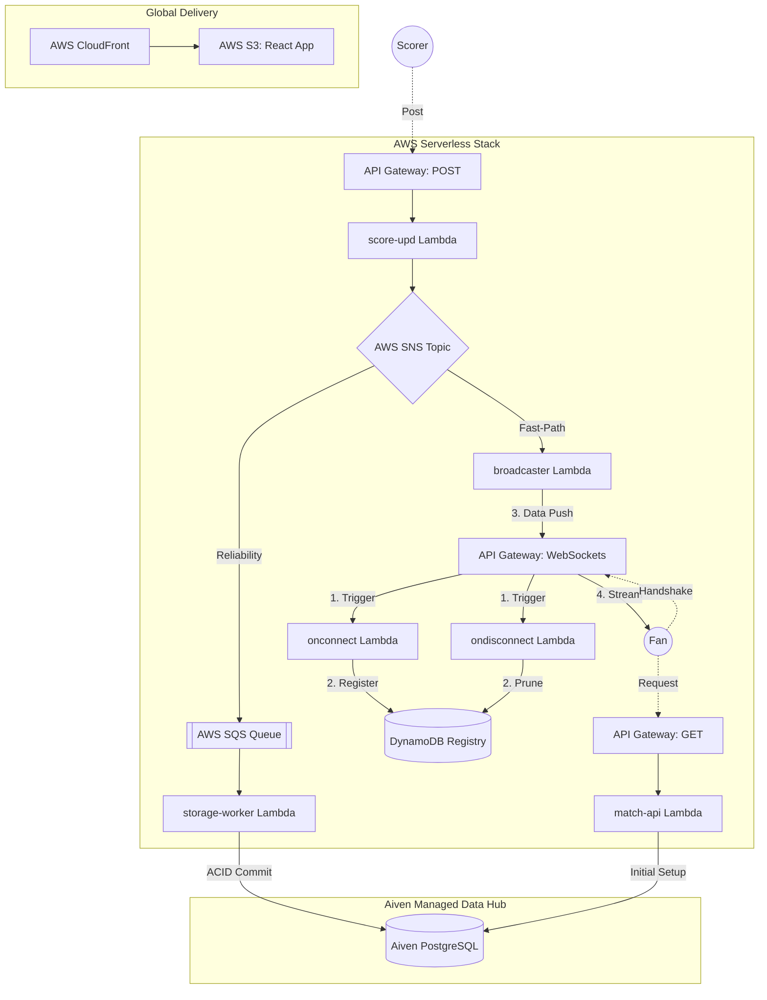

# 🏏 CricScore: Real-Time Cricket Match Engine

### 🏏 High-Performance, Event-Driven Cricket Engine

[](https://aws.amazon.com)
[](https://aws.amazon.com/sns/)
[](https://aiven.io)
[](./docs/changelog.md)

CricScore is a highly performant, serverless cricket engine designed for sub-100ms match updates. It leverages a decoupled, serverless event-driven stack (AWS SNS/SQS) for global real-time broadcasting.

🚀 **Live Production:** **https://cricscore.venkateshsingamsetty.site**

---

## 🔄 System Architecture (Fan-Out)



---

## 👥 Platform Access Roles

- **Viewer 🌍**: Single-click access to global match discovery and real-time spectator hub (Public/No Auth).
- **Scorer 🎮**: Secure multi-tenant isolation for official ball-by-ball match scoring (Secure/Email Auth).
- **Admin ⚡**: Enterprise-grade persistence governance and match record purging (Protected/Admin PIN).

---

## ⚡ Local Environment & Testing

### 1. Prerequisite Installation

To run or deploy CricScore locally, you need Node.js, Terraform, AWS CLI, Checkov, and GitLeaks.
💡 **Pro-Tip:** You can automatically install all required tools on macOS or Linux by simply running:

```bash
./scripts/setup.sh
```

### 2. Configuration & Deployment

Create a `.env.local` file at the root of the project to manage your local infrastructure deployment. _(These variables map exactly to the GitHub Actions requirements listed in the next section)._

- `AWS_ACCESS_KEY_ID`, `AWS_SECRET_ACCESS_KEY`, `AWS_REGION`, `AWS_DEFAULT_REGION`
- `TF_DATABASE_URL`, `TF_SES_SOURCE_EMAIL`
- `DOMAIN_NAME`, `ZONE_DOMAIN`, `SUBDOMAIN_PREFIX`, `PROJECT_NAME`

To run the full stack locally, use the deployment script (this will automatically provision AWS and generate your required `frontend/.env` URLs):

```bash
./deploy.sh --use-local-env
```

👉 For comprehensive instructions, see the **[Full Deployment Guide](./docs/deployment.md)**.

### 3. Frontend Local Development

We provide a convenient root-level `package.json` that acts as a proxy to the `frontend/` directory so you don't have to change folders. Here is the local development lifecycle:

- **`npm run dev`**: The Sandbox. Use this 99% of the time. Starts a hyper-fast local server with Hot Module Replacement (HMR). Changes instantly appear when you save.
- **`npm run build`**: The Factory. Translates TypeScript, aggressively minifies CSS/JS, and squishes the app into a highly optimized `frontend/dist/` folder for AWS production.
- **`npm run preview`**: The Rehearsal. Boots a local server pointing directly at the optimized `dist/` folder. Use this specifically to test exact production load speeds or debug minification issues before opening a PR.

### 4. Pre-Commit Validation

To prevent failing the strict GitHub Actions pipelines, validate your code locally before pushing:

```bash
# Frontend Validation
cd frontend
npm run lint    # Catches unused variables and TS errors
npm run test    # Executes component unit tests
npm run build   # Validates the production bundle compiles
cd ..

# Infrastructure Validation
cd terraform
terraform fmt -check -recursive  # Validates HCL formatting
terraform validate               # Validates infrastructure logic
checkov -d .                     # (Optional) Run local IaC security scans
cd ..

# Secrets Detection
gitleaks detect --source . -v    # Detects accidental AWS keys or passwords
```

**⚠️ Optional Manual Dependency Scanning (Trivy)**
Trivy is not configured as an automatic pre-commit hook because downloading its massive vulnerability database locally on every commit severely degrades developer speed. It is strictly executed in the cloud pipelines.

If you are specifically debugging a dependency issue, you can scan locally:

```bash
# Requires: brew install trivy
trivy fs ./frontend --scanners vuln --severity HIGH,CRITICAL
trivy fs ./backend/lambdas --scanners vuln --severity HIGH,CRITICAL
```

---

## 🔐 GitHub Actions (Production CI/CD)

To enable the automated deployment pipelines, configure the following in your GitHub repository settings (**Settings → Secrets and variables → Actions**).

**Repository Secrets (Sensitive):**

- `AWS_ACCESS_KEY_ID` & `AWS_SECRET_ACCESS_KEY`: IAM credentials for provisioning.
- `TF_DATABASE_URL`: Aiven PostgreSQL connection string.
- `TF_SES_SOURCE_EMAIL`: Verified Amazon SES sender email.
- `VITE_ADMIN_PIN`: The secret PIN to protect the scorer dashboard.

**Repository Variables (Non-Sensitive):**

- `AWS_REGION` / `AWS_DEFAULT_REGION`: Deployment region (e.g., `us-east-1`). Both variables are required by Terraform/AWS CLI across workflows.
- `DOMAIN_NAME`, `ZONE_DOMAIN`, `SUBDOMAIN_PREFIX`, `PROJECT_NAME`: Infrastructure namespacing.
- `API_GATEWAY_ID`, `WS_API_GATEWAY_ID`, `S3_BUCKET`, `CLOUDFRONT_DISTRIBUTION_ID`: Cloud resource IDs/endpoints.

If these variables are not set, the workflow will emit a warning during the `Validate repository Variables` step.

---

## 🛡️ Hardened CI/CD & Security Stack

CricScore implements a robust, enterprise-grade CI/CD and security auditing lifecycle powered by GitHub Actions:

- **Branch Isolation & Safety**: Deployment workflows to AWS only trigger automatically on pushes/merges to the `main` branch, ensuring development branches never overwrite the live production environment.
- **Concurrency Optimization**: Cancel-in-progress concurrency groups automatically prune older, redundant pipeline runs, saving run minutes.
- **GitLeaks (Secrets Detection)**: Proactively scans the entire commit history to block accidentally pushed API keys, tokens, and passwords from merging.
- **CodeQL (SAST scanning)**: Runs native GitHub CodeQL static analysis to check the JavaScript/TypeScript code for coding logic bugs and vulnerabilities.
- **Trivy (Dependency & filesystem scanning)**: Scans package locks and directories for `HIGH` and `CRITICAL` severity vulnerability alerts, explicitly blocking the deployment if unfixed vulnerable dependencies are found.
- **Checkov (Infrastructure-as-Code auditing)**: Performs strict static security audits on the Terraform configuration directory, explicitly blocking AWS provisioning if any undocumented infrastructure misconfigurations are detected.
- **OWASP ZAP (DAST scanning)**: Automated black-box dynamic application security testing executed against the live application endpoints.
- **Syft (SBOM generation)**: Automatically generates a Software Bill of Materials (SBOM) using the standard SPDX JSON format to provide deep visibility into open-source supply chain dependencies.
- **Dependabot (Automated updates)**: Performs daily updates for npm packages and Terraform providers, raising automated pull requests for security updates.

---

## 📖 Technical Documentation

### 1. 🛡️ Security & Identity

- **[Security Posture](./docs/security_posture.md)**: Defense in depth strategy, multi-tenant isolation, and encryption layers.
- **[Branch Protection & Governance](./docs/branch_protection.md)**: Required status checks, CI/CD pipeline blockers, and administrator enforcement.

### 2. 🔭 Observability & Monitoring

- **[Observability Suite](./docs/observability.md)**: CloudWatch Dashboards, X-Ray Tracing, Sentry Crash Reporting, and Uptime monitors.

### 3. 🏗️ Architecture & Engineering

- **[Detailed Architecture](./docs/architecture.md)**: System design, sequence flows, and EDA logic.
- **[API Guide](./docs/api.md)**: REST & WebSocket contract specifications.
- **[Aiven Managed Services](./docs/aiven.md)**: PostgreSQL database configuration and keep-alive strategy.
- **[Node.js Guide](./docs/nodejs_guide.md)**: ESM vs CommonJS standardizations.

### 4. 💰 Cost Optimization

- **[Cost & Performance](./docs/cost_management.md)**: Free-tier monitoring strategy and architecture scale limits.

### 5. ✅ Quality & Validation

- **[Testing Guide](./docs/testing.md)**: Vitest and Playwright test commands and E2E structures.
- **[Toolchain & Security Stack](./docs/tools.md)**: Master list of all CI/CD, IaC, and AppSec tools used in the pipeline.

### 6. ⚙️ Operations & DevOps

- **[Full Deployment & Infrastructure](./docs/deployment.md)**: Local preview, bootstrap foundations, and AWS/Aiven Setup.
- **[Automated Releases](./docs/release_process.md)**: Semantic release and Conventional Commit specifications.
- **[Full Project Log](./docs/changelog.md)**: Release records and development timeline.
- **[Troubleshooting](./docs/troubleshooting.md)**: Setup fixes and identity verification help.
