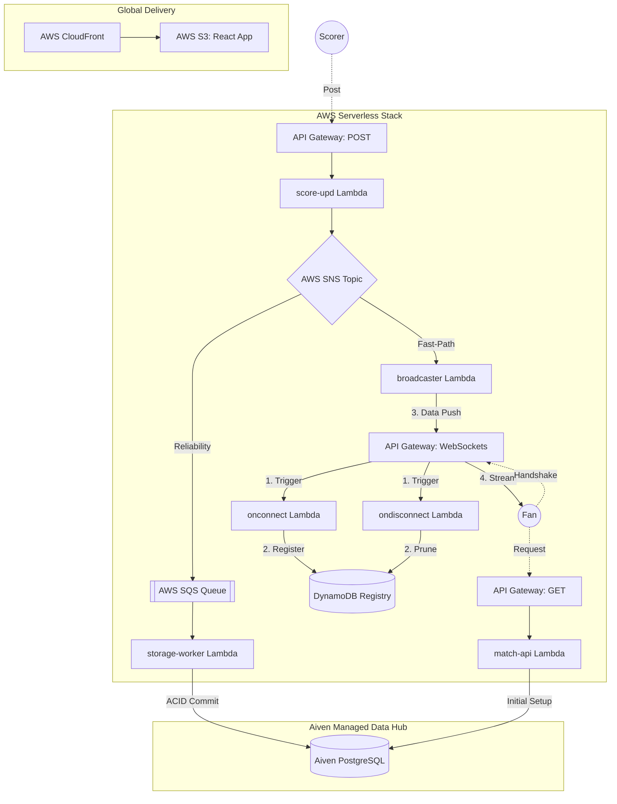

# 🏏 CricScore: Real-Time Cricket Match Engine
### 🏏 High-Performance, Event-Driven Cricket Engine

[](https://aiven.io)
[](https://aws.amazon.com)
[](https://aws.amazon.com/sns/)
[](./docs/changelog.md)

CricScore is a highly performant, serverless cricket engine designed for sub-100ms match updates. It leverages a decoupled, serverless event-driven stack (AWS SNS/SQS) for global real-time broadcasting.

🚀 **Live Production:** **https://cricscore.venkateshsingamsetty.site**

---

## 🔄 System Architecture (v2.0.0 Fan-Out)


---

## 🗄️ Aiven Managed Services & AWS Fan-Out
CricScore utilizes the **Aiven Lifecycle Management** platform combined with **AWS SNS/SQS** to provide professional-grade, high-availability data integrity:

- **AWS SNS & SQS (v2.0.0)**: The **Fast-Path Event Hub** and **Reliability Buffer** fan-out pattern ensures sub-100ms ultra-low-latency UI broadcasts while synchronously protecting Aiven from traffic spikes.
- **AWS DynamoDB**: The **Connection Registry** tracking all active spectator WebSocket tunnels in real-time.
- **Aiven for PostgreSQL**: The **System of Record** for all historical match data, innings, and ball-by-ball archives.

📖 **[Detailed Aiven & Infrastructure Breakdown](./docs/aiven.md)**

---


## ⚡ Getting Started
 **Local Developer Preview**: Run the frontend locally (Requires Node.js 24.x — pin with `.nvmrc`).
    
    - Node version (recommended): the repository is pinned to **Node 24**. Use `nvm` or your preferred version manager to match the project:
      ```bash
      # installs Node 24 (reads .nvmrc) and uses it for this shell
      nvm install
      nvm use
      ```
      CI workflows are pinned to Node 24 as well.
    - **Step 1:** Install frontend dependencies:
      ```bash
      npm install --prefix frontend
      ```
      *(Alternatively, run `npm install` inside the `frontend/` directory)*
    - **Step 2 (Per-folder):** Create `frontend/.env` containing the `VITE_` variables (do NOT commit secrets), then run the dev server:
      ```bash
      # create frontend/.env with VITE_ keys (manually)
      npm run dev --prefix frontend
      ```

    - **Local deploy (concise)**

      - Create a git-ignored `./.env.local` containing your `TF_` (sensitive) and `VITE_` (client) values.
      - Deploy (recommended):
        ```bash
        ./deploy.sh --use-local-env
        ```
        or explicitly:
        ```bash
        set -a; . ./.env.local; set +a
        ./deploy.sh
        ```
      - Frontend dev (no terraform):
        ```bash
        ./scripts/sync-env.sh
        npm run dev --prefix frontend
        ```
      - Notes: CI builds use GitHub Secrets (API_GATEWAY_ID / WS_API_GATEWAY_ID). Do not commit `.env.local`. `VITE_` variables are exposed to clients.
- **Full Deployment Guide:** **🚀 [How to Clone and Deploy Your Own Infrastructure](./docs/deployment.md)**

### Local deploy — required local files

To run a full deploy from your workstation (the same `./deploy.sh` used in CI), prepare two local files:

- `.env.local` (repository root, NOT committed)
  - Purpose: contains Terraform/backend overrides and non-AWS repo variables used by the local deploy script.
  - Required keys (example values shown; DO NOT commit real secrets):
    ```
    TF_DATABASE_URL='postgres://...@cricscore-db.example.com:17727/defaultdb?sslmode=require'
    TF_SES_SOURCE_EMAIL='you@example.com'

    # Non-sensitive repo vars (optional; can also be set as repo Variables)
    S3_BUCKET=cricscore-app-XXXXXXXXXXXX
    CLOUDFRONT_DISTRIBUTION_ID=EXXXXXXXXXXXX
    SITE_DOMAIN=your.domain.tld
    ```
  - Usage: load into your shell before running `./deploy.sh`:
    ```bash
    # Export variables from .env.local for this shell session
    set -a
    . .env.local
    set +a

    # then run the deploy script
    ./deploy.sh
    ```
  - Note: `.env.local` is ignored by `.gitignore` to avoid accidental commits.

- AWS credentials: `~/.aws/credentials` or environment
  - Purpose: the deploy uses the AWS CLI and Terraform which must authenticate to your AWS account.
  - Recommended: store access keys in `~/.aws/credentials` under a profile, or use `aws sso login` if your org uses SSO.
  - Example (~/.aws/credentials):
    ```ini
    [default]
    aws_access_key_id = AKIA...
    aws_secret_access_key = ....
    region = us-east-1
    ```
  - The repository previously included a helper script `scripts/load-env.sh` to emit export lines — that script was removed to avoid accidentally overwriting AWS credentials. Do NOT place long-lived AWS keys in repo files.

With these two local files configured, `./deploy.sh` will initialize Terraform, build the frontend, upload assets to S3, and invalidate CloudFront — matching the CI workflow behavior.

---

## 👥 Platform Access Roles
- **Viewer 🌍**: Single-click access to global match discovery and real-time spectator hub (Public/No Auth).
- **Scorer 🎮**: Secure multi-tenant isolation for official ball-by-ball match scoring (Secure/Email Auth).
- **Admin ⚡**: Enterprise-grade persistence governance and match record purging (Protected/Admin PIN).

---

## 🏗️ System Architecture & Technical Portal
CricScore implements a high-performance **Event-Driven Architecture (EDA)** using 100% serverless and managed services.

### 📖 Technical Guides & Documentation
- **[Full Deployment & Infrastructure](./docs/deployment.md)**: Local preview, bootstrap foundations, and AWS/Aiven Setup.
- **[Aiven Managed Services](./docs/aiven.md)**: PostgreSQL configuration.
- **[Detailed Architecture](./docs/architecture.md)**: System design, sequence flows, and EDA logic.
- **[API Guide](./docs/api.md)**: REST & WebSocket contract specifications.
- **[Cost & Performance](./docs/cost_management.md)**: Aiven & AWS Free-tier monitoring strategy.
- **[Full Project Log](./docs/changelog.md)**: Release records and development timeline.
- **[Troubleshooting](./docs/troubleshooting.md)**: Setup fixes and identity verification help.

## 🛡️ Hardened CI/CD & Security Stack
CricScore implements a robust, enterprise-grade CI/CD and security auditing lifecycle powered by GitHub Actions:

* **Trivy (Dependency & filesystem scanning)**: Scans package locks and directories for `HIGH` and `CRITICAL` severity vulnerability alerts during frontend validation and backend lambda packing steps.
* **Checkov (Infrastructure-as-Code auditing)**: Performs static security audits on the Terraform configuration directory to catch AWS misconfigurations before provisioning.
* **CodeQL (SAST scanning)**: Runs native GitHub CodeQL static analysis to check the JavaScript/TypeScript code for coding logic bugs and vulnerabilities.
* **Dependabot (Automated updates)**: Performs daily updates for npm packages and Terraform providers, raising automated pull requests for security updates.
* **Branch Isolation & Safety**: Deployment workflows to AWS only trigger automatically on pushes/merges to the `main` branch, ensuring development branches never overwrite the live production environment.
* **Concurrency Optimization**: Cancel-in-progress concurrency groups automatically prune older, redundant pipeline runs, saving run minutes.

---

## 🔐 CI / GitHub Secrets
The GitHub Actions workflows require a few repository secrets to run safely. Add these under the repository Settings → Secrets → Actions.

- **AWS_REGION**: AWS region to deploy into (e.g. `us-east-1`).
- **AWS_ACCESS_KEY_ID** and **AWS_SECRET_ACCESS_KEY**: credentials used by `aws-actions/configure-aws-credentials`.
- **AWS_ACCOUNT_ID**: (used to compose ECR / ARNs in CI).
- **API_GATEWAY_ID**: API Gateway REST API id used by the frontend (replaces hard-coded id).
- **WS_API_GATEWAY_ID**: API Gateway WebSocket API id used by the frontend.
- **VITE_ADMIN_PIN**: Admin PIN injected into the frontend build (kept secret).
- **TF_SES_SOURCE_EMAIL**, **TF_DATABASE_URL**: Terraform / backend secrets used by `backend-deploy`.

Tip: Non-sensitive values such as `S3_BUCKET` or `CLOUDFRONT_DISTRIBUTION_ID` can be stored as repository Variables or documented in `docs/deployment.md` if you prefer not to use secrets.

### Repository Variables (non-sensitive)
For convenience and safer workflow configuration, set the following repository-level Variables (Settings → Variables → Actions). These values are referenced by the workflows as `vars.*` and are intended for non-sensitive identifiers.

- **S3_BUCKET**: S3 bucket name used to host the frontend build (e.g. `cricscore-app-20260308065217521900000001`).
- **CLOUDFRONT_DISTRIBUTION_ID**: CloudFront distribution ID for invalidations (e.g. `EIXAGLEK1KNCP`).

If these variables are not set, the workflow will emit a warning during the `Validate repository Variables` step. For sensitive values keep using repository Secrets.
