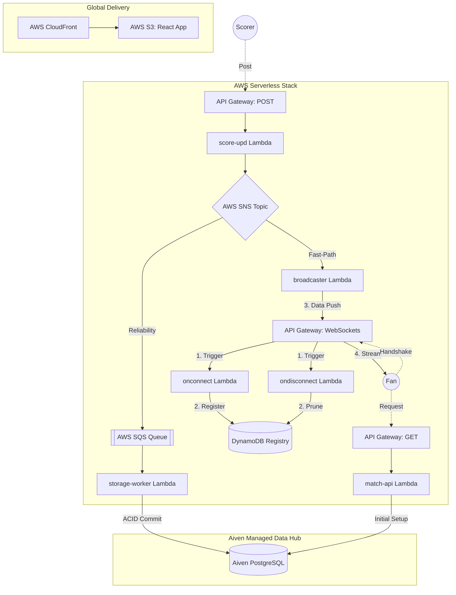

# 🏏 CricScore: Real-Time Cricket Match Engine

🚀 **Production Environment:** **https://cricscore.venkateshsingamsetty.site**

🧪 **Development Environment:** **https://cricscoredev.venkateshsingamsetty.site**

👉 **Deployment Details:** **[Full Deployment Guide](./docs/deployment.md)**

## 🎯 Project Vision

CricScore demonstrates how a production-style real-time sports platform
can be designed using modern cloud-native, DevOps, security, and
reliability engineering practices while maintaining a cost-optimized
architecture.

The platform simulates a real-world cricket scoring ecosystem:

- Global viewers consuming live match updates
- Authorized scorers submitting ball-by-ball events
- Event-driven processing pipelines
- Infrastructure provisioning using Infrastructure as Code
- Automated security validation
- Observability and operational monitoring
- Fully automated CI/CD workflows

The goal is not only to build a cricket application, but to demonstrate
enterprise engineering practices applied to a real-world workload.

### 🤖 Agentic AI & RAG Integration

CricScore features a production-grade **Agentic AI Chat Assistant** powered by:

| Concept                               | Implementation                                                           |
| ------------------------------------- | ------------------------------------------------------------------------ |
| **Model Context Protocol (MCP)**      | Secure, decoupled tool execution — LLM never sees credentials            |
| **Text-to-SQL RAG**                   | LLM autonomously writes & executes SQL to answer live match queries      |
| **Multi-Doc Vector RAG (`pgvector`)** | Cosine-similarity search across multiple uploaded PDF rulebooks          |
| **OpenRouter LLMs**                   | Chat: **gpt-4o-mini**, Embeddings: **text-embedding-3-small**            |
| **Dev/Prod Isolation**                | `DB_SCHEMA` env var scopes all queries to the correct environment schema |

---

## 🔄 System Architecture (Fan-Out)


```mermaid
graph TD
    %% Global CDN Layer
    subgraph CDN [Global Delivery]
        CF[AWS CloudFront] --> S3[AWS S3: React App]
    end

    %% Cloud Logic
    subgraph AWS [AWS Serverless Stack]
        REST_GET[API Gateway: GET] --> match_api[match-api Lambda]

        REST_POST[API Gateway: POST] --> score_update[score-upd Lambda]
        score_update --> SNS{AWS SNS Topic}

        %% Consumer logic
        SNS -->|Reliability| SQS[[AWS SQS Queue]]
        SQS --> storage_worker[storage-worker Lambda]

        SNS -->|Fast-Path| broadcaster[broadcaster Lambda]

        %% WebSocket Gateway Hub
        WS_GW[API Gateway: WebSockets] -->|1. Trigger| onConnect[onconnect Lambda]
        WS_GW -->|1. Trigger| onDisconnect[ondisconnect Lambda]

        onConnect -->|2. Register| DDB[(DynamoDB Registry)]
        onDisconnect -->|2. Prune| DDB

        broadcaster -->|3. Data Push| WS_GW
        WS_GW -->|4. Stream| Fan
    end

    %% Data Hub vertically stacked for clear routing
    subgraph Aiven [Aiven Managed Data Hub]
        PG[(Aiven PostgreSQL)]
    end

    %% Explicit data routing
    match_api -->|Initial Setup| PG
    storage_worker -->|ACID Commit| PG

    %% User Interaction Labels
    Fan((Fan)) -.->|Request| REST_GET
    Fan -.->|Handshake| WS_GW
    Scorer((Scorer)) -.->|Post| REST_POST
```

---

# 🛠️ Technology Stack

## Frontend

| Technology   | Purpose                                       |
| ------------ | --------------------------------------------- |
| React        | User interface framework                      |
| TypeScript   | Type-safe application development             |
| Vite         | Frontend build tooling and development server |
| HTML5 / CSS3 | UI structure and styling                      |

---

## Backend & APIs

| Technology          | Purpose                              |
| ------------------- | ------------------------------------ |
| AWS Lambda          | Serverless backend execution         |
| Amazon API Gateway  | REST API and WebSocket communication |
| AWS Cognito         | Identity management and JWT auth     |
| AWS Amplify Auth    | Frontend auth SDK (sign-up/sign-in)  |
| Amazon SNS          | Event fan-out messaging              |
| Amazon SQS          | Asynchronous worker queues           |
| Node.js 24.x        | High performance runtime             |
| OpenRouter / OpenAI | Foundation Models for Agentic RAG    |
| MCP SDK             | Model Context Protocol architecture  |

---

## Database

| Technology       | Purpose                                              |
| ---------------- | ---------------------------------------------------- |
| Aiven PostgreSQL | Managed relational database                          |
| PostgreSQL       | Match, player, score, and tournament persistence     |
| pgvector         | Vector similarity search extension for RAG           |
| HNSW Index       | High-performance approximate nearest-neighbor search |

---

## Infrastructure & Cloud

| Technology | Purpose                        |
| ---------- | ------------------------------ |
| Terraform  | Infrastructure as Code         |
| AWS Cloud  | Cloud infrastructure platform  |
| CloudFront | Global content delivery        |
| S3         | Static website hosting         |
| Route53    | DNS management                 |
| ACM        | SSL/TLS certificate management |

---

## DevSecOps & Security

| Tool            | Purpose                               |
| --------------- | ------------------------------------- |
| GitHub Actions  | CI/CD automation                      |
| Checkov         | Terraform security scanning           |
| GitLeaks        | Secret detection                      |
| Trivy           | Dependency and vulnerability scanning |
| OWASP ZAP       | Dynamic application security testing  |
| Dependabot      | Dependency vulnerability monitoring   |
| SBOM Generation | Software supply chain visibility      |

---

## Testing

| Tool                  | Purpose                       |
| --------------------- | ----------------------------- |
| Vitest                | Unit testing framework        |
| React Testing Library | Frontend component testing    |
| Playwright            | End-to-end browser automation |

---

# 🤖 AI Architecture

See the **[Full AI Architecture Guide](./docs/ai_architecture.md)** for a complete deep-dive.

## MCP Tools

The `chat-api` Lambda implements the **Model Context Protocol (MCP)** with two registered tools:

| Tool                      | Type            | Purpose                                                                                           |
| ------------------------- | --------------- | ------------------------------------------------------------------------------------------------- |
| `execute_sql`             | Text-to-SQL RAG | Writes & executes READ-ONLY SQL to answer live score, player stats, and historical data questions |
| `search_tournament_rules` | Vector RAG      | Embeds the user query and performs cosine-similarity search against the uploaded PDF rulebook     |
| `delete_match`            | Admin Action    | Deletes one, multiple, or all matches from the database (Admin JWT required)                      |
| `deleteGuestData`         | Admin Action    | Finds and deletes all Cognito guest accounts and their match records (Admin JWT required)         |

## AI File Structure

```
apps/backend/lambdas/chat-api/
├── index.js                      ← Thin Lambda router (entry point)
├── config/
│   ├── db.js                     ← Shared PostgreSQL pool + setSearchPath (dev/prod aware)
│   └── llm.js                    ← Shared OpenAI client, model & embedding config
├── handlers/
│   ├── chatHandler.js            ← Agentic MCP chat loop (main AI pipeline)
│   ├── summaryHandler.js         ← AI post-match summary generation
│   └── uploadRulesHandler.js     ← PDF text extraction + batch embedding ingestion
└── mcp/
    ├── server.js                 ← MCP Server (tool registry)
    └── tools/
        ├── executeSql.js         ← Text-to-SQL tool (READ ONLY, 3s timeout)
        ├── searchRules.js        ← Vector cosine-similarity search tool
        ├── deleteMatch.js        ← Admin match deletion tool (JWT-gated)
        └── deleteGuestData.js    ← Admin guest account purge tool (JWT-gated)
```

## Required Environment Variables

| Variable       | Description                          | Example                        |
| -------------- | ------------------------------------ | ------------------------------ |
| `LLM_API_KEY`  | OpenRouter or OpenAI API key         | `sk-or-v1-...`                 |
| `LLM_BASE_URL` | LLM provider base URL                | `https://openrouter.ai/api/v1` |
| `LLM_MODEL`    | _(Optional)_ Override model name     | `gpt-4o-mini`                  |
| `DATABASE_URL` | Aiven PostgreSQL connection string   | `postgres://...`               |
| `DB_SCHEMA`    | Environment schema (`dev` or `prod`) | `dev`                          |

> **Security:** All credentials are loaded inside the MCP Server/tools only. The LLM (OpenRouter) **never** receives `DATABASE_URL` or `LLM_API_KEY` — it only sees tool schemas and query results.

---

# 🏢 Enterprise-Grade Standards & Technical Documentation

CricScore is engineered to demonstrate production-readiness across 6 core pillars of enterprise architecture. All technical decisions, tradeoffs, and deep-dives are documented in their respective guides below.

### 1. 🛡️ DevSecOps & Security

**Zero-Trust Identity & Automated Scanning**
We enforce a strict security posture using **AWS Cognito JWT-based authentication**, API Gateway JWT Authorizers, and multi-tenant data isolation. The CI/CD pipeline acts as an automated gatekeeper, blocking PRs that fail GitLeaks, Trivy, Checkov, CodeQL, or OWASP ZAP.

- 📖 **[Authentication & Authorization](./docs/auth.md)**: Cognito SSO flows, guest mode, admin user management, JWT validation, and cross-session identity guard.
- 📖 **[Security Posture & Tradeoffs](./docs/security_posture.md)**: Defense in depth strategy, multi-tenant isolation, and encryption layers.
- 📖 **[Branch Protection & Governance](./docs/branch_protection.md)**: Required status checks, CI/CD pipeline blockers, and administrator enforcement.

### 2. 🔭 Observability & Logging

**Total System Visibility**
All Lambda executions stream structured JSON logs to CloudWatch. We employ AWS X-Ray for distributed tracing across API Gateway, SNS, SQS, and Lambda, allowing us to pinpoint latency bottlenecks. Critical failure metrics trigger automated SNS alerts.

- 📖 **[Observability Suite](./docs/observability.md)**: CloudWatch Dashboards, X-Ray Tracing, Sentry Crash Reporting, and Uptime monitors.
- 📖 **[Cost & Performance](./docs/cost_management.md)**: Free-tier monitoring strategy and architecture scale limits.
- 📖 **[AWS Resources Dashboard](./docs/aws_resources_dashboard.md)**: Automatically generated, real-time index of every single deployed AWS resource with deep-links to the console.

### 3. ✅ Rigorous Testing

**Multi-Layer Test Pyramid**
Code is validated at every tier: Unit tests evaluate isolated Lambda functions, API tests validate REST contracts, and Playwright executes E2E User Journey tests against the staging environment.

- 📖 **[Testing Guide](./docs/testing.md)**: Vitest and Playwright test commands, Availability Testing (Chaos/DR), and E2E structures.
- 📖 **[Toolchain & Security Stack](./docs/tools.md)**: Master list of all CI/CD, IaC, and AppSec tools used in the pipeline.

### 4. ♾️ High Availability & Reliability

**Fault-Tolerant Event-Driven Design**
The architecture decouples the frontend from backend persistence using SNS fan-out and SQS queuing. If the database experiences downtime, SQS retains messages and retries automatically via dead-letter queues (DLQs).

- 📖 **[Detailed Architecture](./docs/architecture.md)**: System design, sequence flows, and EDA logic.
- 📖 **[API Guide](./docs/api.md)**: REST & WebSocket contract specifications.
- 📖 **[Aiven Managed Services](./docs/aiven.md)**: PostgreSQL database configuration and keep-alive strategy.
- 📖 **[Node.js Guide](./docs/nodejs_guide.md)**: ESM vs CommonJS standardizations.

### 5. 🏗️ Infrastructure as Code (IaC)

**Immutable & Reproducible Environments**
100% of the AWS infrastructure is codified in Terraform. Changes are planned, validated for security drift by Checkov, and applied automatically via GitHub Actions, eliminating manual click-ops errors.

- 📖 **[Full Deployment & Infrastructure](./docs/deployment.md)**: Local preview, bootstrap foundations, and AWS/Aiven Setup.
- 📖 **[Troubleshooting](./docs/troubleshooting.md)**: Setup fixes and identity verification help.

### 6. 🤖 Agentic AI & RAG

**Production-grade AI with MCP Security Boundaries**
The AI Chat system implements the Model Context Protocol to enforce a strict security boundary between the LLM and the database. All tool execution, credential access, and query validation happens inside the MCP Server — entirely hidden from the LLM provider.

- 📖 **[AI Architecture](./docs/ai_architecture.md)**: Full Agentic RAG design, MCP architecture diagram, troubleshooting log (13 documented bugs & fixes), educational AI concepts, and cost breakdown.

### 7. 🚀 CI/CD Automation

**Aggressive Pipeline Governance**
Merge requests to `main` require 8 passing status checks. The deployment pipeline automatically builds the Vite frontend, synchronizes S3 buckets, invalidates CloudFront caches, packages Lambdas, and executes semantic version releases entirely hands-free.

- 📖 **[GitHub Actions Architecture](./docs/github_actions.md)**: CI/CD Directory structure constraints and pipeline organization.
- 📖 **[Automated Releases](./docs/release_process.md)**: Semantic release and Conventional Commit specifications.
- 📖 **[Full Project Log](./docs/changelog.md)**: Release records and development timeline.

---

# 🤖 AI Assisted Development

AI tools were used as productivity accelerators for:

- Code suggestions
- Documentation generation
- Test creation assistance
- Troubleshooting
- Architecture brainstorming
