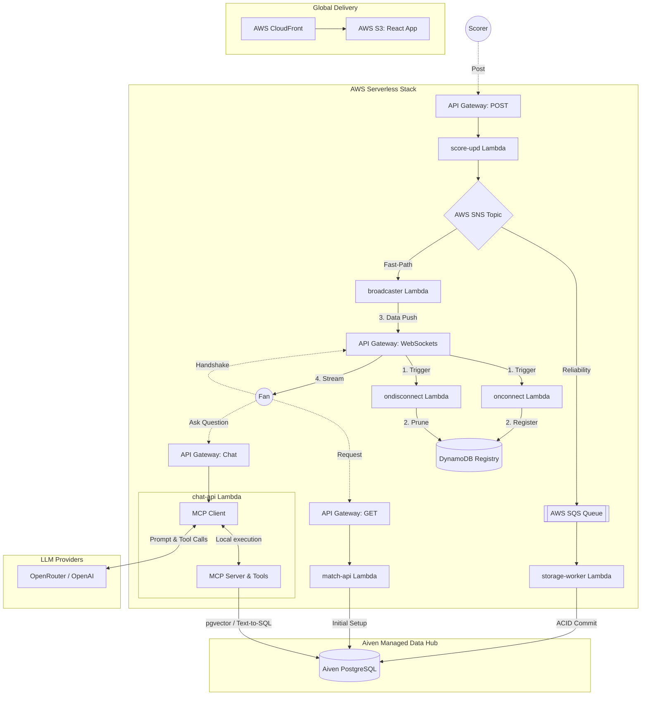

# 🏏 CricScore: Real-Time Cricket Match Engine

🚀 **Production Environment:** **https://cricscore.venkateshsingamsetty.com**

🧪 **Development Environment:** **https://cricscoredev.venkateshsingamsetty.com**

👉 **Deployment Details:** **[Full Deployment Guide](./docs/deployment.md)**

🛠️ **Developer Workflow:** **[Contributing & PR Guide](./CONTRIBUTING.md)**

---

## 🎯 Project Vision

CricScore demonstrates how a high-performance, real-time sports platform can be designed using modern **Multi-Cloud**, **Serverless**, and **Event-Driven** architecture. By combining AWS services with Aiven managed databases, the project maintains an enterprise-grade, cost-optimized footprint.

The project models a live cricket platform featuring:

- **Serverless Compute**: Fully managed AWS Lambda backends.
- **Event-Driven Architecture**: Fan-out messaging via SNS and SQS for fault-tolerant state processing.
- **Agentic AI**: Autonomous RAG capabilities with Text-to-SQL and Vector Search.
- **Multi-Cloud Infrastructure**: Terraform-managed deployments bridging AWS and Aiven PostgreSQL.
- **Real-Time Streaming**: WebSocket API Gateway for instant, low-latency score updates.
- **DevSecOps Governance**: End-to-end CI/CD automation with automated security and compliance scanning.

This repository serves as a practical, production-style reference implementation for modern cloud engineering, AI integration, and rigorous operational discipline.

---

## 🔄 System Architecture (Fan-Out)


```mermaid
graph TD
    %% Global CDN Layer
    subgraph CDN [Global Delivery]
        CF[AWS CloudFront] --> S3[AWS S3: React App]
    end

    %% Cloud Logic
    subgraph AWS [AWS Serverless Stack]
        REST_GET[API Gateway: GET] --> match_api[match-api Lambda]

        REST_POST[API Gateway: POST] --> score_update[score-upd Lambda]
        score_update --> SNS{AWS SNS Topic}

        %% Agentic AI
        REST_AI[API Gateway: Chat] --> MCP_C

        subgraph chat_api [chat-api Lambda]
            MCP_C[MCP Client]
            MCP_S[MCP Server & Tools]
            MCP_C <-->|Local execution| MCP_S
        end

        %% Consumer logic
        SNS -->|Reliability| SQS[[AWS SQS Queue]]
        SQS --> storage_worker[storage-worker Lambda]

        SNS -->|Fast-Path| broadcaster[broadcaster Lambda]

        %% WebSocket Gateway Hub
        WS_GW[API Gateway: WebSockets] -->|1. Trigger| onConnect[onconnect Lambda]
        WS_GW -->|1. Trigger| onDisconnect[ondisconnect Lambda]

        onConnect -->|2. Register| DDB[(DynamoDB Registry)]
        onDisconnect -->|2. Prune| DDB

        broadcaster -->|3. Data Push| WS_GW
        WS_GW -->|4. Stream| Fan
    end

    %% Data Hub
    subgraph Aiven [Aiven Managed Data Hub]
        PG[(Aiven PostgreSQL)]
    end

    %% External AI Models
    subgraph AI [LLM Providers]
        LLM[OpenRouter / OpenAI]
    end

    %% Explicit data routing
    match_api -->|Initial Setup| PG
    storage_worker -->|ACID Commit| PG
    MCP_S -->|pgvector / Text-to-SQL| PG
    MCP_C <-->|Prompt & Tool Calls| LLM

    %% User Interaction Labels
    Fan((Fan)) -.->|Request| REST_GET
    Fan -.->|Handshake| WS_GW
    Fan -.->|Ask Question| REST_AI
    Scorer((Scorer)) -.->|Post| REST_POST
```

---

## 🏢 Enterprise-Grade Standards & Technical Documentation

CricScore is structured to demonstrate production-oriented engineering practices across 7 core pillars of enterprise architecture. All technical decisions, tradeoffs, and deep-dives are documented in their respective guides below.

### 1. 🛡️ DevSecOps & Security

**Zero-Trust Identity & Automated Scanning**
The platform is designed around **AWS Cognito JWT-based authentication**, API Gateway JWT Authorizers, and multi-tenant data isolation. The CI/CD pipeline acts as an automated gatekeeper, blocking PRs that fail GitLeaks, Trivy, Checkov, CodeQL, or native NPM Audits (OWASP ZAP actively scans the deployed environments post-merge).

- 📖 **[Authentication & Authorization](./docs/auth.md)**: Cognito SSO flows, guest mode, admin user management, JWT validation, and cross-session identity guard.
- 📖 **[Security Posture & Tradeoffs](./docs/security_posture.md)**: Defense in depth strategy, multi-tenant isolation, and encryption layers.
- 📖 **[Branch Protection & Governance](./docs/branch_protection.md)**: Strict required status checks, zero direct pushes to `main`, and administrator enforcement.
- 📖 **[Contributing & Developer Workflow](./CONTRIBUTING.md)**: Step-by-step feature branch workflow, Git Hooks (`pre-push`), and full local validation commands (`validate_local.sh`).

### 2. 🔭 Observability & Logging

**Total System Visibility**
The platform streams structured JSON logs to CloudWatch Logs across all 8 Lambda functions. AWS X-Ray (5% sampling) provides distributed tracing across API Gateway, SNS, SQS, and Lambda to pinpoint latency bottlenecks. CloudWatch Alarms fire SNS email alerts when critical Lambda error rates exceed zero.

- 📖 **[Observability Suite](./docs/observability.md)**: CloudWatch Logs, X-Ray Tracing, CloudWatch Alarms + SNS Alerts, and optional Sentry/Uptime setup — all within the AWS free tier.
- 📖 **[Cost & Performance](./docs/cost_management.md)**: Free-tier monitoring strategy, removed paid resources (Dashboard, KMS), and architecture scale limits.
- 📖 **[AWS Resources Dashboard](./docs/aws_resources_dashboard.md)**: Script-generated index of every deployed AWS resource with deep-links directly into the AWS Console.

### 3. ✅ Rigorous Testing

**Multi-Layer Test Pyramid**
Code is validated at every tier: Unit tests evaluate isolated Lambda functions, API tests validate REST contracts, and Playwright executes E2E user journey tests against the staging environment.

- 📖 **[Testing Guide](./docs/testing.md)**: Vitest and Playwright test commands, Availability Testing (Chaos/DR), and E2E structures.
- 📖 **[Toolchain & Security Stack](./docs/tools.md)**: Master list of all CI/CD, IaC, and AppSec tools used in the pipeline.

### 4. ♾️ High Availability & Reliability

**Fault-Tolerant Event-Driven Design**
The architecture decouples the frontend from backend persistence using SNS fan-out and SQS queuing. If the database experiences downtime, the queue-based pattern retains and replays work with retry and dead-letter handling.

- 📖 **[Detailed Architecture](./docs/architecture.md)**: System design, sequence flows, and EDA logic.
- 📖 **[API Guide](./docs/api.md)**: REST & WebSocket contract specifications.
- 📖 **[Aiven Managed Services](./docs/aiven.md)**: PostgreSQL database configuration and keep-alive strategy.
- 📖 **[Node.js Guide](./docs/nodejs_guide.md)**: ESM vs CommonJS standardizations and dependency security.

### 5. 🏗️ Infrastructure as Code (IaC)

**Immutable & Reproducible Environments**
The AWS infrastructure is codified in Terraform. Changes can be planned, validated for security drift by Checkov, and applied through GitHub Actions or the deploy script to reduce manual click-ops errors.

- 📖 **[Full Deployment & Infrastructure](./docs/deployment.md)**: Local preview, bootstrap foundations, and AWS/Aiven Setup.
- 📖 **[Troubleshooting](./docs/troubleshooting.md)**: Setup fixes and identity verification help.

### 6. 🤖 Agentic AI & RAG

**Production-style AI with MCP Security Boundaries**
CricScore includes a production-style **AI Chat Assistant**. The system implements the Model Context Protocol to enforce a clear security boundary between the LLM and the database. Tool execution, credential access, and query validation remain strictly inside the MCP server boundary rather than being exposed directly to the LLM provider.

- 📖 **[AI Architecture](./docs/ai_architecture.md)**: Full Agentic RAG design, MCP architecture diagram, troubleshooting log (18 documented bugs & fixes), educational AI concepts, and cost breakdown.

### 7. 🚀 CI/CD Automation

**Tag-Based Pipeline Governance**
Merge requests to `main` require passing status checks. The main pipeline deploys strictly to the **dev** environment and runs Playwright/ZAP E2E tests. Upon success, semantic versioning automatically generates a release tag (e.g., `v1.2.3`). A completely separate production deployment workflow is then triggered by these tags, allowing for instant, push-button rollbacks if needed.

- 📖 **[GitHub Actions Architecture](./docs/github_actions.md)**: CI/CD Directory structure constraints and pipeline organization.
- 📖 **[Automated Releases](./docs/release_process.md)**: Semantic release and Conventional Commit specifications.
- 📖 **[Full Project Log](./docs/changelog.md)**: Release records and development timeline.

---

## 🛠️ Technology Stack

### Frontend

| Technology   | Purpose                                       |
| ------------ | --------------------------------------------- |
| React        | User interface framework                      |
| TypeScript   | Type-safe application development             |
| Vite         | Frontend build tooling and development server |
| HTML5 / CSS3 | UI structure and styling                      |

### Backend & APIs

| Technology          | Purpose                              |
| ------------------- | ------------------------------------ |
| AWS Lambda          | Serverless backend execution         |
| Amazon API Gateway  | REST API and WebSocket communication |
| AWS Cognito         | Identity management and JWT auth     |
| AWS Amplify Auth    | Frontend auth SDK (sign-up/sign-in)  |
| Amazon SNS          | Event fan-out messaging              |
| Amazon SQS          | Asynchronous worker queues           |
| Node.js 24.x        | High performance runtime             |
| OpenRouter / OpenAI | Foundation Models for Agentic RAG    |
| MCP SDK             | Model Context Protocol architecture  |

### Database

| Technology       | Purpose                                              |
| ---------------- | ---------------------------------------------------- |
| Aiven PostgreSQL | Managed relational database                          |
| PostgreSQL       | Match, player, score, and tournament persistence     |
| pgvector         | Vector similarity search extension for RAG           |
| HNSW Index       | High-performance approximate nearest-neighbor search |

### Infrastructure & Cloud

| Technology | Purpose                        |
| ---------- | ------------------------------ |
| Terraform  | Infrastructure as Code         |
| AWS Cloud  | Cloud infrastructure platform  |
| CloudFront | Global content delivery        |
| S3         | Static website hosting         |
| Route53    | DNS management                 |
| ACM        | SSL/TLS certificate management |

### DevSecOps & Security

| Tool            | Purpose                               |
| --------------- | ------------------------------------- |
| GitHub Actions  | CI/CD automation                      |
| Checkov         | Terraform security scanning           |
| GitLeaks        | Secret detection                      |
| Trivy           | Dependency and vulnerability scanning |
| npm audit       | Native Node.js vulnerability scanning |
| OWASP ZAP       | Dynamic application security testing  |
| Dependabot      | Dependency vulnerability monitoring   |
| SBOM Generation | Software supply chain visibility      |

### Testing

| Tool                  | Purpose                       |
| --------------------- | ----------------------------- |
| Vitest                | Unit testing framework        |
| React Testing Library | Frontend component testing    |
| Playwright            | End-to-end browser automation |

---

## 🚀 Getting Started & Deployment

To deploy CricScore to your own AWS account, use the canonical deployer scripts:

```bash
# Development
./infra/scripts/deploy.sh --env dev

# Production
./infra/scripts/deploy.sh --env prod
```

This script applies the correct Terraform environment, regenerates the frontend runtime values from live AWS outputs, builds the app, uploads it to S3, and invalidates CloudFront so the dev and prod sites stay isolated.

### 💻 Local Development

Want to just run the React frontend locally (`localhost:3000`) against the live cloud backend without deploying infrastructure?
📖 **[See the Local Frontend Quickstart Guide](./docs/local_frontend_quickstart.md)**.

### 🔐 One-Time Setup for a Fresh Clone

Before the first deployment, make sure you have the required local values ready:

- AWS credentials configured for the target account
- Terraform installed locally
- Aiven PostgreSQL connection string for the environment you want to deploy
- OpenRouter or OpenAI API key for the LLM layer
- SES sender email and admin email configured in the environment variables
- A hosted domain or Route 53 zone already created

A typical local setup is:

```bash
cp .env.local.example .env.local
# fill in the required AWS / database / LLM values before running the deploy script
```

If your repo does not include a `.env.local.example`, use the values already referenced by the infra scripts and Terraform variables as the source of truth.

### 💰 Cost Notes

The recurring cost is expected to stay very low for normal usage. In practice, the main fixed monthly expense is typically the Route 53 hosted zone, while most other services are event-driven or usage-based. If you are not actively testing the dev site, you can destroy or pause it to keep costs near the minimum possible level.

---

## 🤖 AI Assisted Development

AI tools were used as productivity accelerators for:

- Code suggestions
- Documentation generation
- Test creation assistance
- Troubleshooting
- Architecture brainstorming
