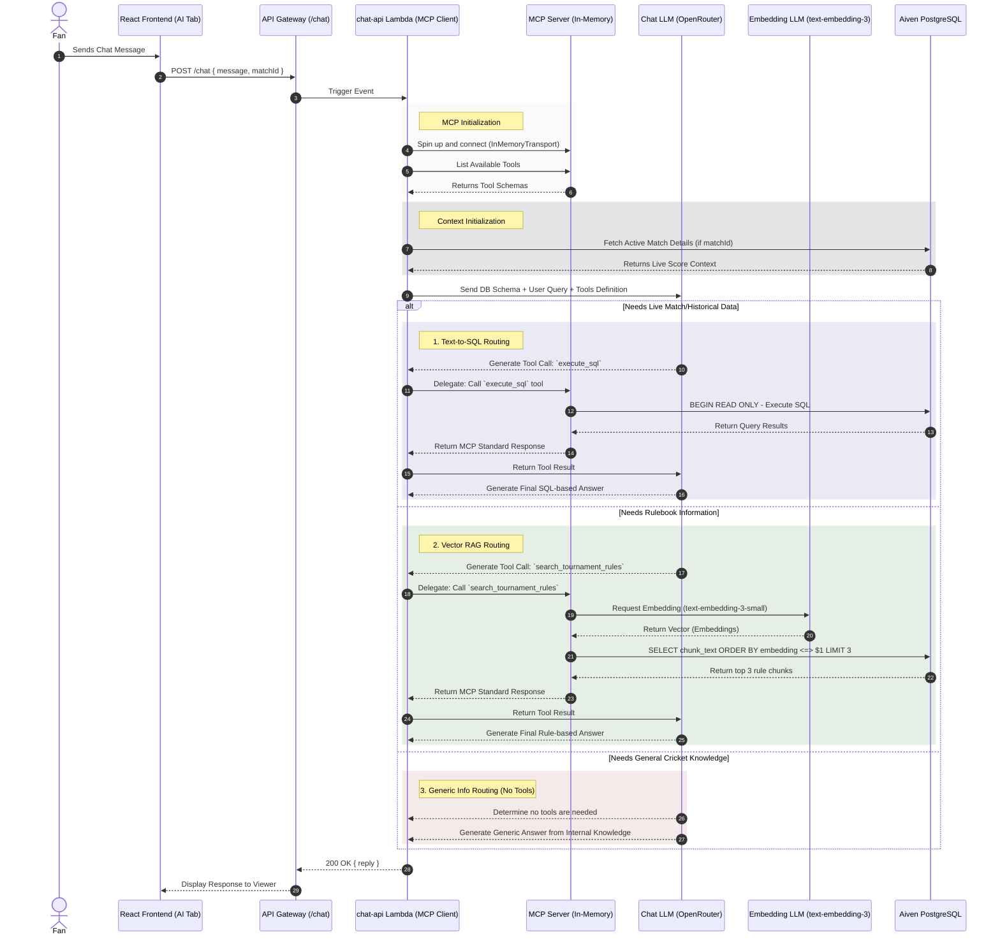
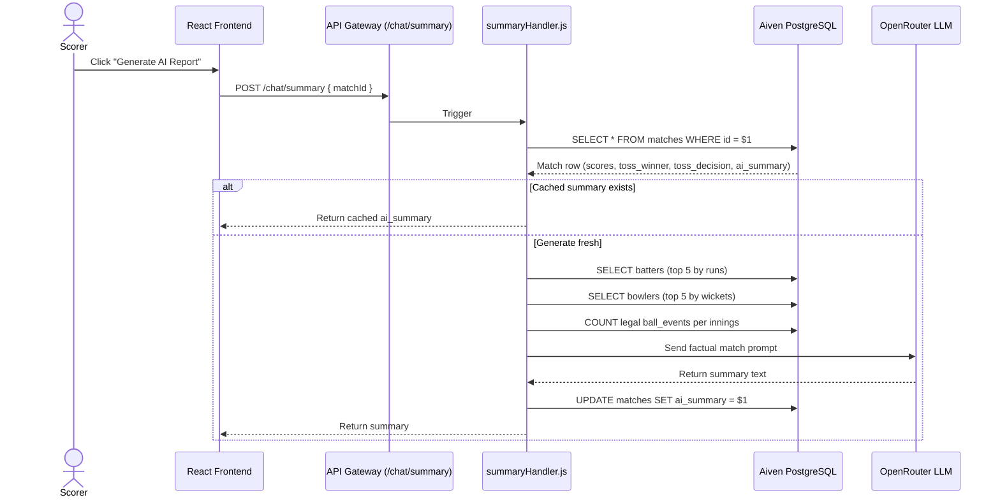

# 🤖 AI Architecture: Agentic RAG (Text-to-SQL & Vector Search)

CricScore integrates an advanced **Agentic Retrieval-Augmented Generation (RAG)** system to provide an interactive **AI Chat Assistant** for fans.

Our chatbot is a fully autonomous AI Agent capable of two primary RAG methodologies:

1. **Text-to-SQL:** It answers questions about live matches, historical data, and player stats in real-time by autonomously writing and executing read-only SQL queries directly against the high-performance PostgreSQL event hub.
2. **Vector Semantic Search:** It answers rule-based questions (e.g. rain delays, tiebreakers) by embedding the query and performing a cosine-similarity search against a custom `pgvector` knowledge base built from uploaded PDF tournament rulebooks.

## 🏗️ Architecture

The AI Chat system is built as a serverless Lambda (`chat-api`) integrated with Amazon API Gateway, communicating directly with advanced LLM providers (e.g., Groq, OpenRouter) using **OpenAI Tool Calling (Functions)**.



## 🌐 Model Context Protocol (MCP) Integration

CricScore natively implements the **Model Context Protocol (MCP)** to standardise and decouple its AI tooling.

Instead of tightly coupling database and vector logic directly into the LLM chat router loop, the `chat-api` Lambda operates using an **MCP Client-Server Architecture**:

1. **MCP Server (`mcpServer.js`):** A standalone module that defines the tools (`execute_sql`, `search_tournament_rules`) using the `@modelcontextprotocol/sdk`. It manages the database pooling and security parameters internally.
2. **MCP Client (`index.js`):** The main Lambda handler instantiates an MCP Client, connects to the MCP Server via `InMemoryTransport`, and dynamically lists the tools. When the LLM decides to call a tool, the client simply delegates the call via the standardized `client.callTool()` interface.

_Why use `InMemoryTransport`?_ Standard MCP typically runs over `stdio` or WebSockets/SSE for local IDE or distributed execution. By utilizing the `InMemoryTransport` within the Lambda, we achieve the perfect architectural decoupling and standardization of MCP without needing to provision expensive, long-running ECS/EC2 containers to host an SSE server!

## 📚 Vector RAG: Multi-Document PDF Tournament Rules

We have extended the PostgreSQL database with the `pgvector` extension to serve as a native Vector Database alongside our relational data. This completely removes the need for a third-party vector database (like Pinecone).

1. **Multi-Document PDF Processing (`/rules/upload`):** Admins can upload multiple distinct PDF rulebooks via the AI Chatbot (shown only when logged in as Admin). The `chat-api` Lambda receives the base64 encoded PDF along with the `fileName`, uses `pdf-parse` (v2) to extract text, and splits the text into chunks.
2. **Scoped Replacements:** If a document with the same `fileName` is uploaded, the backend first issues a scoped `DELETE FROM tournament_rules WHERE document_name = $1` to wipe the old chunks for that specific document before inserting the new ones.
3. **Batch Embedding Generation:** To prevent AWS API Gateway from timing out (30-second hard limit), the backend passes all chunks in a single batched array request to OpenAI's `text-embedding-3-small` model.
4. **Storage:** The chunks, their 1536-dimensional embeddings, and the `document_name` are stored in the `tournament_rules` table.
5. **Agentic Tool:** The LLM is provided the `search_tournament_rules` tool. If a user asks a rule-related question, the LLM calls this tool, and the backend performs a semantic vector search (`<=>`) against `pgvector` to return the 3 most relevant paragraphs to the LLM, including their source `document_name`.
6. **Explicit Citations:** The LLM is strictly instructed via its system prompt to explicitly cite `[Source: document_name]` in its final response, so users can trust exactly which rulebook the regulation came from.

## 🔑 LLM API Key Configuration

The backend is configured to use OpenAI API compatible endpoints. We previously utilized Groq, but due to rate limiting issues with large tool-calling schemas on free tiers, we have switched our primary inference engine to **OpenRouter**.

Because Agentic Tool Calling and Vector RAG require high reasoning capabilities and stability, we route our requests through OpenRouter.
We explicitly use the following models:

- **Chat & Tool Routing Model**: `gpt-4o-mini` (fast, cost-effective reasoning)
- **Embedding Model**: `text-embedding-3-small` (generates the mathematical vectors for pgvector)

The following secrets have been added to **GitHub Repository Secrets** for use in CI/CD, and in `.env.local` for local execution:

- `OPENROUTER_API_KEY`: Used as the primary key (`https://openrouter.ai/api/v1`) to access powerful models dynamically.

### 🔄 How to Change the LLM Provider

If you decide to switch inference providers (e.g., from OpenRouter back to Groq, or to OpenAI, Together AI, etc.), you must update the base URL and API keys in the following places:

1. **Local Deployment (`deploy_local_dev.sh`)**
   - Update `export TF_VAR_llm_api_key="$OPENROUTER_API_KEY"` (or whatever environment variable you use in `.env.local`).
   - Update `export TF_VAR_llm_base_url="https://openrouter.ai/api/v1"` to the new provider's base URL.

2. **CI/CD Deployment (`.github/workflows/ci-cd.yml` & `drift.yml`)**
   - In the `Deploy Infrastructure` steps, update the `TF_VAR_llm_api_key` to map to your new GitHub Secret (e.g., `TF_VAR_llm_api_key: ${{ secrets.GROQ_API_KEY }}`).
   - Update `TF_VAR_llm_base_url` to the new provider's base URL.

3. **Backend Logic (`apps/backend/lambdas/chat-api/summaryHandler.js`)**
   - The default model identifier (e.g., `gpt-4o-mini` or `llama-3.3-70b-versatile`) is hardcoded in the `generateSummary` fallback logic. Update it to match the model you wish to use on the new provider.

_(Note: You do not need to modify the Terraform files directly, as `variables.tf` expects these to be passed down dynamically)._

## ⚙️ How Agentic Text-to-SQL Works

Instead of using a Vector Database (which introduces sync latency), the CricScore RAG system operates directly on the relational data:

1. **Schema Injection:** The system prompt injected into the LLM includes a highly succinct schema representation of the `matches`, `innings`, `players`, `bowlers`, and `ball_events` tables.
2. **Tool Definition:** The LLM is provided with an `execute_sql` tool definition in the OpenAI API request.
3. **Autonomous Execution:** If the user asks an analytical question, the LLM generates a PostgreSQL query. The `chat-api` Lambda executes this query on the user's behalf.
4. **Security & Governance:**
   - **Read-Only:** All LLM-generated queries are strictly wrapped in a `BEGIN READ ONLY;` transaction to prevent data corruption or hallucinated `DROP TABLE` commands.
   - **Performance Protection:** A strict `statement_timeout = 3000` is enforced at the transaction level to prevent the LLM from generating wildly complex joins that could bottleneck the database.
   - **Schema Isolation:** The `chat-api` Lambda dynamically sets the PostgreSQL `search_path` (e.g., `SET search_path TO dev;`) before executing any queries. This ensures that the Agentic AI only has access to the exact schema for the environment it is deployed in, preventing cross-environment data leakage.

### Database Connection Notes

When connecting the Node.js `pg` client to the Aiven PostgreSQL database, the connection string (`DATABASE_URL`) provided by Terraform includes `?sslmode=require`. To prevent `self-signed certificate in certificate chain` errors, the Lambda explicitly strips this query parameter and configures the connection pool with `ssl: { rejectUnauthorized: false }`.

---

## 📊 AI Post-Match Summary (`summaryHandler.js`)

After a match concludes, the scorer can trigger an **AI-generated post-match report** via the Chat interface. The summary is generated once and then cached in the `matches.ai_summary` column for all subsequent requests.

### How It Works



### Data Sources

The summary prompt is built from **database facts only** — no estimation or model inference:

| Data Point               | Source                                                          |
| ------------------------ | --------------------------------------------------------------- |
| Match result & winner    | `matches.match_winner`, `matches.status`                        |
| Team scores & wickets    | `matches.team_a_score`, `team_b_score`, etc.                    |
| Toss winner & decision   | `matches.toss_winner`, `matches.toss_decision`                  |
| Overs bowled per innings | `COUNT(ball_events)` where extra_type NOT IN ('WIDE','NO_BALL') |
| Top batters              | `players` JOIN `innings` — sorted by runs DESC                  |
| Top bowlers              | `bowlers` JOIN `innings` — sorted by wickets DESC               |

### Overs Calculation Strategy

Rather than using the stored `team_a_overs`/`team_b_overs` decimal fields (which can be stale when a match ends mid-over), the handler counts actual legal `ball_events` per innings:

```js
// Total legal balls → plain English using floor division
const completedOvers = Math.floor(totalLegalBalls / 6);
const remainder = totalLegalBalls % 6;
// → "1 over", "5 balls", "1 over and 2 balls" etc.
```

This guarantees accuracy even when the match ended on ball 6 (which would otherwise read as `0.5` in the decimal field).

### Prompt Engineering

The LLM receives a tightly-scoped, factual prompt:

- Overs are pre-computed to plain English **before** the prompt — no decimals are ever passed to the model.
- The toss winner/decision is injected verbatim from the DB as a concrete instruction.
- The model is told: _"Overs are already pre-calculated in plain English for you below. Use them exactly as written."_
- Creativity is intentionally constrained: _"Do not be overly creative or dramatic. Keep it straightforward."_

### Caching

Once generated, the summary is cached in `matches.ai_summary`. Subsequent requests return the cached value instantly without calling the LLM again. Admins can clear the cache by setting `ai_summary = NULL` in the DB (or a future admin API endpoint).

---

## 🛠️ Agentic Text-to-SQL Gotchas & Fixes

While building the Agentic SQL RAG, we encountered and resolved several common hallucination/execution issues:

1. **Schema Environment Fallback Issue:**
   - **Bug:** The Lambda relied on `process.env.DB_SCHEMA` to set the `search_path`. Since Terraform wasn't passing this variable, the AI kept querying the empty `public` schema instead of `dev`, falsely reporting 0 results.
   - **Fix:** Added `DB_SCHEMA = var.environment` to the `chat_api` Lambda's environment variables in Terraform.

2. **Over-Strict Context Refusal:**
   - **Bug:** The system prompt originally said "You can answer questions about the active match...". Because `matchContext` was sometimes empty (e.g., when chatting from the main dashboard), the LLM assumed it wasn't allowed to answer generic queries and refused to run SQL tools.
   - **Fix:** Explicitly commanded the LLM: `"Do not refuse to answer if there is no 'Active Match Context'. Just query the database!"`

3. **Case Sensitivity SQL Hallucination:**
   - **Bug:** The LLM successfully executed SQL but guessed lowercase enum strings (e.g., `WHERE status = 'completed'`). PostgreSQL strings are case-sensitive, so this returned 0 rows.
   - **Fix:** Injected explicit `Database Hints` into the system prompt:
     - Notified the LLM that `status` uses `UPPERCASE` values.
     - Mandated the use of `ILIKE` for all other case-insensitive string matching.

4. **Timezone (UTC) Hallucination:**
   - **Bug:** When asked "how many matches were played today?", the LLM ran `CURRENT_DATE = CAST(created_at AS DATE)`. Because the PostgreSQL server runs in UTC, "today" for the server had already rolled over to the next day, causing it to return 0 matches.
   - **Fix:** Added a hint telling the LLM to query using an interval for "today" (e.g. `created_at >= NOW() - INTERVAL '24 hours'`).

5. **Off-Topic Abuse (Guardrails):**
   - **Bug:** The LLM was willing to answer non-cricket questions (e.g. "generate code for adding 2 numbers in python"), which wastes API tokens on irrelevant requests.
   - **Fix:** Implemented strict persona boundaries in the system prompt. The AI is explicitly instructed to act strictly as a CricScore AI and refuse any prompts unrelated to cricket, matches, or sports statistics.

6. **Lambda & LLM API Timeouts:**
   - **Bug:** When executing complex tool chains, the `chat_api` Lambda repeatedly crashed with `Error: undefined`. CloudWatch logs revealed it was hitting the default 3-second AWS Lambda timeout, and sometimes hanging indefinitely due to Groq's API server stability issues/rate limits for the `llama-3.3-70b-versatile` model.
   - **Fix:**
     - Increased the AWS Lambda timeout to `30` seconds in Terraform (`infra/terraform/lambda.tf`).
     - Swapped the default LLM provider from Groq to OpenRouter in deployment scripts (`deploy_local_dev.sh`), defaulting to `gpt-4o-mini` for lightning-fast and reliable responses that bypass the timeouts.

7. **Vector RAG - PDF-Parse Canvas Crash:**
   - **Bug:** Deploying `pdf-parse` inside the Lambda environment crashed instantly during initialization with `ReferenceError: DOMMatrix is not defined`. This is due to the underlying `pdf.js` library attempting to use browser-specific canvas APIs on modern Node.js environments without native canvas bindings.
   - **Fix:** Polyfilled the missing APIs globally (`global.DOMMatrix`, `global.ImageData`, `global.Path2D`) at the very top of the Lambda handler before the require statement.

8. **Vector RAG - API Gateway 30s Timeout Limit:**
   - **Bug:** When uploading a large PDF, iterating over 50+ chunks and making sequential requests to OpenAI to generate vector embeddings caused the Lambda to exceed API Gateway's unchangeable 30-second maximum integration timeout, leading to an immediate `503 Service Unavailable` for the client.
   - **Fix:** Refactored the embedding pipeline to collect all valid chunks into an array and send a single batched request to `openai.embeddings.create({ input: chunkArray })`. This brought processing time for a 10-page document down from 45+ seconds to under 3 seconds!

9. **Vector RAG - OpenRouter SDK Crash:**
   - **Bug:** Even with batch embeddings, the Lambda timed out at exactly 30 seconds without generating vectors. Testing revealed that the official OpenAI Node.js SDK internally crashes with an `ERR_STREAM_PREMATURE_CLOSE` error when trying to fetch embeddings from OpenRouter instead of OpenAI, causing the server to silently hang.
   - **Fix:** Ripped out the OpenAI SDK dependency for generating the vector embeddings and replaced it with a 100% native Node.js `fetch` request, directly bypassing the bugged SDK library.

10. **Vector RAG - Lambda Out of Memory (OOM) Timeout:**

- **Bug:** The Lambda function was still randomly timing out at exactly 30 seconds when uploading larger PDFs. CloudWatch logs showed `Max Memory Used: 127 MB | Memory Size: 128 MB`. The `pdf-parse` library loads the entire PDF into memory; when it hit the default 128MB ceiling, V8's garbage collector aggressively thrashed to keep the function alive. This slowed down parsing to an absolute crawl, inevitably hitting the 30-second timeout limit.
- **Fix:** Increased the Lambda memory allocation in `lambda.tf` from `128 MB` to `1024 MB`. Because AWS bills on duration (GB-seconds) and 1024MB parses the PDF in just 2 seconds (compared to 128MB thrashing for 30 seconds), it is incredibly fast and completely free due to the generous AWS Free Tier limits (400,000 GB-seconds/month). This upgrade allowed the Lambda to instantly chunk and embed over 230+ rules sections seamlessly in a single execution!

11. **MCP - OpenAI Strict Schema Rejection:**

- **Bug:** When trying to pass the MCP tools (`client.listTools()`) directly into the OpenAI LLM `tools` parameter, the API violently rejected the request with a `400 Bad Request`.
- **Fix:** The MCP SDK standardizes inputs using JSON Schema Draft-07, automatically injecting `"$schema": "http://json-schema.org/draft-07/schema#"` into the tool definitions. However, OpenAI's API strictly prohibits additional root properties outside of standard OpenAPI types. To fix this, we map over the MCP tools and explicitly execute `delete toolDef.inputSchema.$schema` before passing them to the LLM.

12. **Vector RAG - pgvector `<=>` Operator Not Found:**

- **Bug:** After successfully routing to the `search_tournament_rules` MCP tool and generating an embedding, the vector similarity query failed with `operator does not exist: public.vector <=> public.vector`. The `pgvector` extension registers its `<=>` cosine operator inside the `public` schema. However, the MCP Server was executing `SET search_path TO dev` (or `prod`), which **removes `public` from the path entirely**. PostgreSQL found the `vector` type but could not locate its operators.
- **Fix:** Changed the `SET search_path` query to always include `public` as a fallback: `SET search_path TO ${dbSchema}, public`. This preserves strict data isolation (queries land in `dev` or `prod`) while keeping all pgvector extension operators globally visible. This single-line fix works for both environments dynamically via the `DB_SCHEMA` env variable injected by Terraform.

13. **LLM Answering from General Knowledge Instead of Rulebook:**

- **Bug:** When users asked vague rules questions like "break timings?" without explicitly saying "in my rulebook", the LLM skipped the `search_tournament_rules` tool entirely and answered from its general cricket training data, giving generic ICC rules instead of tournament-specific ones.
- **Fix (1) - Stronger System Prompt:** Updated the routing instruction to a strict mandate: _"NEVER answer a rulebook-type question from memory. Always search first, then answer based on the retrieved chunks. The rulebook has tournament-specific rules that override general cricket knowledge."_
- **Fix (2) - DB_SCHEMA Escaping Bug:** The database schema was being sent to the LLM as a literal `${DB_SCHEMA}` string (due to a `\\$` escape in a JavaScript template literal) instead of the actual table definitions. Fixed by removing the erroneous backslash escape.

14. **AI Post-Match Summary — Toss Outcome Hallucination:**

- **Bug:** The AI summary invented or assumed the toss result (e.g., "Team A won the toss and elected to bat") even when Team B actually won the toss and bowled. This happened because the original match creation used a single `batFirstTeam` field — the AI had no factual toss data and guessed based on batting order.
- **Fix:** Added `toss_winner` and `toss_decision` columns to the `matches` table. The Match Setup screen now collects these explicitly. The `summaryHandler.js` reads them from the DB and injects them verbatim into the prompt: _"Mention the toss details: [TEAM X] won the toss and elected to [BAT/BOWL]."_

15. **AI Post-Match Summary — Decimal Over Notation ("0.5 overs", "1.1 overs"):**

- **Bug:** The AI wrote "Team B chased in 0.5 overs" instead of "5 balls". The original `formatOvers()` helper produced strings like `"0.5 overs (0 completed overs and 5 balls)"`. The LLM latched onto the decimal prefix and used it verbatim, ignoring the parenthetical description.
- **Fix:** Replaced `formatOvers()` with `ballsToOversText()` which emits **only** plain English from a raw ball count — no decimals at all. The prompt was updated from _"Always write out overs in plain English"_ to _"Overs are already pre-calculated in plain English for you below. Use them exactly as written."_ This completely removes any ambiguity.

16. **AI Post-Match Summary — "5 Balls" Shown for a Complete 1-Over Innings:**

- **Bug:** A team that chased the target on ball 6 (completing exactly 1 over) was shown as having batted "5 balls" in the summary. The root cause was a race condition in the scoring engine: when the match-winning ball is recorded, the match immediately moves to `COMPLETED` state — but the over-flip transition (`overs=0.5 → overs=1.0`) runs on the _next_ state tick, which never fires. As a result, `matches.team_b_overs` was persisted as `0.5`.
- **Fix:** `summaryHandler.js` no longer reads the stored `team_a_overs`/`team_b_overs` decimal fields for the AI summary. Instead, it runs a fresh query to `COUNT` the actual legal `ball_events` per innings (`extra_type NOT IN ('WIDE','NO_BALL')`), then converts the total to overs using floor division. This is always correct, regardless of whether the over counter was finalized at match end.

17. **AI Database Context Truncation:**

- **Bug:** The AI could only "see" and analyze the 4 most recent matches, even if there were 10+ in the database. When users asked for "all matches", it would claim there were only 4.
- **Fix:** The `executeSql.js` MCP tool was previously stringifying the database JSON results and strictly truncating them at 2,000 characters to prevent prompt bloat. Increased the truncation limit to 25,000 characters, allowing the LLM to ingest much larger datasets for historical queries.

18. **AI Summary Race Condition ("1 run" Hallucination):**

- **Bug:** When a match ended with a boundary (e.g. hitting 6 runs to win), the AI summary immediately generated and confidently stated the team "finished at 1 run". The frontend was triggering the summary generation API instantly upon UI completion, but the final ball's payload was still sitting in the backend's SQS processing queue. Thus, the database query inside the summary handler was reading the pre-final-ball state.
- **Fix:** Added a `setTimeout` of 2.5 seconds in the frontend before dispatching the `/chat/summary` request. This small buffer ensures the background SQS workers have ample time to flush the final ball and update the `innings.total_runs` prior to the AI inspecting the scorecard.

---

## 🧠 Educational Context: Mapping AI Buzzwords to CricScore

This architecture seamlessly combines several advanced AI concepts. Here is a breakdown of what these terms actually mean in the context of this specific CricScore application:

### 1. AI (Artificial Intelligence)

The broad concept of computers mimicking human understanding.
**In CricScore:** The overall Chat feature where a fan can type a natural language question (e.g., "Who won the match yesterday?") and receive an intelligent, contextual answer instead of navigating through rigid menus or clicking buttons.

### 2. GenAI (Generative AI)

A subset of AI that focuses on creating novel content (text, images, code) rather than just classifying or predicting.
**In CricScore:** Instead of returning pre-programmed string templates (like `"Player X scored Y runs"`), the `chat-api` Lambda sends the data to an LLM (via OpenRouter) which **generates** a completely unique, conversational, and context-aware response perfectly tailored to the user's specific phrasing.

### 3. RAG (Retrieval-Augmented Generation)

A technique where the AI system retrieves factual, external data from a database and injects it into the LLM's prompt so it can generate answers based on truth rather than hallucinating from its training data.
**In CricScore:** We implement two types of RAG:

- **Structured RAG (Text-to-SQL):** Retrieving live match scores and historical statistics from PostgreSQL.
- **Unstructured RAG (Vector Search):** Retrieving semantic chunks of the uploaded PDF Tournament Rulebook via `pgvector`.

### 4. Agentic AI

Systems where the LLM is given autonomous decision-making capabilities and access to "tools," allowing it to dynamically decide _how_ to solve a problem rather than just answering a static prompt.
**In CricScore:** The LLM acts as an Agent. When asked a question, it autonomously routes the request: it decides whether it needs to call the `execute_sql` tool for score data, the `search_tournament_rules` tool for PDF data, or no tools at all for general cricket knowledge.

### 5. MCP (Model Context Protocol)

An open standard that standardizes how AI models securely connect to and use external tools and data sources, separating the AI "brain" from the actual execution of the code.
**In CricScore:** We use an MCP Server (`mcpServer.js`) to securely encapsulate our database credentials (`DATABASE_URL`) and the tool execution code. The LLM acts as the MCP Client, receiving the schemas but never seeing the actual database passwords. This enforces a strict security boundary and makes the tools highly reusable!

---

## 💰 Cost & Infrastructure Scaling

This AI architecture is specifically designed to be **Serverless** and **Pay-Per-Use**, making it incredibly cheap (often entirely free) for local development and small-to-medium tournaments.

### AWS Lambda & API Gateway

- **Compute (AWS Free Tier):** AWS provides **400,000 GB-seconds** of compute time for free every month.
- **Memory Scaling vs Cost:** The `chat-api` Lambda is configured with **1024 MB** of RAM. This provides the memory overhead necessary to quickly parse large PDF files (via `pdf-parse`) in just ~2 seconds. Because AWS bills on duration multiplied by memory, running a 1024 MB function for 2 seconds (2.0 GB-s) is actually **cheaper** than running a 128 MB function that thrashes its garbage collector for 30 seconds (3.8 GB-s) before timing out!
- **MCP Infrastructure:** By utilizing the `@modelcontextprotocol/sdk`'s `InMemoryTransport`, the MCP Server boots instantly inside the Lambda execution environment. This completely avoids the need to provision expensive, always-on EC2 instances or ECS/Fargate containers to host WebSocket/SSE connections.

### Vector Database (`pgvector`)

- **Zero Extra Cost:** Instead of paying a premium monthly subscription for a dedicated Vector Database like Pinecone or Weaviate, we utilize the open-source `pgvector` extension directly within our existing Aiven PostgreSQL instance. The `HNSW` index ensures similarity searches remain lightning-fast without incurring any additional infrastructure fees.

### LLM Providers (OpenRouter)

- **Model Choice:** By using OpenRouter, we can dynamically route to the most cost-effective models. Using models like `gpt-4o-mini` or open-source equivalents provides exceptional function-calling accuracy at a fraction of a cent per request.
- **Embeddings:** Vector embeddings are generated using `text-embedding-3-small`, which is remarkably cheap and highly performant for semantic rulebook search.

---

## 🔐 Admin Tools & Secret Login

The Admin Tab has been intentionally **removed** from the public navigation bar to prevent unauthorized users from discovering administrative capabilities.

### Secret Login via Chatbot

Administrators log in by typing a hidden slash command directly into the AI chatbot:

```
/login <pin>
```

- If logged in via Cognito SSO as the designated `ADMIN_EMAIL`, the UI reloads in admin mode.
- If the PIN is wrong, the chatbot displays `❌ Invalid Admin PIN.` locally — no API call is ever made.

### Admin-Only MCP Tools

Once authenticated as admin, the MCP Server exposes **additional tools** that are hidden from regular users:

| Tool             | Description                                                             |
| ---------------- | ----------------------------------------------------------------------- |
| `delete_match`   | Delete a **single**, **multiple**, or **ALL** matches from the database |
| `send_email`     | Send a custom HTML email to one or more recipients via AWS SES          |
| Upload PDF Rules | The upload button becomes visible in the chatbot header for admins      |
| Manage Documents | A "Docs" dropdown allows admins to list and delete specific rulebooks   |

#### `delete_match` Usage Examples

Ask the chatbot naturally:

- _"Delete match `abc-123`"_ → deletes one match by ID
- _"Delete matches `abc-123` and `def-456`"_ → deletes two matches
- _"Delete all matches"_ → wipes all matches from the database

The tool internally handles all three cases:

```js
// Single ID
DELETE FROM matches WHERE id = $1

// Multiple IDs
DELETE FROM matches WHERE id IN ($1, $2, ...)

// All
DELETE FROM matches RETURNING id
```

### Toss Details in Match Creation

Match setup now captures full toss information:

- **Toss Winner**: Which team won the coin toss
- **Toss Decision**: Whether they elected to Bat or Bowl

These fields are persisted to the `matches` table (`toss_winner`, `toss_decision` columns) and included in the AI post-match summary automatically.
