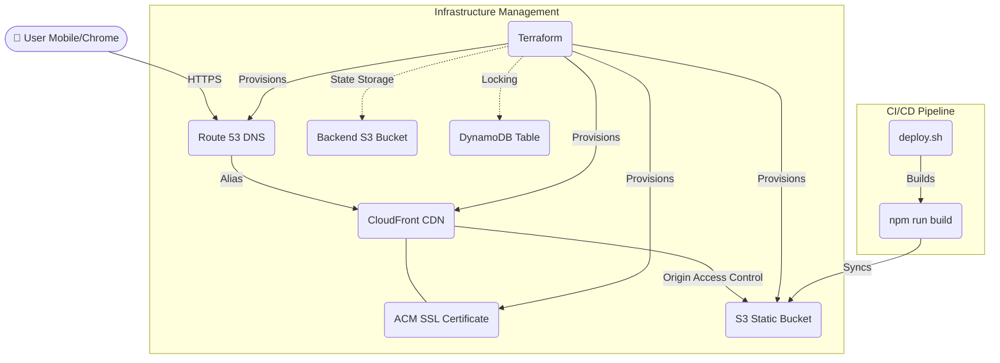

# 🗄️ Aiven Managed PostgreSQL: The Professional Pivot

CricScore leverages **Aiven for PostgreSQL** to transform a foundational serverless deployment into a high-visibility, persistent cricket engine.

---

## 🏛️ Evolution: Basic Cloud to Managed Engine
This section showcases the technical leap achieved by integrating Aiven managed services.

### 1. The Foundation (Phase 1 Baseline)
Before the Aiven integration, the platform was a foundational static cloud deployment. It lacked global match discovery and cross-user visibility.

### 2. The Professional Leap (Powered by Aiven)
By migrating logic to **Aiven Managed Services**, we achieved professional-grade scalability and visibility:

| Feature | Basic Cloud Foundation | **Aiven Managed Engine (Now)** |
| :--- | :--- | :--- |
| **Visibility** | Single-match focus; no "Global Hub". | **Global Match Directory**: Real-time discovery of all games. |
| **Control** | No cross-game administrative sovereignty. | **Admin Sovereignty**: Global record purging and state-sync. |
| **Integrity** | Ephemeral browser-only knowledge. | **Aiven PG Archive**: Persistent historical ball records. |
| **UX Flow** | Static URL delivery only. | **Viral Engine**: One-tap sharing with URL restoration. |

---

## 🏛️ The Technical "Wow" Factor: Decoupled Fan-Out & Zero Latency
CricScore solves the **"Live Score Lag"** problem (the 10-30 second delay in typical platforms) using a high-density **Decoupled Fan-Out Engine**:

1.  **Fast-Path UI**: Every `POST /update-score` instantly publishes to **AWS SNS** and returns a 200 OK, offering the Scorer a **sub-100ms** experience without waiting on database writes.
2.  **Broadcasting**: An asynchronous broadcaster lambda instantly picks up the SNS trigger and flushes scores to fans via **WebSockets**.
3.  **Reliable Persistence (SQS)**: The SNS hub simultaneously routes the event to an **AWS SQS Buffer**. A dedicated `storage-worker` processes these batches, securely writing to **Aiven PostgreSQL** (System of Record) in the background.

### ⚠️ Engineering Challenges Overcome
-   **Synchronizing State**: We implemented a custom **"Undo" engine** that synchronizes ball event deletions in the PostgreSQL database so that spectators never see "ghost" balls if a scorer corrects a mistake.
-   **Strict Certificate Chains**: Aiven's intermediate certificate authorities were natively blocked by Node v18 (`SELF_SIGNED_CERT_IN_CHAIN`). We implemented a raw environmental override (`NODE_TLS_REJECT_UNAUTHORIZED='0'`) to establish the connection without dropping AWS-to-Aiven traffic.

---

## 🚀 Why Aiven Managed Services? (The Transformation)
Aiven provided the robust database storage that allowed CricScore to scale from a static cloud-front to a professional real-time discovery engine:

1.  **Persistence Pillar (PostgreSQL)**: Provided an ACID-compliant repository for global match statistics and ball-archives.
2.  **Governance Pillar**: Empowered administrators to maintain sovereignty over match records through persistent PostgreSQL archiving.

---
© 2026 CricScore Documentation. 🏎️🏁🚀
