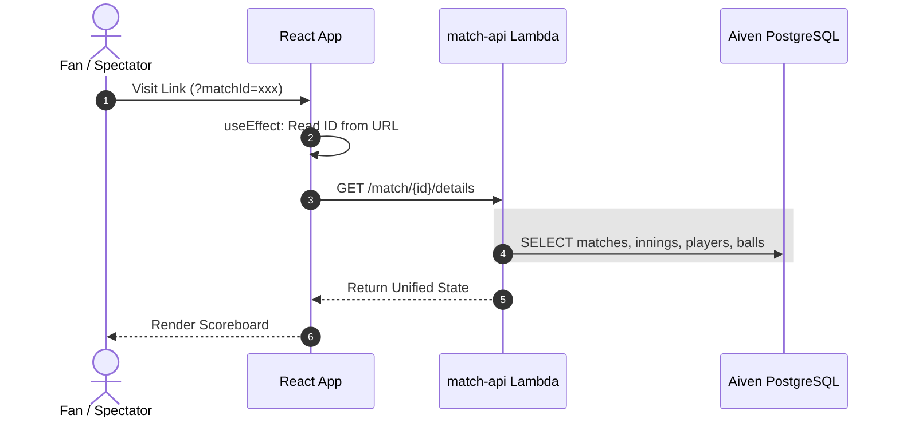
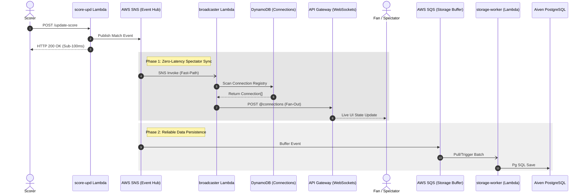

# 🏗️ Architecture: Live Event-Driven Scoring Engine

CricScore is built on a high-concurrency, **Event-Driven Architecture (EDA)** where every ball event is a persistent record in **Aiven PostgreSQL** and a real-time broadcast via **AWS API Gateway WebSockets**.

## 🔄 Detailed Sequence Flows (Fan-Out)

### 1. 📊 Fetch Match Details (Deep-Link Hydration)

### 2. ⚡ Live Score Update (Decoupled Fan-Out)

---

## 🏛️ Technical Pillars & Specifications
CricScore implements a high-performance **Event-Driven Architecture (EDA)** using 100% serverless and managed services:

- **Decoupled Fan-Out:** Leverages AWS SNS for instant UI responses and AWS SQS for asynchronous background persistence to Aiven PostgreSQL.
- **Zero-Latency Broadcast:** Achieves sub-100ms global score delivery using an asynchronous broadcaster lambda driven instantly by SNS.
- **State Restoration:** Automated deep-link hydration for instant bypass-routing to active match scoreboards via UUID-anchored URLs.
- **Aiven TLS Bypass:** Explicit fallback overriding Node v24 strict intermediate CAs (`NODE_TLS_REJECT_UNAUTHORIZED = '0'`) allowing seamless PostgreSQL scaling.
- **UI Render Debouncing:** Synchronous `useRef` execution locks prevent React async state-drifts during rapid scoring bursts, enforcing exact chronological network sequences.
- **Secure Isolation:** Enterprise-grade multi-tenant scoring engine with **VITE_ADMIN_PIN** record governance.

---

## 🏛️ Component Breakdown

### **1. Official Scorer (The Implementation)**
*   **Match Registry**: Games are anchored to a unique, non-sequentially generated UUID provided by the **Aiven PostgreSQL** registry during initialization.
*   **score_update Lambda**: Acts as the scoring producer. Validates incoming ball-by-ball payloads and publishes them to the AWS SNS event hub for downstream fan-out.
*   **State Persistence**: ACID-compliant transactions ensure that innings, scores, and historical ball records are atomically committed.

### **2. Managed Fan Hub (The Discovery Engine)**
*   **match_api Lambda**: The entry point for fans. Handles match discovery hub fetching and initial deep-link hydration to retrieve match state from Aiven PostgreSQL.
*   **broadcaster Lambda**: The heart of the fast-path. It consumes SNS events and performs a massive parallel push to all active spectator WebSocket tunnels by querying the DynamoDB Registry.
*   **WebSocket Lifecycle (onConnect/onDisconnect)**: These Lambdas manage the "who is watching now" registry in DynamoDB, ensuring zero-latency fan-out targeting.
*   **Deep-Link System**: Zero-friction URL-restoration logic for immediate spectator bypass-routing.

### **3. Reliability & Persistence (The Storage Buffer)**
*   **storage_worker Lambda**: Subscribed to the AWS SQS queue. It processes match events in reliable batches, ensuring that even during high-traffic bursts, database commits to Aiven PostgreSQL remain consistent and ordered.

### **4. Security Strategy**
- **Administrative Sovereignty**: Operations impacting global match state (e.g., `DELETE /match/{id}`) are restricted via a **State-Sync PIN** (`VITE_ADMIN_PIN`), ensuring only authorized board-governance actors can purge records.

- **SSL Enforcement**: Mandatory for all Aiven PostgreSQL persistence sessions.
- **Multi-Tenant Isolation**: Dual-scoped session logic ensures that scorer identities and match states are isolated by both Email and MatchID, preventing cross-tenant data leakage.
- **Role-Based Access Hierarchy**:
    - **Viewer 🌍**: Public/No-Auth spectator access based solely on the sharable match UUID.
    - **Scorer 🎮**: Secure/Email-Auth access for persistence and ball-by-ball updates.
    - **Admin ⚡**: Protected/PIN-Auth access for global record purging and database maintenance.

### **5. Infrastructure Automation & CI/CD**
- **Automated Bootstrapping**: `scripts/setup.sh` provides intelligent OS-aware dependency installation (`node`, `terraform`, `jq`, `aws-cli`) across Mac and Linux.
- **Dynamic Variable Hydration**: `deploy.sh` bridges standard uppercase environment variables (`DOMAIN_NAME`) into strict Terraform formats (`TF_VAR_domain_name`), keeping `.env.local` clean.
- **Non-Destructive Configuration**: Local deployment cleanly *appends* live API Gateway and WebSocket URLs into `frontend/.env` without wiping out manual configuration like `VITE_ADMIN_PIN`.
- **Pipeline Dynamics**: The `.github/workflows/backend-infra.yml` utilizes GitHub Repository Variables (`${{ vars.DOMAIN_NAME }}`) rather than hardcoded URLs, ensuring perfectly portable CI/CD workflows across environments.

---
© 2026 CricScore Documentation. 🏎️🏎️🏆🏛️🛡️🏁🚀
