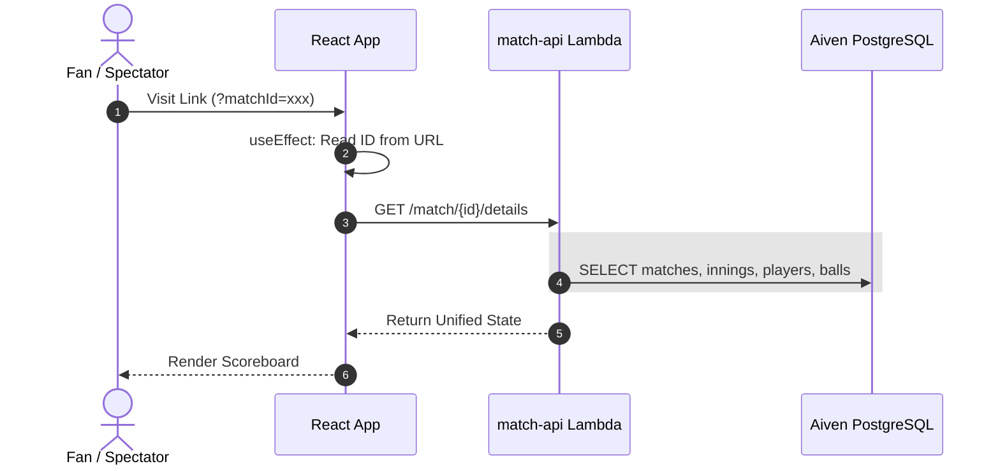
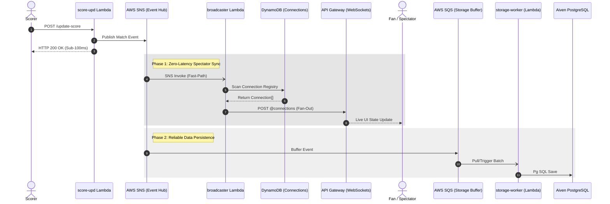

# 🏗️ Architecture: Live Event-Driven Scoring Engine

CricScore is built on a high-concurrency, **Event-Driven Architecture (EDA)** where every ball event is a persistent record in **Aiven PostgreSQL** and a real-time broadcast via **AWS API Gateway WebSockets**.

## 🔄 Detailed Sequence Flows (Fan-Out)

### 1. 📊 Fetch Match Details (Deep-Link Hydration)

```mermaid
sequenceDiagram
    autonumber
    actor Viewer as Fan / Spectator
    participant App as React App
    participant Lambda as match-api Lambda
    participant Aiven_PG as Aiven PostgreSQL

    Viewer->>App: Visit Link (?matchId=xxx)
    App->>App: useEffect: Read ID from URL
    App->>Lambda: GET /match/{id}/details
    rect rgb(0, 0, 0, 0.1)
        Lambda->>Aiven_PG: SELECT matches, innings, players, balls
    end
    Lambda-->>App: Return Unified State
    App-->>Viewer: Render Scoreboard
```

### 2. ⚡ Live Score Update (Decoupled Fan-Out)

```mermaid
sequenceDiagram
    autonumber
    actor Scorer as Scorer
    participant Producer as score-upd Lambda
    participant SNS as AWS SNS (Event Hub)
    participant Broadcaster as broadcaster Lambda
    participant DDB as DynamoDB (Connections)
    participant APIGW_WS as API Gateway (WebSockets)
    actor Viewer as Fan / Spectator

    participant SQS as AWS SQS (Storage Buffer)
    participant Consumer as storage-worker (Lambda)
    participant Aiven_Hub as Aiven PostgreSQL

    Scorer->>Producer: POST /update-score
    Producer->>SNS: Publish Match Event
    Producer-->>Scorer: HTTP 200 OK (Sub-100ms)

    rect rgb(0, 0, 0, 0.1)
        Note right of SNS: Phase 1: Zero-Latency Spectator Sync
        SNS-)Broadcaster: SNS Invoke (Fast-Path)
        Broadcaster->>DDB: Scan Connection Registry
        DDB-->>Broadcaster: Return Connection[]
        Broadcaster->>APIGW_WS: POST @connections (Fan-Out)
        APIGW_WS-->>Viewer: Live UI State Update
    end

    rect rgb(100, 100, 100, 0.1)
        Note right of SNS: Phase 2: Reliable Data Persistence
        SNS->>SQS: Buffer Event
        SQS-)Consumer: Pull/Trigger Batch
        Consumer->>Aiven_Hub: Pg SQL Save
    end
```

---

## 🏛️ Technical Pillars & Specifications

CricScore implements a high-performance **Event-Driven Architecture (EDA)** using 100% serverless and managed services:

- **Decoupled Fan-Out:** Leverages AWS SNS for instant UI responses and AWS SQS for asynchronous background persistence to Aiven PostgreSQL.
- **Zero-Latency Broadcast:** Achieves sub-100ms global score delivery using an asynchronous broadcaster lambda driven instantly by SNS.
- **State Restoration:** Automated deep-link hydration for instant bypass-routing to active match scoreboards via UUID-anchored URLs.
- **X-Ray Distributed Tracing:** AWS X-Ray is actively enabled across the Lambda stack using a strict 5% sampling rule, providing deep insights into cold starts and bottlenecks while mathematically guaranteeing $0 cost.
- **Aiven TLS Bypass:** Explicit fallback overriding Node v24 strict intermediate CAs (`NODE_TLS_REJECT_UNAUTHORIZED = '0'`) allowing seamless PostgreSQL scaling.
- **UI Render Debouncing:** Synchronous `useRef` execution locks prevent React async state-drifts during rapid scoring bursts, enforcing exact chronological network sequences.
- **Secure Isolation:** Enterprise-grade multi-tenant scoring engine with **VITE_ADMIN_PIN** record governance.

---

## 🔐 Authentication & Role Model

> See [`docs/auth.md`](./auth.md) for the full authentication specification.

CricScore uses **AWS Cognito User Pools** with a 4-tier role model:

| Role          | Access                                                                 |
| ------------- | ---------------------------------------------------------------------- |
| **Viewer 🌍** | Public-only, no sign-in required                                       |
| **Guest 🎮**  | Auto-provisioned Cognito shadow account (`guest-{ts}@cricscore.local`) |
| **Scorer 🎮** | Full scorer access; owns their own matches                             |
| **Admin ⚡**  | Full access — delete any match/user, user management                   |

Authorization is enforced at two layers:

1. **Frontend** — JWT presence and `cognito:groups` group check in React state
2. **Backend** — API Gateway JWT Authorizer validates every token; Lambda checks ownership per resource

---

## 🏛️ Component Breakdown

### **1. Official Scorer (The Implementation)**

- **Match Registry**: Games are anchored to a unique UUID provided by **Aiven PostgreSQL** during initialization.
- **score_update Lambda**: Validates ball-by-ball payloads and publishes them to AWS SNS for downstream fan-out.
- **State Persistence**: ACID-compliant transactions ensure innings, scores, and ball records are atomically committed.
- **Cross-Session Identity Guard**: A `prevEmailRef` ref in `App.tsx` detects user identity changes (e.g., guest → real account) and automatically clears all match state, preventing data bleed across sessions.

### **2. Managed Fan Hub (The Discovery Engine)**

- **match_api Lambda**: Handles match discovery, initial deep-link hydration, admin user management APIs, and all CRUD operations with per-resource auth checks.
- **broadcaster Lambda**: Consumes SNS events and performs parallel pushes to active spectator WebSocket tunnels via DynamoDB Registry.
- **WebSocket Lifecycle (onConnect/onDisconnect)**: Manage the "who is watching now" registry in DynamoDB.
- **Admin Panel**: React component providing user management (list, promote, demote, delete) and database cleanup operations. Accessible only to users in the Cognito `Admin` group.

### **3. Reliability & Persistence (The Storage Buffer)**

- **storage_worker Lambda**: Subscribed to AWS SQS. Processes match events in reliable batches ensuring consistent, ordered commits to Aiven PostgreSQL.

### **4. Security Strategy**

- **Cognito SSO Authentication**: All scorer and admin operations require a valid Cognito JWT. API Gateway uses a JWT Authorizer to validate tokens on every request.
- **Per-Resource Authorization**: The `isAuthorized()` function in `match-api` checks that the requesting user is either the match owner, a super-admin email, or in the Cognito `Admin` group.
- **Admin Group**: Managed in Cognito via Terraform. Admin users can perform privileged operations (delete any match, manage users) regardless of match ownership.
- **Guest Isolation**: Guest accounts use shadow Cognito accounts (`guest-*@cricscore.local`) that can be cleaned up by Admins without affecting real user data.
- **SSL Enforcement**: Mandatory for all Aiven PostgreSQL persistence sessions.
- **Multi-Tenant Isolation**: Match states are isolated by `scorer_email` + `matchId`, preventing cross-tenant data leakage.
- **Role-Based Access Hierarchy**:
  - **Viewer 🌍**: Public/No-Auth spectator access based solely on the sharable match UUID.
  - **Scorer 🎮**: Cognito-authenticated access for persistence and ball-by-ball updates. Can only manage matches they created.
  - **Admin ⚡**: Cognito group membership required. Full access to global record management, user administration, and database maintenance.

### **5. Infrastructure Automation & CI/CD**

- **Automated Bootstrapping**: `infra/scripts/setup.sh` provides intelligent OS-aware dependency installation.
- **Dynamic Variable Hydration**: `deploy_local_dev.sh` bridges environment variables into Terraform format.
- **Non-Destructive Configuration**: Local deployment cleanly appends live API Gateway and WebSocket URLs into `apps/frontend/.env`.
- **Pipeline Dynamics**: `.github/workflows/ci-cd.yml` uses GitHub Repository Variables for perfectly portable CI/CD workflows.

---

© 2026 CricScore Documentation. 🏎️🏎️🏆🏛️🛡️🏁🚀
