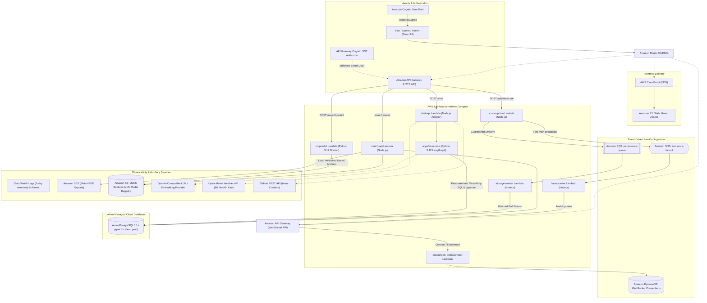
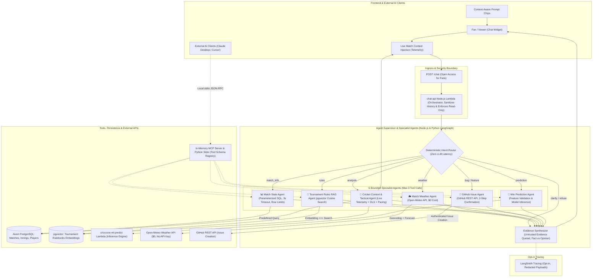
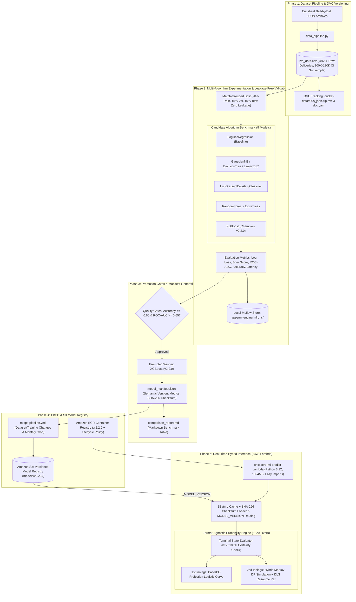
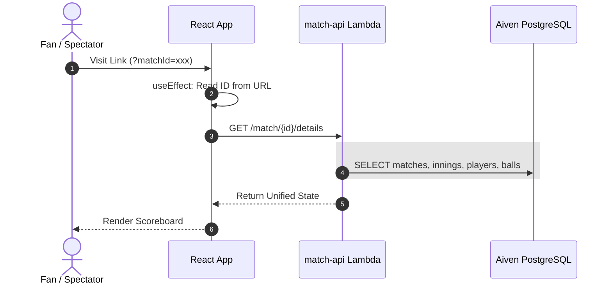
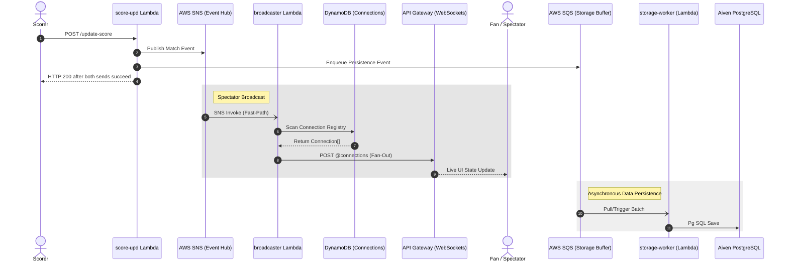

# 🏗️ Architecture: Live Event-Driven Scoring Engine

CricScore is built on a high-concurrency, **Event-Driven Architecture (EDA)** where every ball event is a persistent record in **Aiven PostgreSQL** and a real-time broadcast via **AWS API Gateway WebSockets**.

## 🗺️ System Diagrams (Mermaid)

Editable, text-based versions of the platform diagrams. The icon-based images shown in the main [README](../README.md) are generated from [`docs/diagrams/generate_architecture_diagrams.py`](./diagrams/generate_architecture_diagrams.py).

### ☁️ 1. Multi-Cloud System Architecture: AWS Serverless & Aiven PostgreSQL

The core application platform leverages a serverless, event-driven multi-cloud design separating high-speed real-time ingestion from relational persistence.

```mermaid
flowchart TD
    %% User and CDN Layer
    Client["Fan / Scorer / Admin (React UI)"] --> Route53["Amazon Route 53 (DNS)"]
    Route53 -.-> CloudFront["AWS CloudFront (CDN)"]
    Route53 -.-> APIGW_HTTP["Amazon API Gateway (HTTP API)"]
    Route53 -.-> APIGW_WS["Amazon API Gateway (WebSocket API)"]

    subgraph Edge ["Frontend Delivery"]
        CloudFront --> S3_App["Amazon S3: Static React Assets"]
    end

    %% Security & Ingress
    subgraph Security ["Identity & Authorization"]
        Cognito["Amazon Cognito User Pool"]
        JWT_Auth["API Gateway Cognito JWT Authorizer"]
        Cognito -->|Token Issuance| Client
        JWT_Auth -.->|Enforces Bearer JWT| APIGW_HTTP
    end

    %% Backend Compute
    subgraph Compute ["AWS Lambda Serverless Compute"]
        MatchAPI["match-api Lambda (Node.js)"]
        ScoreUpdate["score-update Lambda (Node.js)"]
        StorageWorker["storage-worker Lambda (Node.js)"]
        Broadcaster["broadcaster Lambda (Node.js)"]
        ConnHandlers["onconnect / ondisconnect Lambdas"]
        ChatAPI["chat-api Lambda (Node.js Adapter)"]
        MLPredict["ml-predict Lambda (Python 3.12 Docker)"]
        AIService["apps/ai-service (Python 3.12 LangGraph)"]
    end

    %% Asynchronous Fan-Out
    subgraph Messaging ["Event-Driven Fan-Out Ingestion"]
        SNS_Score{{"Amazon SNS: live-score-fanout"}}
        SQS_Queue[["Amazon SQS: persistence-queue"]]
        DDB[("Amazon DynamoDB: WebSocket Connections")]
    end

    %% Multi-Cloud Persistence
    subgraph AivenCloud ["Aiven Managed Cloud Database"]
        AivenPG[("Aiven PostgreSQL 16 + pgvector (dev / prod)")]
    end

    %% External & Auxiliary Services
    subgraph Operations ["Observability & Auxiliary Services"]
        CloudWatch["CloudWatch Logs (7-day retention) & Alarms"]
        SES["Amazon SES (Match PDF Reports)"]
        S3_Backups[("Amazon S3: Match Backups & ML Model Registry")]
        OpenAI["OpenAI-Compatible LLM / Embedding Provider"]
        OpenMeteo["Open-Meteo Weather API ($0, No API Key)"]
        GitHubAPI["GitHub REST API (Issue Creation)"]
    end

    %% Wire connections
    APIGW_HTTP -->|/match routes| MatchAPI
    APIGW_HTTP -->|POST /update-score| ScoreUpdate
    APIGW_HTTP -->|POST /chat| ChatAPI
    APIGW_HTTP -->|POST /match/predict| MLPredict
    APIGW_WS -->|Connect / Disconnect| ConnHandlers
    ConnHandlers --> DDB

    ScoreUpdate -->|Fast Path Broadcast| SNS_Score
    ScoreUpdate -->|Guaranteed Delivery| SQS_Queue
    SNS_Score --> Broadcaster
    Broadcaster -->|Push Updates| APIGW_WS
    SQS_Queue --> StorageWorker

    MatchAPI --> AivenPG
    StorageWorker -->|Batched Ball Events| AivenPG
    MatchAPI --> SES
    MatchAPI --> S3_Backups

    MLPredict -->|Load Versioned Model Artifacts| S3_Backups

    ChatAPI --> AIService
    ChatAPI -.-> OpenMeteo
    ChatAPI -.-> GitHubAPI
    AIService -->|Parameterized Read-Only SQL & pgvector| AivenPG
    AIService -.-> OpenAI
```

---

### 🤖 2. Agentic AI, MCP & Specialist Multi-Agent Architecture

CricScore implements a modular Agentic AI platform built on **Model Context Protocol (MCP)**, **LangGraph**, and **LangChain** with strict read-only security boundaries and domain-bounded specialist agents:

```mermaid
flowchart TD
    subgraph UserInterface ["Frontend & External AI Clients"]
        User["Fan / Viewer (Chat Widget)"]
        Chips["Context-Aware Prompt Chips"]
        LiveContext["Live Match Context Injection (Telemetry)"]
        ExtMCP["External AI Clients (Claude Desktop / Cursor)"]
    end

    subgraph SecurityGate ["Ingress & Security Boundary"]
        APIGW_Chat["POST /chat (Open Access for Fans)"]
        NodeAdapter["chat-api Node.js Lambda (Orchestrator, Sanitizes History & Enforces Read-Only)"]
    end

    subgraph AgentSupervisor ["Agent Supervisor & Specialist Agents (Node.js & Python LangGraph)"]
        Classifier{"Deterministic Intent Router (Zero LLM Latency)"}

        subgraph SpecializedAgents ["6 Bounded Specialist Agents (Max 3 Tool Calls)"]
            MatchAgent["📊 Match Stats Agent (Parameterized SQL, 3s Timeout, Row Limits)"]
            RAGAgent["📖 Tournament Rules RAG Agent (pgvector Cosine Search)"]
            WeatherAgent["🌦️ Match Weather Agent (Open-Meteo API, $0 Cost)"]
            IssueAgent["🐛 GitHub Issue Agent (GitHub REST API, 2-Step Confirmation)"]
            AnalysisAgent["🏏 Cricket Context & Tactical Agent (Live Telemetry + DLS + Pacing)"]
            PredictionAgent["🎯 Win Prediction Agent (Feature Validation & Model Inference)"]
        end

        Synthesizer["Evidence Synthesizer (Untrusted Evidence Quoted, Fact vs Opinion)"]
    end

    subgraph DataAndTools ["Tools, Persistence & External APIs"]
        PG_Relational[("Aiven PostgreSQL: Matches, Innings, Players")]
        PG_Vector[("pgvector: Tournament Rulebooks Embeddings")]
        ML_Model["cricscore-ml-predict Lambda (Inference Engine)"]
        WeatherAPI["Open-Meteo Weather API ($0, No API Key)"]
        GitHubAPI_Tool["GitHub REST API (Issue Creation)"]
        MCPServer["In-Memory MCP Server & Python Stdio (Tool Schema Registry)"]
    end

    subgraph Observability ["Opt-in Tracing"]
        LangSmith["LangSmith Tracing (Opt-in, Redacted Payloads)"]
    end

    User --> LiveContext
    Chips --> User
    LiveContext --> APIGW_Chat
    APIGW_Chat --> NodeAdapter
    NodeAdapter --> Classifier

    Classifier -->|match_info| MatchAgent
    Classifier -->|rules| RAGAgent
    Classifier -->|weather| WeatherAgent
    Classifier -->|bug / feature| IssueAgent
    Classifier -->|analysis| AnalysisAgent
    Classifier -->|prediction| PredictionAgent
    Classifier -->|clarify / refuse| Synthesizer

    MatchAgent -->|Predefined Query| PG_Relational
    RAGAgent -->|Embedding <=> Search| PG_Vector
    WeatherAgent -->|Geocoding + Forecast| WeatherAPI
    IssueAgent -->|Authenticated Issue Creation| GitHubAPI_Tool
    AnalysisAgent --> PG_Relational
    AnalysisAgent --> PG_Vector
    AnalysisAgent --> LiveContext
    PredictionAgent --> ML_Model

    MatchAgent --> Synthesizer
    RAGAgent --> Synthesizer
    WeatherAgent --> Synthesizer
    IssueAgent --> Synthesizer
    AnalysisAgent --> Synthesizer
    PredictionAgent --> Synthesizer

    ExtMCP -.->|Local stdio JSON-RPC| MCPServer
    MCPServer -.-> MatchAgent
    MCPServer -.-> RAGAgent
    MCPServer -.-> WeatherAgent
    MCPServer -.-> IssueAgent
    MCPServer -.-> PredictionAgent

    Synthesizer -.-> LangSmith
    Synthesizer --> User
```

#### Complete Specialist Agent & Tool Inventory

| #     | Specialist Agent                          | Capability / MCP Tool                   | Source & Technology         | Key Features & Guardrails                                                                                                                                                                |
| :---- | :---------------------------------------- | :-------------------------------------- | :-------------------------- | :--------------------------------------------------------------------------------------------------------------------------------------------------------------------------------------- |
| **1** | 📊 **Match Stats Agent**                  | `execute_sql`                           | Aiven PostgreSQL 16         | • Strict read-only `SELECT` enforcement • Blocks write/DDL keywords (`DROP`, `DELETE`, `UPDATE`) • 3-second statement timeout                                                    |
| **2** | 📖 **Tournament Rules RAG Agent**         | `search_tournament_rules`               | `pgvector` store (Aiven PG) | • Cosine similarity search on PDF chunks • Proportional powerplay scaling for shortened overs • Strict citation: `[Source: document_name]` • Anti-hallucination truthfulness |
| **3** | 🌦️ **Weather Specialist Agent**           | `get_match_weather`                     | Open-Meteo API              | • Geocoding + hourly forecasts • Rain probability %, temp, wind speed • Cricket & DLS rain advisories • $0 cost (no API key required)                                        |
| **4** | 🐛 **GitHub Issue Reporter Agent**        | `create_github_issue`                   | GitHub REST API             | • Creates labeled issues (`via-cricscore-ai`, category) • 2-step confirmation to capture title & description • Rate-limited: max 1 issue per turn                                |
| **5** | 🏏 **Cricket Context & Tactical Agent**   | Live match context injection            | Real-time scoreboard state  | • Analyzes CRR vs RRR equations • Match phase analysis (Powerplay / Middle / Death) • Evaluates bowler overs and matchup strategy without extra DB queries                       |
| **6** | 🎯 **Win Probability & Prediction Agent** | `predict_match_outcome` / direct Lambda | XGBoost + Markov DP + DLS   | • Validates 8 situational features • Blends ML gradient boosting with dynamic programming • Produces probabilistic percentages and conversational commentary                     |

---

### 🧠 3. Serverless MLOps & Hybrid Win Prediction Architecture

The prediction platform integrates a reproducible **MLOps lifecycle** (DVC + MLflow + GitHub Actions) with a hybrid **Dynamic Programming (DP) + DLS win probability engine**:

```mermaid
flowchart TD
    subgraph DataPipeline ["Phase 1: Dataset Pipeline & DVC Versioning"]
        Cricsheet["Cricsheet Ball-by-Ball JSON Archives"]
        Extractor["data_pipeline.py"]
        RawCSV[("live_data.csv (786K+ Raw Deliveries, 100K-120K CI Subsample)")]
        DVC_Track["DVC Tracking: cricket-data/t20s_json.zip.dvc & dvc.yaml"]
        Cricsheet --> Extractor --> RawCSV --> DVC_Track
    end

    subgraph Experimentation ["Phase 2: Multi-Algorithm Experimentation & Leakage-Free Validation"]
        Splitter["Match-Grouped Split (70% Train, 15% Val, 15% Test: Zero Leakage)"]

        subgraph Candidates ["Candidate Algorithm Benchmark (8 Models)"]
            LogReg["LogisticRegression (Baseline)"]
            NB["GaussianNB / DecisionTree / LinearSVC"]
            HGB["HistGradientBoostingClassifier"]
            RF["RandomForest / ExtraTrees"]
            XGB["XGBoost (Champion v2.2.0)"]
        end

        Metrics["Evaluation Metrics: Log Loss, Brier Score, ROC-AUC, Accuracy, Latency"]
        MLflowStore[("Local MLflow Store: apps/ml-engine/mlruns/")]

        RawCSV --> Splitter --> Candidates --> Metrics --> MLflowStore
    end

    subgraph Governance ["Phase 3: Promotion Gates & Manifest Generation"]
        Gate{"Quality Gates: Accuracy >= 0.60 & ROC-AUC >= 0.65?"}
        Winner["Promoted Winner: XGBoost (v2.2.0)"]
        Manifest["model_manifest.json (Semantic Version, Metrics, SHA-256 Checksum)"]
        Report["comparison_report.md (Markdown Benchmark Table)"]

        Metrics --> Gate
        Gate -->|Approved| Winner --> Manifest --> Report
    end

    subgraph Automation ["Phase 4: CI/CD & S3 Model Registry"]
        WorkflowA["mlops-pipeline.yml (Dataset/Training Changes & Monthly Cron)"]
        S3Registry[("Amazon S3: Versioned Model Registry (models/v2.2.0/)")]
        ECR["Amazon ECR Container Registry (:v2.2.0 + Lifecycle Policy)"]
    end

    subgraph Serving ["Phase 5: Real-Time Hybrid Inference (AWS Lambda)"]
        LambdaContainer["cricscore-ml-predict Lambda (Python 3.12, 1024MB, Lazy Imports)"]
        SafeLoader["S3 /tmp Cache + SHA-256 Checksum Loader & MODEL_VERSION Routing"]

        subgraph HybridEngine ["Format-Agnostic Probability Engine (1–20 Overs)"]
            FirstInn["1st Innings: Par-RPO Projection Logistic Curve"]
            SecondInn["2nd Innings: Hybrid Markov DP Simulation + DLS Resource Par"]
            TerminalCheck["Terminal State Evaluator (0% / 100% Certainty Check)"]
        end

        Manifest --> WorkflowA
        WorkflowA --> S3Registry
        S3Registry -->|MODEL_VERSION| SafeLoader
        ECR --> LambdaContainer
        LambdaContainer --> SafeLoader --> TerminalCheck --> FirstInn
        TerminalCheck --> SecondInn
    end
```

---

## 🔄 Detailed Sequence Flows (Fan-Out)

### 1. 📊 Fetch Match Details (Deep-Link Hydration)

```mermaid
sequenceDiagram
    autonumber
    actor Viewer as Fan / Spectator
    participant App as React App
    participant Lambda as match-api Lambda
    participant Aiven_PG as Aiven PostgreSQL

    Viewer->>App: Visit Link (?matchId=xxx)
    App->>App: useEffect: Read ID from URL
    App->>Lambda: GET /match/{id}/details
    rect rgb(0, 0, 0, 0.1)
        Lambda->>Aiven_PG: SELECT matches, innings, players, balls
    end
    Lambda-->>App: Return Unified State
    App-->>Viewer: Render Scoreboard
```

### 2. ⚡ Live Score Update (Decoupled Fan-Out)

```mermaid
sequenceDiagram
    autonumber
    actor Scorer as Scorer
    participant Producer as score-upd Lambda
    participant SNS as AWS SNS (Event Hub)
    participant Broadcaster as broadcaster Lambda
    participant DDB as DynamoDB (Connections)
    participant APIGW_WS as API Gateway (WebSockets)
    actor Viewer as Fan / Spectator

    participant SQS as AWS SQS (Storage Buffer)
    participant Consumer as storage-worker (Lambda)
    participant Aiven_Hub as Aiven PostgreSQL

    Scorer->>Producer: POST /update-score
    Producer->>SNS: Publish Match Event
    Producer->>SQS: Enqueue Persistence Event
    Producer-->>Scorer: HTTP 200 after both sends succeed

    rect rgb(0, 0, 0, 0.1)
        Note right of SNS: Spectator Broadcast
        SNS-)Broadcaster: SNS Invoke (Fast-Path)
        Broadcaster->>DDB: Scan Connection Registry
        DDB-->>Broadcaster: Return Connection[]
        Broadcaster->>APIGW_WS: POST @connections (Fan-Out)
        APIGW_WS-->>Viewer: Live UI State Update
    end

    rect rgb(100, 100, 100, 0.1)
        Note right of SQS: Asynchronous Data Persistence
        SQS-)Consumer: Pull/Trigger Batch
        Consumer->>Aiven_Hub: Pg SQL Save
    end
```

---

## 🏛️ Technical Pillars & Specifications

CricScore implements an **Event-Driven Architecture (EDA)** using serverless and managed services:

- **Decoupled Fan-Out:** The `score-upd` Lambda publishes to AWS SNS for instant spectator broadcasts and enqueues a separate FIFO message into AWS SQS (`storage-buffer.fifo`) for ordered asynchronous persistence to Aiven PostgreSQL.
- **Authoritative Cumulative State & Strike-Rotation Safety:** Every `POST /match/{id}/score` payload includes authoritative `explicitTotalRuns` and `explicitTotalWickets` alongside `ballData.batterName` (the batter who faced the delivery), ensuring both `storage-worker` and `LiveScoreboard` stay 100% synchronized across odd-run strike rotations, over completions, and `undo: true` rollbacks.
- **WebSocket vs. Polling Recency Guard (`lastWsUpdateRef`):** `LiveScoreboard` suppresses background REST poll overwrites for 3 seconds after any WebSocket push so a lagging database read never reverts a live boundary or wicket.
- **Idempotent Innings & Match Completion:** `POST /match/{id}/innings` uses `ON CONFLICT (match_id, inning_number) DO UPDATE`, and both `storage-worker` and `match-api` automatically resolve optimistic `inn2_<timestamp>` IDs to the canonical PostgreSQL `inning_id`.
- **X-Ray Distributed Tracing:** AWS X-Ray active tracing is enabled across all Lambda functions with a 5% fixed sampling rate and a one-request-per-second reservoir (`infra/terraform/xray.tf`).
- **Scoring Authorization:** Cognito JWTs protect scoring and admin routes at API Gateway, while `match-api` enforces per-resource ownership (`scorer_email`) or Cognito `Admin` group membership. Public match-read routes expose live scoreboards by match UUID.

---

## 🔐 Authentication & Role Model

> See [`docs/auth.md`](./auth.md) for the full authentication specification.

CricScore uses **AWS Cognito User Pools** with a 4-tier role model:

| Role          | Access                                                                                            |
| ------------- | ------------------------------------------------------------------------------------------------- |
| **Viewer 🌍** | Public-only, no sign-in required                                                                  |
| **Guest 🎮**  | Cognito account (`guest-{ts}@cricscore.local`); guest matches are persisted and can be cleaned up |
| **Scorer 🎮** | Authenticated scorer access; owns their own matches                                               |
| **Admin ⚡**  | Admin-group access, with a configured super-admin email bypass for backend operations             |

Authorization for protected operations is enforced at two layers:

1. **Frontend** — JWT presence and `cognito:groups` group check in React state
2. **Backend** — API Gateway JWT Authorizer validates tokens on protected routes; Lambda checks ownership or admin access where applicable. Public routes do not use this authorizer.

---

## 🏛️ Component Breakdown

### **1. Official Scorer (The Implementation)**

- **Match Registry**: Games are anchored to a unique UUID provided by **Aiven PostgreSQL** during initialization.
- **score_update Lambda**: Validates ball-by-ball payloads and publishes them to AWS SNS for downstream fan-out.
- **State Persistence**: Score events are queued through FIFO SQS for asynchronous storage; the live broadcast and database write are separate operations.
- **Cross-Session Identity Guard**: A `prevEmailRef` ref in `App.tsx` detects user identity changes (e.g., guest → real account) and automatically clears all match state, preventing data bleed across sessions.

### **2. Managed Fan Hub (The Discovery Engine)**

- **match_api Lambda**: Handles match discovery, initial deep-link hydration, admin user management APIs, and all CRUD operations with per-resource auth checks.
- **broadcaster Lambda**: Consumes SNS events and performs parallel pushes to active spectator WebSocket tunnels via DynamoDB Registry.
- **WebSocket Lifecycle (onConnect/onDisconnect)**: Manage the "who is watching now" registry in DynamoDB.
- **Admin Panel**: React component providing user management (list, promote, demote, delete) and database cleanup operations. Accessible only to users in the Cognito `Admin` group.

### **3. Reliability & Persistence (The Storage Buffer)**

- **storage_worker Lambda**: Triggered by FIFO AWS SQS batches to persist queued match events to Aiven PostgreSQL.

### **4. Security Strategy**

- **Cognito Authentication**: Scoring and administrative routes require a valid Cognito JWT. API Gateway applies its JWT Authorizer only to configured protected routes; public routes do not use it.
- **Per-Resource Authorization**: The `isAuthorized()` function in `match-api` checks that the requesting user is either the match owner, a super-admin email, or in the Cognito `Admin` group.
- **Admin Group**: Managed in Cognito via Terraform. Administrative routes check group membership; selected backend operations also permit the configured super-admin email.
- **Guest Isolation**: Guest accounts use shadow Cognito accounts (`guest-*@cricscore.local`) that can be cleaned up by Admins without affecting real user data.
- **TLS**: PostgreSQL connections use TLS; the chat API currently disables server-certificate verification.
- **Match Ownership**: Scoring changes check `scorer_email` and `matchId`; public match-read routes remain accessible by match UUID.
- **Role-Based Access Hierarchy**:
  - **Viewer 🌍**: Public/No-Auth spectator access based solely on the sharable match UUID.
  - **Scorer 🎮**: Cognito-authenticated access for persistence and ball-by-ball updates. Can only manage matches they created.
  - **Admin ⚡**: Cognito `Admin` group membership is checked for administrative operations; selected backend operations also allow the configured super-admin email.

### **5. Infrastructure Automation & CI/CD**

- **Automated Bootstrapping**: `infra/scripts/setup.sh` provides intelligent OS-aware dependency installation.
- **Dynamic Variable Hydration**: `./infra/scripts/deploy.sh --env dev` bridges environment variables into Terraform format.
- **Non-Destructive Configuration**: Local deployment cleanly appends live API Gateway and WebSocket URLs into `apps/frontend/.env`.
- **Pipeline Dynamics**: `.github/workflows/ci.yml` validates changes and deploys DEV; `.github/workflows/cd.yml` handles PROD releases. Both use GitHub environment variables and secrets.

### **6. Agentic AI & MCP Specialist Architecture (The Assistant)**

- **Dual-Supervisor Design**:
  - **Serverless Edge Supervisor (`chat-api` Lambda)**: Direct, low-latency Node.js Lambda running an in-memory MCP Client and Server (`InMemoryTransport`). Validates SQL queries as strictly read-only `SELECT` statements, queries `pgvector` for rulebook citations, fetches zero-cost Open-Meteo weather forecasts, and creates GitHub issues via server-side Octokit tokens.
  - **Python Multi-Agent Supervisor (`apps/ai-service`)**: Extended LangGraph supervisor with deterministic intent routing and evidence synthesis across 6 domain-bounded specialist agents.
- **6 Specialist Agents**:
  1. 📊 **Match Stats Agent**: Read-only parameterized PostgreSQL 16 text-to-SQL with 3-second statement timeouts and row limits.
  2. 📖 **Tournament Rules RAG Agent**: `pgvector` cosine similarity search across chunked tournament PDFs with mandatory `[Source: document_name]` citation.
  3. 🌦️ **Weather Specialist Agent**: Open-Meteo API integration ($0 cost, no API keys) providing hourly temperatures, rain probability %, and DLS rain advisories.
  4. 🐛 **GitHub Issue Reporter Agent**: Creates triaged GitHub issues with `via-cricscore-ai` labeling and strict 2-step confirmation to prevent spam.
  5. 🏏 **Cricket Context & Tactical Agent**: Evaluates CRR vs RRR, match phases (Powerplay, Middle, Death), and bowler overs from live telemetry.
  6. 🎯 **Win Probability & Prediction Agent**: Invokes the `ml-predict` inference engine and wraps statistical win likelihood in tactical cricket commentary.

### **7. Serverless MLOps & Hybrid Win Prediction (The Engine)**

- **DVC Dataset Versioning**: Tracks Cricsheet T20 raw ball-by-ball archives (`cricket-data/t20s_json.zip.dvc`, 786K+ raw deliveries) with SHA-256 reproducibility.
- **Multi-Algorithm Benchmarking**: Evaluates 8 candidate models (Logistic Regression, GaussianNB, Decision Trees, Linear SVM, Random Forest, Extra Trees, HistGradientBoosting, and **XGBoost**) via match-grouped 70/15/15 splits to eliminate target leakage.
- **S3 Model Registry & Decoupled ECR Runtime**: Decouples the Python 3.12 Docker runtime in Amazon ECR from the versioned `.joblib` model weights in S3 (`models/${var.ml_model_version}/`), enabling instant zero-downtime rollbacks via Terraform without rebuilding 650MB+ container images.
- **Hybrid Serving Engine (`predict.py`)**: At runtime, `cricscore-ml-predict` dynamically blends XGBoost gradient boosting with a 2nd-innings Markov Chain Dynamic Programming (DP) chase simulation and Duckworth-Lewis-Stern (DLS) resource par tables.

---

© 2026 CricScore Documentation. 🏎️🏎️🏆🏛️🛡️🏁🚀
