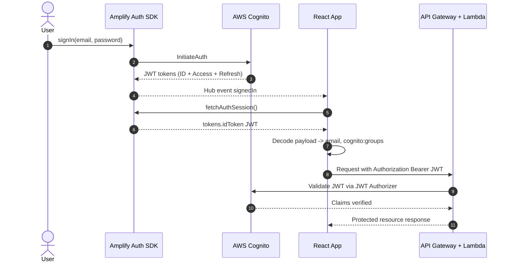

# 🔐 Authentication & Authorization

CricScore uses **AWS Cognito User Pools** for identity management with a tiered role model supporting public viewers, authenticated scorers, guest scorers, and admins.

---

## 🏛️ Auth Architecture Overview

```mermaid
graph TD
    A[User Visits App] --> B{Has Session?}
    B -- No --> C[Amplify Authenticator UI]
    B -- Yes --> D{User Role?}
    C --> E[Sign Up / Sign In]
    C --> F[Continue as Guest]
    F --> G[Guest Cognito Account Created<br/>guest-timestamp@cricscore.local]
    E --> H[Cognito JWT Token Issued]
    G --> H
    H --> D
    D -- Regular User --> I[Scorer View]
    D -- Admin Group --> J[Settings (Admin Panel) + Scorer View]
    D -- No token --> K[Viewer Only]
```

---

## 👤 User Roles

| Role          | Access                                                  | Identity                              |
| ------------- | ------------------------------------------------------- | ------------------------------------- |
| **Viewer 🌍** | Public scoreboard, live feeds, match history            | No auth required                      |
| **Scorer 🎮** | Create & score matches, email reports, view own matches | Cognito User + JWT                    |
| **Guest 🎮**  | Create & score matches (no persistence after session)   | Auto-generated Cognito shadow account |
| **Admin ⚡**  | Everything + User management, delete any match/user     | Cognito `Admin` group membership      |

---

## 🔑 Authentication Flow

### Regular Sign-In / Sign-Up

1. User clicks **SCORER** tab → redirected to Amplify Authenticator
2. Amplify handles Sign Up (with `given_name`, `family_name`, `email`) and Sign In
3. On success, `Hub.listen("auth", "signedIn")` fires → `fetchAuthSession()` retrieves the JWT
4. JWT payload is decoded to extract `email` and `cognito:groups`
5. `userToken` state is set; if user is in `Admin` group, `isAdmin = true`

### Guest Mode

1. User clicks **Continue as Guest** button in Authenticator footer
2. App calls `signOut()` to clear any existing session
3. A shadow Cognito account is created: `signUp({ username: "guest-{timestamp}@cricscore.local" })`
4. Immediately signed in with `signIn()`
5. `isGuestScorer = true` state is set; user gets full Scorer functionality
6. Guest matches are tracked by their `scorer_email` (the guest email)
7. Guest accounts can be deleted by Admins via the Settings (Admin Panel) or AI Chat

### Sign Out

1. User clicks **SIGN OUT** in the top nav
2. `signOut()` is called via `aws-amplify/auth`
3. All auth state is cleared: `userToken`, `isAdmin`, `userEmail` reset to null
4. View resets to `VIEWER`

### Cross-Session Identity Guard

- A `prevEmailRef` ref tracks the last known user email
- When `userEmail` changes (e.g., guest → real user), all match state is automatically cleared:
  - `matchStatus`, `matchId`, `teamA/B`, `currentInnings`, `previousInnings` all reset
  - `hasRestored` resets to `false` so fresh state restoration from `localStorage` occurs
  - View resets to `VIEWER`; `hubKey` increments to force LiveScoreboard refresh
- This prevents stale guest match data from appearing to a newly logged-in user

---

## 🛡️ Authorization Model

### Frontend Guards

```typescript
// In App.tsx — check if user can access SCORER view
if (target === "SCORER" && userToken) setView("SCORER");
// Admin panel requires Cognito Admin group
if (target === "ADMIN" && isAdmin) setView("ADMIN_PANEL");
```

### Backend JWT Validation (API Gateway)

All authenticated routes use an **API Gateway JWT Authorizer** configured against the Cognito User Pool.

```javascript
// match-api/index.js
const getClaims = (event) => {
  const authorizer = event.requestContext?.authorizer || {};
  return authorizer.jwt?.claims || authorizer.claims || {};
};

const isAuthorized = (event, matchRecord) => {
  const claims = getClaims(event);
  const isSuperAdmin = claims.email === process.env.ADMIN_REPORT_EMAIL;
  const hasAdminGroup = (claims["cognito:groups"] || []).includes("Admin");
  if (isSuperAdmin || hasAdminGroup) return true;
  if (matchRecord && claims.email === matchRecord.scorer_email) return true;
  return false;
};
```

**Protected endpoints**: `DELETE /match/{id}`, `POST /innings`, `PATCH /match/{id}`, `POST /match/{id}/email`
**Admin-only endpoints**: `DELETE /matches`, `GET /admin/users`, `POST /admin/users/roles`, `DELETE /admin/users`

---

## 👥 Admin User Management

The Settings tab (Admin Panel) provides full user lifecycle management:

### List Users (`GET /admin/users`)

- Queries Cognito User Pool via `ListUsersCommand`
- Returns: `username`, `email`, `status`, `isAdmin`, `isScorer` flags

### Promote/Demote Roles (`POST/DELETE /admin/users/roles`)

- `POST`: Adds user to Cognito group via `AdminAddUserToGroupCommand`
- `DELETE`: Removes user from Cognito group via `AdminRemoveUserFromGroupCommand`
- Supported roles: `Admin`, `Scorer`

### Delete User (`DELETE /admin/users`)

- Hard-deletes a user from Cognito via `AdminDeleteUserCommand`
- Cascades to delete all match records owned by that user's email
- **Admin-only**: Only users in the `Admin` Cognito group can perform this action

### Delete Guest Users (via AI Chat)

When logged in as admin, you can instruct the AI chatbot to delete guest users:

- The `deleteGuestData` MCP tool filters users whose `email` attribute starts with `guest-` and ends with `@cricscore.local`
- Cognito users are deleted via `AdminDeleteUserCommand`
- Match records are removed via cascading database deletes

---

## 🗝️ Session Token Flow



---

## 🔒 Cognito Infrastructure Configuration

| Setting                 | Value                                                                                                      |
| ----------------------- | ---------------------------------------------------------------------------------------------------------- |
| **User Pool**           | `cricscoredev` (Terraform managed)                                                                         |
| **Auth Flow**           | `USER_SRP_AUTH` + `REFRESH_TOKEN_AUTH`                                                                     |
| **Sign-in Alias**       | Email                                                                                                      |
| **Required Attributes** | `email`, `given_name`, `family_name`                                                                       |
| **Admin Group**         | `Admin` (Cognito User Group)                                                                               |
| **Token Validity**      | ID Token: 1 hour, Refresh Token: 30 days                                                                   |
| **Lambda IAM Policy**   | `lambda_cognito_admin` — `AdminDeleteUser`, `AdminAddUserToGroup`, `AdminRemoveUserFromGroup`, `ListUsers` |

---

## 🧪 Auth-Related Test Coverage

| Test                                    | File                               | Status |
| --------------------------------------- | ---------------------------------- | ------ |
| DELETE /match unauthorized → 403        | `match-api/index.test.js`          | ✅     |
| DELETE /match authorized (owner) → 200  | `match-api/index.test.js`          | ✅     |
| POST /match without JWT → 401           | `match-api/index.test.js`          | ✅     |
| Admin group can delete any match        | `match-api/index.test.js`          | ✅     |
| GET /admin/users non-admin → 403        | `match-api/index.test.js`          | ✅     |
| Guest user detection by email attribute | `chat-api/mcp/tools/tools.test.js` | ✅     |

---

© 2026 CricScore Documentation
