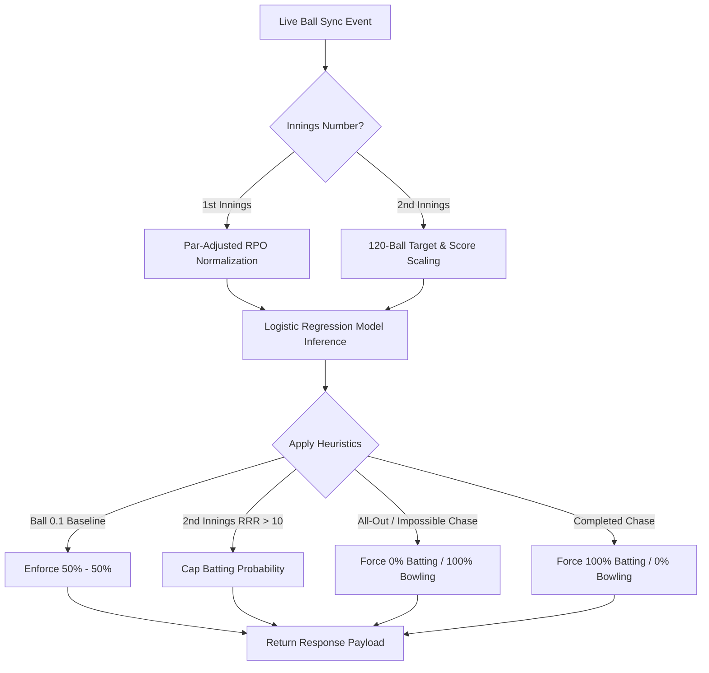

# 🧮 CricScore Prediction Engine & DLS (Duckworth-Lewis-Stern) Specification

This document details the exact mathematical models, scaling algorithms, heuristic overrides, and **Duckworth-Lewis-Stern (DLS)** par-score calculations powering the real-time AI Match Predictor in CricScore.

---

## 📊 Part 1: Live Win Predictor Calculations

The live prediction engine (`apps/ml-engine/predict.py`) calculates real-time win probabilities after every ball using a combination of **Logistic Regression** and **Shortened-Match Feature Normalization**.

### 1. 1st Innings Feature Normalization (Par-Adjusted RPO Scaling)

In shortened matches (e.g. 1, 5, 10, or 15 overs), raw inputs like `balls_left = 5` at ball 0.1 would trick a T20 model into treating the match as an exhausted 20th over.

To fix this, CricScore calculates a dynamic **Expected Par Run Rate (RPO)** based on match length:

$$\text{par\_rpo} = 8.0 + (20 - \text{total\_overs}) \times 0.2$$

$$\text{match\_par} = \max(1.0, \text{par\_rpo} \times \text{total\_overs})$$

#### Scaled Model Inputs:

$$\text{model\_current\_score} = \left( \frac{\text{current\_score}}{\text{match\_par}} \right) \times 160.0$$

$$\text{model\_balls\_left} = \left( \frac{\text{balls\_left}}{\text{total\_match\_balls}} \right) \times 120.0$$

- **Example (1-Over Match, 9 runs in 5 balls)**:
  - $\text{total\_overs} = 1.0 \implies \text{par\_rpo} = 11.8 \implies \text{match\_par} = 11.8$
  - $\text{model\_current\_score} = (9 / 11.8) \times 160 = 122.0$ (standard T20 equivalent)
  - Result: Win probability is calibrated smoothly at **87%**, avoiding false 99% spikes.

---

### 2. 2nd Innings Feature Normalization

During the 2nd innings chase, both the `current_score` and `target_score` are normalized to 120-ball T20 baseline equivalents using the scale factor:

$$\text{scale\_factor} = \frac{120.0}{\text{total\_match\_balls}}$$

$$\text{model\_current\_score} = \text{current\_score} \times \text{scale\_factor}$$

$$\text{model\_target\_score} = \text{target\_score} \times \text{scale\_factor}$$

$$\text{model\_balls\_left} = \text{balls\_left} \times \text{scale\_factor}$$

- **Example (1-Over Match, Target 7, Score 2/0 in 3 balls)**:
  - $\text{scale\_factor} = 20.0$
  - $\text{model\_current\_score} = 40.0$, $\text{model\_target\_score} = 140.0$, $\text{model\_balls\_left} = 60.0$
  - Result: Evaluated as needing 100 runs in 60 balls ($RRR = 10.0$), giving a realistic **62% Win Probability**.

---

### 3. Hard Heuristic Overrides

To guarantee mathematical sanity, the prediction engine applies strict rule-based overrides:

| Scenario               | Rule Condition                                                            | Resulting Win Probability       |
| :--------------------- | :------------------------------------------------------------------------ | :------------------------------ |
| **Match Start**        | `inning == 1` AND `score == 0` AND `wickets == 0` AND `balls_bowled == 0` | **50% Batting / 50% Bowling**   |
| **Completed Chase**    | `inning == 2` AND `current_score >= target_score`                         | **100% Batting / 0% Bowling**   |
| **All Out**            | `wickets_lost >= 10`                                                      | **0% Batting / 100% Bowling**   |
| **Impossible Target**  | `inning == 2` AND `(target_score - current_score) > balls_left * 6`       | **0% Batting / 100% Bowling**   |
| **Extreme RRR (> 18)** | `inning == 2` AND `RRR > 18.0`                                            | **Batting Win % Capped at 1%**  |
| **High RRR (> 15)**    | `inning == 2` AND `RRR > 15.0`                                            | **Batting Win % Capped at 5%**  |
| **Steep RRR (> 12)**   | `inning == 2` AND `RRR > 12.0`                                            | **Batting Win % Capped at 15%** |

---

## 🌧️ Part 2: Duckworth-Lewis-Stern (DLS) Method Specification

The **Duckworth-Lewis-Stern (DLS)** method is the standard mathematical formula used in professional cricket (ICC) to reset targets and determine match winners during rain interruptions or shortened innings.

### 1. The Core Concept: Resources Remaining ($R$)

DLS models a batting team's scoring capacity as a function of two resources:

1. **Overs Remaining** ($u$)
2. **Wickets Lost** ($w$)

The percentage of resources remaining ($R$) is defined by the exponential decay formula:

$$R(u, w) = R_0(w) \times \left( 1 - e^{-b(w) \cdot u} \right)$$

Where:

- $u$ = Overs remaining in the innings ($0 \le u \le 20$ for T20).
- $w$ = Number of wickets lost ($0 \le w \le 9$).
- $R_0(w)$ = Maximum resource available with $w$ wickets lost.
- $b(w)$ = Decay constant for $w$ wickets lost.

#### Standard T20 Resource Table ($R_0$ and $b$ parameters):

| Wickets Lost ($w$) | $R_0(w)$ (%) | Decay Constant $b(w)$ | Resource at 20 overs ($u=20$) |
| :----------------: | :----------: | :-------------------: | :---------------------------: |
|       **0**        |    100.0%    |        0.0544         |            100.0%             |
|       **1**        |    93.4%     |        0.0558         |             91.2%             |
|       **2**        |    85.1%     |        0.0575         |             82.5%             |
|       **3**        |    74.9%     |        0.0598         |             72.1%             |
|       **4**        |    62.7%     |        0.0631         |             59.8%             |
|       **5**        |    48.5%     |        0.0682         |             45.8%             |
|       **6**        |    33.1%     |        0.0765         |             30.9%             |
|       **7**        |    18.7%     |        0.0910         |             17.3%             |
|       **8**        |     8.2%     |        0.1200         |             7.5%              |
|       **9**        |     2.1%     |        0.1800         |             1.9%              |

---

### 2. DLS Par Score Calculation (Rain / Interruption)

When rain stops play during the 2nd innings, DLS calculates the **Par Score** (the score team 2 needed to be at that exact ball to tie the match).

#### Formula for DLS Target Score:

1. **Calculate Team 1 Resource Used**: $R_1 = R(20, 0) = 100\%$
2. **Calculate Team 2 Resource Available**: $R_2 = R(\text{overs\_left}, \text{wickets\_lost})$
3. **Calculate DLS Par Score**:

$$\text{DLS Par Score} = \left\lfloor \text{Team 1 Score} \times \left( \frac{R_2}{R_1} \right) \right\rfloor$$

$$\text{DLS Target to Win} = \text{DLS Par Score} + 1$$

- **Winner Decision Rule**:
  - If $\text{Team 2 Score} > \text{DLS Par Score} \implies$ **Team 2 Wins** by DLS Method.
  - If $\text{Team 2 Score} < \text{DLS Par Score} \implies$ **Team 1 Wins** by DLS Method.
  - If $\text{Team 2 Score} == \text{DLS Par Score} \implies$ **Match Tied** by DLS Method.

---

### 3. Example DLS Calculation

**Scenario**: Team 1 scored **160/6** in 20 overs.
Team 2 is chasing in the 2nd innings. Rain stops play at **10.0 overs** (10 overs left, $u=10$), and Team 2 is at **75/2** (2 wickets down, $w=2$).

1. **Team 1 Resource ($R_1$)**: $100\%$
2. **Team 2 Resource Remaining ($R_2$)**:
   $$R(10, 2) = 85.1 \times \left( 1 - e^{-0.0575 \times 10} \right) \approx 37.2\%$$
   Since Team 2 already used $82.5\% - 37.2\% = 45.3\%$ of their resources.
3. **DLS Par Score**:
   $$\text{DLS Par Score} = \lfloor 160 \times 0.453 \rfloor = 72 \text{ runs}$$

4. **Result**:
   Team 2 is at **75/2**, which is higher than the DLS Par Score of **72**.
   **Team 2 is leading by 3 runs on DLS!** If the match is abandoned now, Team 2 wins.
