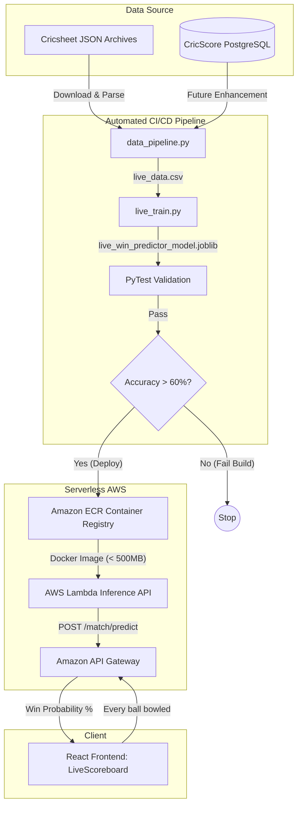
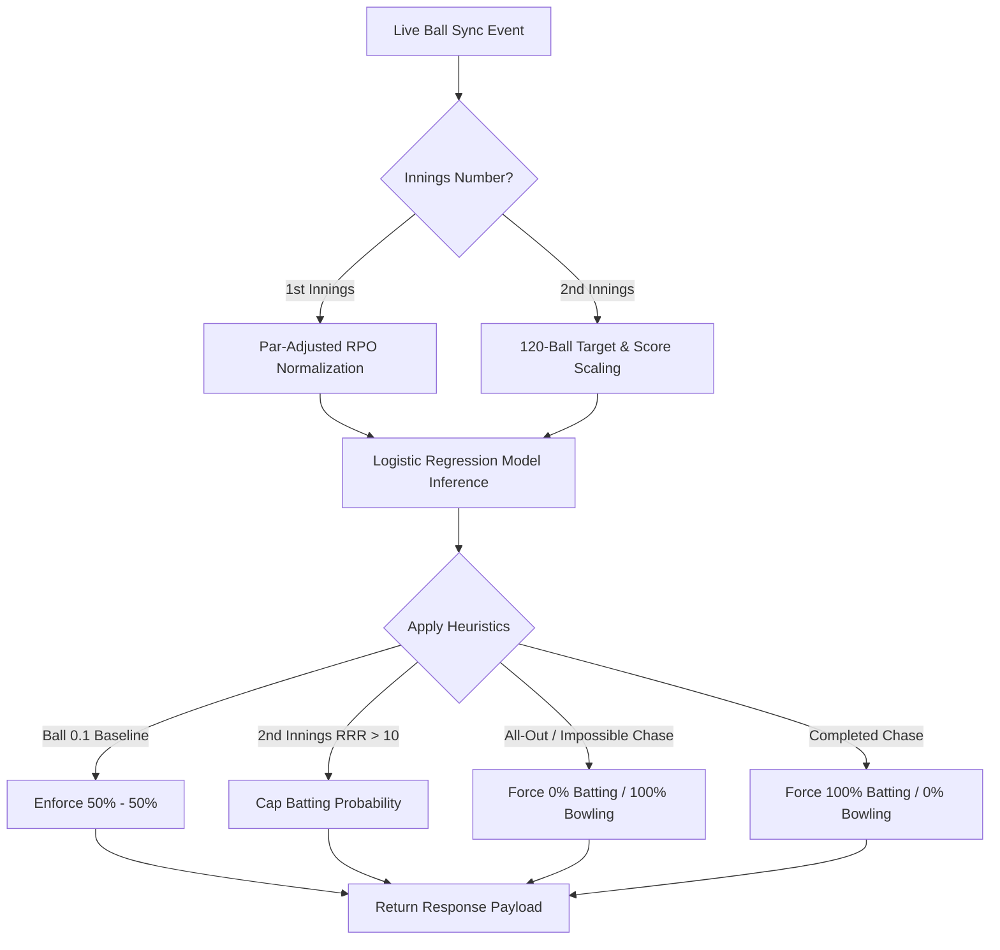

# 🤖 Zero-Cost Serverless MLOps Tutorial

This guide walks through the end-to-end Machine Learning Operations (MLOps) pipeline integrated into the CricScore project. The goal of this pipeline is to predict the outcome of a T20 match based on historical data.

Most importantly, this pipeline is designed to be **100% free** and highly scalable. It avoids expensive GPU instances, heavy ML platforms (like SageMaker), or large inference servers by leveraging GitHub Actions for training and AWS Lambda for inference.

**Quick Navigation:** [Architecture](#️-1-architecture-overview) · [Data Pipeline](#-2-the-data-pipeline-live_datacsv) · [Training](#-3-model-training-live_trainpy) · [CI/CD Gate](#-4-automated-cicd-gate-mlops-pipelineyml) · [Docker Inference](#️-5-serverless-docker-inference-predictpy) · [Frontend](#️-6-frontend-integration) · [Troubleshooting](#-7-lessons-learned--troubleshooting) · [Win Prediction Spec](#-8-win-prediction-engine-specification) · [DLS Method](#️-9-duckworth-lewis-stern-dls-method)

---

## 🏗️ 1. Architecture Overview

The MLOps pipeline consists of four main stages:

1. **Data Ingestion & Preprocessing**: Automatically downloads raw ball-by-ball JSON data from [Cricsheet](https://cricsheet.org/) and compiles it into a structured tabular format (`live_data.csv`).
2. **Model Training & Evaluation**: Trains a lightweight Scikit-Learn `LogisticRegression` model. The training script strictly enforces chronological data splitting to prevent **data leakage** (future events predicting past outcomes).
3. **Continuous Integration (CI) Gate**: A GitHub Actions workflow that automatically runs the pipeline on a monthly cron schedule or manual trigger. It runs a `pytest` suite and enforces a strict accuracy gate (e.g., >60%) before deploying the model.
4. **Serverless Inference**: The model is bundled into an AWS ECR Docker Container, exposing a `POST /match/predict` endpoint via API Gateway with sub-100ms latency.

---

## 📊 2. The Data Pipeline (`live_data.csv`)

**Location**: `apps/ml-engine/data/live_data.csv` (Ignored by Git)

The data pipeline extracts ball-by-ball match situations instead of just pre-match summaries.

**Key Features Extracted:**

- `current_score`: Total runs scored so far.
- `wickets_lost`: Number of wickets fallen.
- `balls_left`: Remaining balls in the innings.
- `target_score`: The target score to win (if in the 2nd innings, otherwise -1).
- `winner`: The team that ultimately won the match.

The script compiles a highly structured `live_data.csv` into a `.gitignore`'d directory (`apps/ml-engine/data/`) to prevent bloating the Git repository.

---

## 🧠 3. Model Training (`live_train.py`)

**Location**: `apps/ml-engine/live_train.py`

We use a robust `LogisticRegression` model trained on in-match dynamic variables.

**Key ML Concepts Applied:**

- **Dynamic State Evaluation**: The model assesses win probability based on the _current match situation_ rather than static pre-match attributes.
- **Categorical Encoding**: Handles string-based features (Team Names).
- **Artifact Generation**: The pipeline outputs two files:
  - `live_win_predictor_model.joblib`: The serialized model weights.
  - `live_metadata.json`: Contains model version, accuracy metrics, and timestamp.

---

## 🚦 4. Automated CI/CD Gate (`mlops-pipeline.yml`)

**Location**: `.github/workflows/mlops-pipeline.yml`

ML models degrade over time (Data Drift). To keep the model fresh, we need a way to safely retrain it.

This GitHub Action triggers whenever changes are made in `apps/ml-engine/`.

1. It installs dependencies (`scikit-learn`, `pandas`).
2. Runs the data pipeline.
3. Runs the training script.
4. **The Gate**: The training script exits with an error code if the model accuracy falls below acceptable thresholds.
5. The resulting lightweight `.joblib` model artifact is then bundled for deployment.

---

## ☁️ 5. Serverless Docker Inference (`predict.py`)

**Location**: `apps/ml-engine/predict.py` & `apps/ml-engine/Dockerfile`

Instead of deploying a traditional zipped Lambda package, the live model is containerized using Docker and hosted on **AWS ECR (Elastic Container Registry)**.

**Serverless Container Execution (Firecracker MicroVM):**
A common misconception is that a Docker image in ECR requires a running server (like ECS or Fargate) to serve requests. However, AWS Lambda natively supports Docker Images under the hood using **Firecracker MicroVMs**.

- The image sits idle in ECR costing nothing.
- When an API Gateway request arrives, Lambda provisions a MicroVM, spins up the container in milliseconds, and executes `predict.py`.
- Once the response is sent, the container is frozen. If no new requests arrive, it is automatically destroyed. You get the heavy dependency support of Docker with the zero-idle-cost benefits of Serverless!

**How it works:**

1. **Containerization**: A `Dockerfile` bundles the `live_win_predictor_model.joblib`, `predict.py`, and dependencies into an AWS Lambda Python base image.
2. **ECR Storage**: The image is pushed to a Private ECR Repository. Private ECR provides **500MB per month of free storage** under the AWS Free Tier. We overwrite the `latest` tag continuously to ensure we stay well under this 500MB free limit (even though Lambda container images can theoretically support up to 10GB sizes).
3. **Execution**: The handler accepts a JSON payload of the live match state, executes `model.predict_proba()`, and returns live ball-by-ball win probabilities.

---

## 🖥️ 6. Frontend Integration

**Location**: `apps/frontend/src/components/AiMatchPrediction.tsx`

The React frontend seamlessly integrates with the Lambda endpoint. Inside the Live Scoreboard view, an `AiMatchPrediction` component issues a `POST` request to the API Gateway after every single ball.

The UI visualizes the probabilities using a compact progress bar nestled right inside the scoreboard header, providing fans and scorers with real-time AI insights.

---

## 🛑 7. Lessons Learned & Troubleshooting

During the development of this MLOps pipeline, we faced and resolved several critical infrastructure issues:

- **AWS Lambda Zip Size Limits**: Initially, we deployed the model via standard `.zip` files. However, the combined size of `pandas`, `scikit-learn`, and the `.joblib` model exceeded Lambda's strict 250MB unzipped limit. **Fix**: We migrated the architecture to AWS ECR Docker Container Images, which increased the limit to 10GB.
- **Out-of-Distribution (OOD) Shortened Matches (e.g. 1-Over Matches)**: Logistic regression models trained on T20 data (`balls_left = 120`) misinterpret shortened match features. Raw linear scaling (`9 runs * 120 / 6 = 180 T20 runs`) falsely projects 9 runs in a 1-over match as an invincible 180 T20 score, inflating win probability to 99%. **Fix**: We introduced Par-Adjusted RPO Scaling (`par_rpo = 8.0 + (20.0 - total_overs) * 0.2`) in `predict.py`, which projects shortened match scores against realistic T20 par benchmarks (calibrating 9 runs in 5 balls to a realistic 87% win probability).
- **Batting vs. Bowling Team Mapping Alignment**: The frontend `AiMatchPrediction` component initially passed static `teamA` and `teamB` strings to the API, causing inverted win predictions during 2nd innings when `teamB` was batting. **Fix**: `AiMatchPrediction.tsx` now dynamically passes `battingTeam` as `team1` and `bowlingTeam` as `team2`, ensuring backend predictions match who is actively at the crease.
- **Start of Match Baseline (50% / 50%)**: At the beginning of 1st innings (`currentScore = 0`, `wicketsLost = 0`), the model initially output skewed weights for shortened match configurations. **Fix**: Explicitly enforced a 50% - 50% baseline rule at the start of every match before scoring begins.
- **Impossible Chase Heuristics**: In 2nd innings chases where the required runs exceed maximum physical possibility (`runsNeeded > ballsLeft * 6`), standard ML models can output nonsensical probabilities. **Fix**: Added explicit hard overrides ensuring 0% win probability for the chasing team and 100% for the defending team.

---

## 📊 8. Win Prediction Engine Specification

This section details the exact mathematical models, scaling algorithms, heuristic overrides, and wicket sensitivity calculations powering the real-time AI Match Predictor in CricScore (`apps/ml-engine/predict.py`).

### 🏗️ Inference Pipeline

The live prediction engine calculates real-time win probabilities after every ball using a combination of **Logistic Regression** and **Shortened-Match Feature Normalization**.

### 🧮 1st Innings Feature Normalization (Par-Adjusted RPO Scaling)

In shortened matches (e.g. 1, 5, 10, or 15 overs), raw inputs like `balls_left = 5` at ball 0.1 would trick a T20 model into treating the match as an exhausted 20th over.

To fix this, CricScore calculates a dynamic **Expected Par Run Rate (RPO)** based on match length:

$$\text{par\_rpo} = 8.0 + (20 - \text{total\_overs}) \times 0.2$$

$$\text{match\_par} = \max(1.0, \text{par\_rpo} \times \text{total\_overs})$$

#### Scaled Model Inputs:

$$\text{model\_current\_score} = \left( \frac{\text{current\_score}}{\text{match\_par}} \right) \times 160.0$$

$$\text{model\_balls\_left} = \left( \frac{\text{balls\_left}}{\text{total\_match\_balls}} \right) \times 120.0$$

- **Example (1-Over Match, 9 runs in 5 balls)**:
  - $\text{total\_overs} = 1.0 \implies \text{par\_rpo} = 11.8 \implies \text{match\_par} = 11.8$
  - $\text{model\_current\_score} = (9 / 11.8) \times 160 = 122.0$ (standard T20 equivalent)
  - Result: Win probability is calibrated smoothly at **87%**, avoiding false 99% spikes.

### 🎯 2nd Innings Feature Normalization

During the 2nd innings chase, both the `current_score` and `target_score` are normalized to 120-ball T20 baseline equivalents using the scale factor:

$$\text{scale\_factor} = \frac{120.0}{\text{total\_match\_balls}}$$

$$\text{model\_current\_score} = \text{current\_score} \times \text{scale\_factor}$$

$$\text{model\_target\_score} = \text{target\_score} \times \text{scale\_factor}$$

$$\text{model\_balls\_left} = \text{balls\_left} \times \text{scale\_factor}$$

- **Example (1-Over Match, Target 7, Score 2/0 in 3 balls)**:
  - $\text{scale\_factor} = 20.0$
  - $\text{model\_current\_score} = 40.0$, $\text{model\_target\_score} = 140.0$, $\text{model\_balls\_left} = 60.0$
  - Result: Evaluated as needing 100 runs in 60 balls ($RRR = 10.0$), giving a realistic **62% Win Probability**.

### 🛑 Hard Heuristic Overrides

To guarantee mathematical sanity, the prediction engine applies strict rule-based overrides:

| Scenario               | Rule Condition                                                            | Resulting Win Probability       |
| :--------------------- | :------------------------------------------------------------------------ | :------------------------------ |
| **Match Start**        | `inning == 1` AND `score == 0` AND `wickets == 0` AND `balls_bowled == 0` | **50% Batting / 50% Bowling**   |
| **Completed Chase**    | `inning == 2` AND `current_score >= target_score`                         | **100% Batting / 0% Bowling**   |
| **All Out**            | `wickets_lost >= 10`                                                      | **0% Batting / 100% Bowling**   |
| **Impossible Target**  | `inning == 2` AND `(target_score - current_score) > balls_left * 6`       | **0% Batting / 100% Bowling**   |
| **Extreme RRR (> 18)** | `inning == 2` AND `RRR > 18.0`                                            | **Batting Win % Capped at 1%**  |
| **High RRR (> 15)**    | `inning == 2` AND `RRR > 15.0`                                            | **Batting Win % Capped at 5%**  |
| **Steep RRR (> 12)**   | `inning == 2` AND `RRR > 12.0`                                            | **Batting Win % Capped at 15%** |

### 🏏 Wicket Sensitivity Analysis

Wickets lost (`wickets_lost`) are a major non-linear feature in the Logistic Regression model. Each wicket reduces remaining batting depth and increases pressure on lower-order batters.

#### Probability Shifts by Wicket Loss (2nd Innings Chases):

1. **Standard T20 Chase (Target 160, Score 80 in 10.0 overs — 60 balls left, 80 needed)**:
   - **0 Wickets Lost (80/0)**: **78% Win Probability**
   - **1 Wicket Lost (80/1)**: **70% Win Probability**
   - **2 Wickets Lost (80/2)**: **60% Win Probability**
   - **3 Wickets Lost (80/3)**: **50% Win Probability**
   - **5 Wickets Lost (80/5)**: **30% Win Probability**
   - **8 Wickets Lost (80/8)**: **11% Win Probability**
   - **10 Wickets Lost (All Out)**: **0% Win Probability** (Loss)

2. **1-Over Shortened Chase (Target 10, Score 5 in 0.3 overs — 3 balls left, 5 needed)**:
   - **0 Wickets Lost (5/0)**: **59% Win Probability**
   - **1 Wicket Lost (5/1)**: **49% Win Probability**
   - **2 Wickets Lost (5/2)**: **39% Win Probability**
   - **10 Wickets Lost (All Out)**: **0% Win Probability** (Loss)

---

## 🌧️ 9. Duckworth-Lewis-Stern (DLS) Method

This section details the exact mathematical formulas, ICC resource decay parameters, par score calculations, and tiebreaker rules for the **Duckworth-Lewis-Stern (DLS)** method implemented in CricScore (`apps/frontend/src/utils/dlsUtils.ts`).

### 📐 The Core Concept: Resources Remaining ($R$)

The DLS method models a batting team's scoring capacity as a function of two fundamental resources:

1. **Overs Remaining** ($u$)
2. **Wickets Lost** ($w$)

The percentage of resources remaining ($R$) is defined by the exponential decay formula:

$$R(u, w) = R_0(w) \times \left( 1 - e^{-b(w) \cdot u} \right)$$

Where:

- $u$ = Overs remaining in the innings ($0 \le u \le 20$ for T20).
- $w$ = Number of wickets lost ($0 \le w \le 9$).
- $R_0(w)$ = Maximum resource available with $w$ wickets lost.
- $b(w)$ = Decay constant for $w$ wickets lost.

#### Standard T20 Resource Table ($R_0$ and $b$ parameters):

| Wickets Lost ($w$) | $R_0(w)$ (%) | Decay Constant $b(w)$ | Resource at 20 overs ($u=20$) |
| :----------------: | :----------: | :-------------------: | :---------------------------: |
|       **0**        |    100.0%    |        0.0544         |            100.0%             |
|       **1**        |    93.4%     |        0.0558         |             91.2%             |
|       **2**        |    85.1%     |        0.0575         |             82.5%             |
|       **3**        |    74.9%     |        0.0598         |             72.1%             |
|       **4**        |    62.7%     |        0.0631         |             59.8%             |
|       **5**        |    48.5%     |        0.0682         |             45.8%             |
|       **6**        |    33.1%     |        0.0765         |             30.9%             |
|       **7**        |    18.7%     |        0.0910         |             17.3%             |
|       **8**        |     8.2%     |        0.1200         |             7.5%              |
|       **9**        |     2.1%     |        0.1800         |             1.9%              |

### 🎯 DLS Par Score Calculation (Rain / Interruption)

When rain or weather interruptions stop play during the 2nd innings, DLS calculates the **Par Score** (the target score team 2 needed to reach at that exact ball to tie the match).

#### Formula for DLS Target Score:

1. **Calculate Team 1 Resource Used**: $R_1 = R(20, 0) = 100\%$
2. **Calculate Team 2 Resource Available**: $R_2 = R(\text{overs\_left}, \text{wickets\_lost})$
3. **Calculate DLS Par Score**:

$$\text{DLS Par Score} = \left\lfloor \text{Team 1 Score} \times \left( \frac{R_2}{R_1} \right) \right\rfloor$$

$$\text{DLS Target to Win} = \text{DLS Par Score} + 1$$

#### Winner Decision Rules:

- If $\text{Team 2 Score} > \text{DLS Par Score} \implies$ **Team 2 Wins** by DLS Method.
- If $\text{Team 2 Score} < \text{DLS Par Score} \implies$ **Team 1 Wins** by DLS Method.
- If $\text{Team 2 Score} == \text{DLS Par Score} \implies$ **Match Tied** by DLS Method.

### 💡 Step-by-Step Worked Example

**Scenario**: Team 1 scored **160/6** in 20 overs.
Team 2 is chasing in the 2nd innings. Rain stops play at **10.0 overs** (10 overs left, $u=10$), and Team 2 is at **75/2** (2 wickets down, $w=2$).

1. **Team 1 Resource ($R_1$)**: $100\%$
2. **Team 2 Resource Remaining ($R_2$)**:
   $$R(10, 2) = 85.1 \times \left( 1 - e^{-0.0575 \times 10} \right) \approx 37.2\%$$
   Since Team 2 already used $82.5\% - 37.2\% = 45.3\%$ of their resources.
3. **DLS Par Score**:
   $$\text{DLS Par Score} = \lfloor 160 \times 0.453 \rfloor = 72 \text{ runs}$$

4. **Result**:
   Team 2 is at **75/2**, which is higher than the DLS Par Score of **72**.
   **Team 2 is leading by 3 runs on DLS!** If the match is abandoned now, Team 2 wins.

---

## 🔮 Future Enhancements

As this is an experimental pipeline, there are several ways to scale it up:

- **Player-Level Data**: Aggregating individual player statistics (strike rate, bowling economy) to determine team strength dynamically based on who is currently at the crease.
- **Deep Learning**: Now that we use ECR Containers, we have the space to include heavier frameworks like PyTorch or TensorFlow if the model complexity increases.
