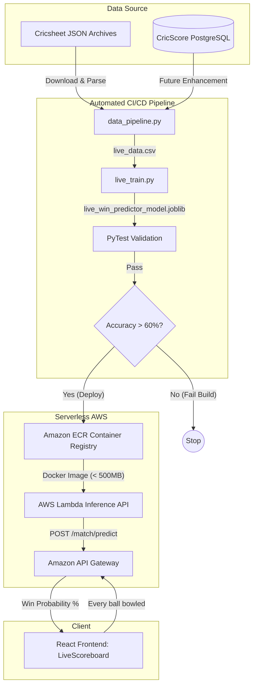

# 🤖 Zero-Cost Serverless MLOps Tutorial

This guide walks through the end-to-end Machine Learning Operations (MLOps) pipeline integrated into the CricScore project. The goal of this pipeline is to predict the outcome of a T20 match based on historical data.

Most importantly, this pipeline is designed to be **100% free** and highly scalable. It avoids expensive GPU instances, heavy ML platforms (like SageMaker), or large inference servers by leveraging GitHub Actions for training and AWS Lambda for inference.

---

## 🏗️ 1. Architecture Overview

The MLOps pipeline consists of four main stages:

1. **Data Ingestion & Preprocessing**: Automatically downloads raw ball-by-ball JSON data from [Cricsheet](https://cricsheet.org/) and compiles it into a structured tabular format (`live_data.csv`).
2. **Model Training & Evaluation**: Trains a lightweight Scikit-Learn `LogisticRegression` model. The training script strictly enforces chronological data splitting to prevent **data leakage** (future events predicting past outcomes).
3. **Continuous Integration (CI) Gate**: A GitHub Actions workflow that automatically runs the pipeline on a monthly cron schedule or manual trigger. It runs a `pytest` suite and enforces a strict accuracy gate (e.g., >60%) before deploying the model.
4. **Serverless Inference**: The model is bundled into an AWS ECR Docker Container, exposing a `POST /match/predict` endpoint via API Gateway with sub-100ms latency.

---

## 📊 2. The Data Pipeline (`live_data.csv`)

**Location**: `apps/ml-engine/data/live_data.csv` (Ignored by Git)

The data pipeline extracts ball-by-ball match situations instead of just pre-match summaries.

**Key Features Extracted:**

- `current_score`: Total runs scored so far.
- `wickets_lost`: Number of wickets fallen.
- `balls_left`: Remaining balls in the innings.
- `target_score`: The target score to win (if in the 2nd innings, otherwise -1).
- `winner`: The team that ultimately won the match.

The script compiles a highly structured `live_data.csv` into a `.gitignore`'d directory (`apps/ml-engine/data/`) to prevent bloating the Git repository.

---

## 🧠 3. Model Training (`live_train.py`)

**Location**: `apps/ml-engine/live_train.py`

We use a robust `LogisticRegression` model trained on in-match dynamic variables.

**Key ML Concepts Applied:**

- **Dynamic State Evaluation**: The model assesses win probability based on the _current match situation_ rather than static pre-match attributes.
- **Categorical Encoding**: Handles string-based features (Team Names).
- **Artifact Generation**: The pipeline outputs two files:
  - `live_win_predictor_model.joblib`: The serialized model weights.
  - `live_metadata.json`: Contains model version, accuracy metrics, and timestamp.

---

## 🚦 4. Automated CI/CD Gate (`mlops-pipeline.yml`)

**Location**: `.github/workflows/mlops-pipeline.yml`

ML models degrade over time (Data Drift). To keep the model fresh, we need a way to safely retrain it.

This GitHub Action triggers whenever changes are made in `apps/ml-engine/`.

1. It installs dependencies (`scikit-learn`, `pandas`).
2. Runs the data pipeline.
3. Runs the training script.
4. **The Gate**: The training script exits with an error code if the model accuracy falls below acceptable thresholds.
5. The resulting lightweight `.joblib` model artifact is then bundled for deployment.

---

## ☁️ 5. Serverless Docker Inference (`predict.py`)

**Location**: `apps/ml-engine/predict.py` & `apps/ml-engine/Dockerfile`

Instead of deploying a traditional zipped Lambda package, the live model is containerized using Docker and hosted on **AWS ECR (Elastic Container Registry)**.

**Serverless Container Execution (Firecracker MicroVM):**
A common misconception is that a Docker image in ECR requires a running server (like ECS or Fargate) to serve requests. However, AWS Lambda natively supports Docker Images under the hood using **Firecracker MicroVMs**.

- The image sits idle in ECR costing nothing.
- When an API Gateway request arrives, Lambda provisions a MicroVM, spins up the container in milliseconds, and executes `predict.py`.
- Once the response is sent, the container is frozen. If no new requests arrive, it is automatically destroyed. You get the heavy dependency support of Docker with the zero-idle-cost benefits of Serverless!

**How it works:**

1. **Containerization**: A `Dockerfile` bundles the `live_win_predictor_model.joblib`, `predict.py`, and dependencies into an AWS Lambda Python base image.
2. **ECR Storage**: The image is pushed to a Private ECR Repository. Private ECR provides **500MB per month of free storage** under the AWS Free Tier. We overwrite the `latest` tag continuously to ensure we stay well under this 500MB free limit (even though Lambda container images can theoretically support up to 10GB sizes).
3. **Execution**: The handler accepts a JSON payload of the live match state, executes `model.predict_proba()`, and returns live ball-by-ball win probabilities.

---

## 🖥️ 6. Frontend Integration

**Location**: `apps/frontend/src/components/AiMatchPrediction.tsx`

The React frontend seamlessly integrates with the Lambda endpoint. Inside the Live Scoreboard view, an `AiMatchPrediction` component issues a `POST` request to the API Gateway after every single ball.

The UI visualizes the probabilities using a compact progress bar nestled right inside the scoreboard header, providing fans and scorers with real-time AI insights.

---

## 🛑 7. Lessons Learned & Troubleshooting

During the development of this MLOps pipeline, we faced and resolved several critical infrastructure issues:

- **AWS Lambda Zip Size Limits**: Initially, we deployed the model via standard `.zip` files. However, the combined size of `pandas`, `scikit-learn`, and the `.joblib` model exceeded Lambda's strict 250MB unzipped limit. **Fix**: We migrated the architecture to AWS ECR Docker Container Images, which increased the limit to 10GB.
- **Out-of-Distribution (OOD) Shortened Matches (e.g. 1-Over Matches)**: Logistic regression models trained on T20 data (`balls_left = 120`) misinterpret shortened match features. Raw linear scaling (`9 runs * 120 / 6 = 180 T20 runs`) falsely projects 9 runs in a 1-over match as an invincible 180 T20 score, inflating win probability to 99%. **Fix**: We introduced Par-Adjusted RPO Scaling (`par_rpo = 8.0 + (20.0 - total_overs) * 0.2`) in `predict.py`, which projects shortened match scores against realistic T20 par benchmarks (calibrating 9 runs in 5 balls to a realistic 87% win probability).
- **Batting vs. Bowling Team Mapping Alignment**: The frontend `AiMatchPrediction` component initially passed static `teamA` and `teamB` strings to the API, causing inverted win predictions during 2nd innings when `teamB` was batting. **Fix**: `AiMatchPrediction.tsx` now dynamically passes `battingTeam` as `team1` and `bowlingTeam` as `team2`, ensuring backend predictions match who is actively at the crease.
- **Start of Match Baseline (50% / 50%)**: At the beginning of 1st innings (`currentScore = 0`, `wicketsLost = 0`), the model initially output skewed weights for shortened match configurations. **Fix**: Explicitly enforced a 50% - 50% baseline rule at the start of every match before scoring begins.
- **Impossible Chase Heuristics**: In 2nd innings chases where the required runs exceed maximum physical possibility (`runsNeeded > ballsLeft * 6`), standard ML models can output nonsensical probabilities. **Fix**: Added explicit hard overrides ensuring 0% win probability for the chasing team and 100% for the defending team.

---

## 🔮 Future Enhancements

As this is an experimental pipeline, there are several ways to scale it up:

- **Player-Level Data**: Aggregating individual player statistics (strike rate, bowling economy) to determine team strength dynamically based on who is currently at the crease.
- **Deep Learning**: Now that we use ECR Containers, we have the space to include heavier frameworks like PyTorch or TensorFlow if the model complexity increases.
