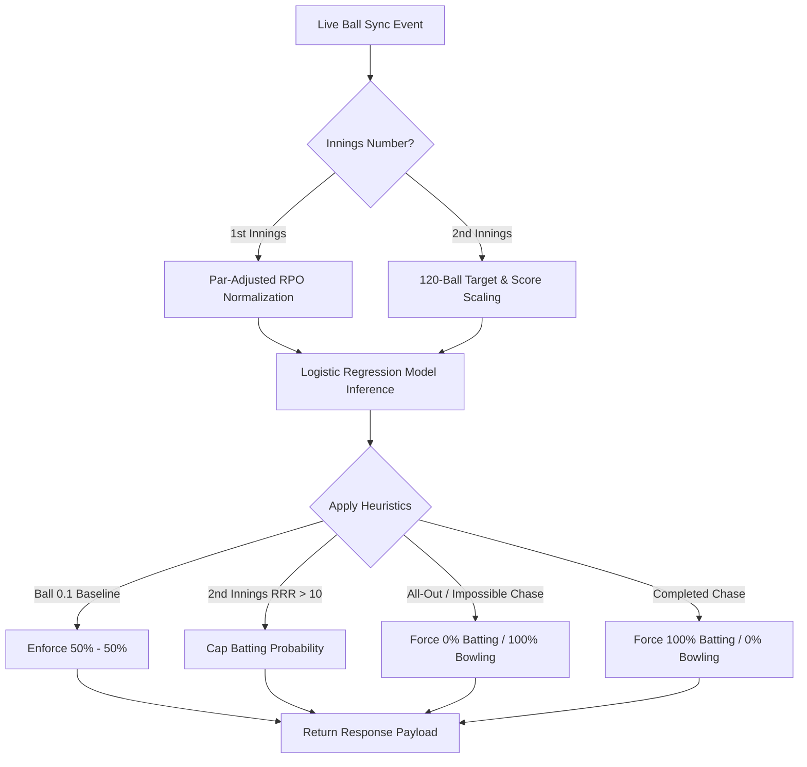

# 📊 CricScore Live Win Prediction Engine Specification

This document details the exact mathematical models, scaling algorithms, heuristic overrides, and wicket sensitivity calculations powering the real-time AI Match Predictor in CricScore (`apps/ml-engine/predict.py`).

---

## 🏗️ 1. Architecture & Inference Pipeline

The live prediction engine calculates real-time win probabilities after every ball using a combination of **Logistic Regression** and **Shortened-Match Feature Normalization**.

---

## 🧮 2. 1st Innings Feature Normalization (Par-Adjusted RPO Scaling)

In shortened matches (e.g. 1, 5, 10, or 15 overs), raw inputs like `balls_left = 5` at ball 0.1 would trick a T20 model into treating the match as an exhausted 20th over.

To fix this, CricScore calculates a dynamic **Expected Par Run Rate (RPO)** based on match length:

$$\text{par\_rpo} = 8.0 + (20 - \text{total\_overs}) \times 0.2$$

$$\text{match\_par} = \max(1.0, \text{par\_rpo} \times \text{total\_overs})$$

### Scaled Model Inputs:

$$\text{model\_current\_score} = \left( \frac{\text{current\_score}}{\text{match\_par}} \right) \times 160.0$$

$$\text{model\_balls\_left} = \left( \frac{\text{balls\_left}}{\text{total\_match\_balls}} \right) \times 120.0$$

- **Example (1-Over Match, 9 runs in 5 balls)**:
  - $\text{total\_overs} = 1.0 \implies \text{par\_rpo} = 11.8 \implies \text{match\_par} = 11.8$
  - $\text{model\_current\_score} = (9 / 11.8) \times 160 = 122.0$ (standard T20 equivalent)
  - Result: Win probability is calibrated smoothly at **87%**, avoiding false 99% spikes.

---

## 🎯 3. 2nd Innings Feature Normalization

During the 2nd innings chase, both the `current_score` and `target_score` are normalized to 120-ball T20 baseline equivalents using the scale factor:

$$\text{scale\_factor} = \frac{120.0}{\text{total\_match\_balls}}$$

$$\text{model\_current\_score} = \text{current\_score} \times \text{scale\_factor}$$

$$\text{model\_target\_score} = \text{target\_score} \times \text{scale\_factor}$$

$$\text{model\_balls\_left} = \text{balls\_left} \times \text{scale\_factor}$$

- **Example (1-Over Match, Target 7, Score 2/0 in 3 balls)**:
  - $\text{scale\_factor} = 20.0$
  - $\text{model\_current\_score} = 40.0$, $\text{model\_target\_score} = 140.0$, $\text{model\_balls\_left} = 60.0$
  - Result: Evaluated as needing 100 runs in 60 balls ($RRR = 10.0$), giving a realistic **62% Win Probability**.

---

## 🛑 4. Hard Heuristic Overrides

To guarantee mathematical sanity, the prediction engine applies strict rule-based overrides:

| Scenario               | Rule Condition                                                            | Resulting Win Probability       |
| :--------------------- | :------------------------------------------------------------------------ | :------------------------------ |
| **Match Start**        | `inning == 1` AND `score == 0` AND `wickets == 0` AND `balls_bowled == 0` | **50% Batting / 50% Bowling**   |
| **Completed Chase**    | `inning == 2` AND `current_score >= target_score`                         | **100% Batting / 0% Bowling**   |
| **All Out**            | `wickets_lost >= 10`                                                      | **0% Batting / 100% Bowling**   |
| **Impossible Target**  | `inning == 2` AND `(target_score - current_score) > balls_left * 6`       | **0% Batting / 100% Bowling**   |
| **Extreme RRR (> 18)** | `inning == 2` AND `RRR > 18.0`                                            | **Batting Win % Capped at 1%**  |
| **High RRR (> 15)**    | `inning == 2` AND `RRR > 15.0`                                            | **Batting Win % Capped at 5%**  |
| **Steep RRR (> 12)**   | `inning == 2` AND `RRR > 12.0`                                            | **Batting Win % Capped at 15%** |

---

## 🏏 5. Wicket Sensitivity Analysis

Wickets lost (`wickets_lost`) are a major non-linear feature in the Logistic Regression model. Each wicket reduces remaining batting depth and increases pressure on lower-order batters.

### Probability Shifts by Wicket Loss (2nd Innings Chases):

1. **Standard T20 Chase (Target 160, Score 80 in 10.0 overs — 60 balls left, 80 needed)**:
   - **0 Wickets Lost (80/0)**: **78% Win Probability**
   - **1 Wicket Lost (80/1)**: **70% Win Probability**
   - **2 Wickets Lost (80/2)**: **60% Win Probability**
   - **3 Wickets Lost (80/3)**: **50% Win Probability**
   - **5 Wickets Lost (80/5)**: **30% Win Probability**
   - **8 Wickets Lost (80/8)**: **11% Win Probability**
   - **10 Wickets Lost (All Out)**: **0% Win Probability** (Loss)

2. **1-Over Shortened Chase (Target 10, Score 5 in 0.3 overs — 3 balls left, 5 needed)**:
   - **0 Wickets Lost (5/0)**: **59% Win Probability**
   - **1 Wicket Lost (5/1)**: **49% Win Probability**
   - **2 Wickets Lost (5/2)**: **39% Win Probability**
   - **10 Wickets Lost (All Out)**: **0% Win Probability** (Loss)
