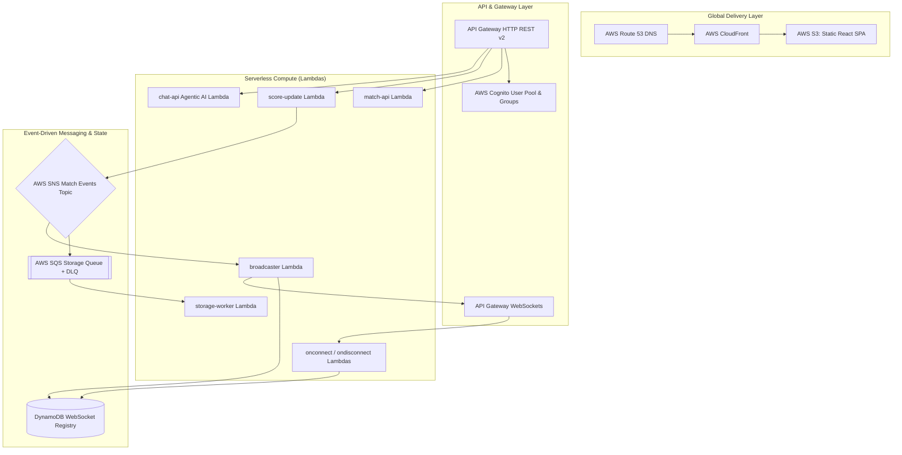

# 🏗️ CricScore Terraform Infrastructure Guide & Tutorial

This document is a comprehensive step-by-step tutorial and reference guide for managing CricScore's Infrastructure as Code (IaC) using **Terraform**.

CricScore's cloud infrastructure is **100% codified** in Terraform. No manual configuration ("click-ops") is performed in the AWS Console.

---

## 🎯 Infrastructure Overview

CricScore uses Terraform to provision and manage:



---

## 📁 Terraform File Directory Layout

| File                          | Responsibilities & Resources Defined                                                                                                             |
| :---------------------------- | :----------------------------------------------------------------------------------------------------------------------------------------------- |
| **`providers.tf`**            | Configures the S3 Remote Backend, DynamoDB state lock table, and dual AWS provider aliases (`us-east-1` for CloudFront ACM SSL certificates).    |
| **`variables.tf`**            | Declares input parameters (`environment`, `domain_name`, `database_url`, `llm_api_key`, etc.).                                                   |
| **`outputs.tf`**              | Exports runtime endpoints (API Gateway URLs, Cognito Pool IDs, S3 bucket names) for consumption by deploy scripts and frontend builds.           |
| **`lambda.tf`**               | Defines all 7 serverless AWS Lambda functions, memory limits, timeouts, log groups, and runtime environment variables.                           |
| **`apigateway_http.tf`**      | Configures API Gateway v2 HTTP REST routes (`/matches`, `/chat`, `/rules/upload`) and Cognito JWT Authorizers.                                   |
| **`apigateway_websocket.tf`** | Configures WebSocket API Gateway (`$connect`, `$disconnect`, `$default`), routes, and WebSocket deployment stages.                               |
| **`messaging.tf`**            | Configures SNS Topic (`cricscore-{env}-match-events`), SQS Queue (`cricscore-{env}-storage-buffer`), Dead Letter Queue (DLQ), and subscriptions. |
| **`cognito.tf`**              | Provisions AWS Cognito User Pool, App Clients, User Groups (`Admin`, `Guest`), and domain prefixes.                                              |
| **`frontend.tf`**             | Provisions S3 Bucket for React static hosting, CloudFront CDN distribution, ACM SSL Certificates, and Route 53 A records.                        |
| **`iam.tf`**                  | Defines fine-grained IAM Execution Roles and Least-Privilege Policies for each individual Lambda function.                                       |
| **`dashboard.tf`**            | Provisions AWS CloudWatch operational dashboards and metrics monitors.                                                                           |
| **`kms_and_logging.tf`**      | Configures CloudWatch log retention and KMS encryption policies.                                                                                 |
| **`xray.tf`**                 | Enables AWS X-Ray distributed tracing across API Gateway and Lambda functions.                                                                   |
| **`environments/`**           | Contains environment-specific variable configurations (`dev.tfvars` and `prod.tfvars`).                                                          |

---

## 🛠️ Step-by-Step Hands-On Tutorial

### Prerequisites

Before running Terraform commands, ensure you have:

1. **Terraform CLI** installed (`>= 1.9.0`): `terraform -version`
2. **AWS CLI v2** configured with IAM deployment credentials: `aws sts get-caller-identity`
3. **Aiven PostgreSQL** connection string ready for `database_url`.

---

### Step 1: Initialize Terraform with Remote Backend

CricScore stores state in an S3 bucket with DynamoDB locking. Initialize your workspace by targeting the environment state key:

```bash
cd infra/terraform

# Initialize for DEV environment
terraform init -backend-config="key=cricscore/dev/terraform.tfstate"
```

_(For PROD, use `key=cricscore/prod/terraform.tfstate`)_.

---

### Step 2: Validate Syntax & Code Formatting

Ensure HCL code syntax and formatting conform to Terraform standards:

```bash
# Check formatting recursively
terraform fmt -check -recursive

# Validate code syntax and internal module wiring
terraform validate
```

---

### Step 3: Run Static Security Analysis (Checkov & Trivy)

Scan the Terraform files for security misconfigurations before planning:

```bash
# Run Checkov IaC security scanner
checkov -d . --config-file .checkov.yaml
```

---

### Step 4: Generate an Execution Plan (`terraform plan`)

Preview the infrastructure changes Terraform will make against AWS without modifying resources:

```bash
# Plan for DEV environment using dev.tfvars
terraform plan -var-file="environments/dev.tfvars" -out=tfplan
```

Review the output:

- `+ create` — New resources to be created.
- `~ update` — Existing resources to be modified in-place.
- `- destroy` — Resources to be deleted.

---

### Step 5: Apply Infrastructure Changes (`terraform apply`)

Apply the saved execution plan to provision resources in AWS:

```bash
terraform apply tfplan
```

---

### Step 6: Inspect Deployed Outputs

View the exported Terraform outputs (API Gateway IDs, Cognito Client IDs, CloudFront Distro IDs):

```bash
terraform output
```

Output example:

```hcl
api_gateway_id       = "a1b2c3d4e5"
ws_api_gateway_id    = "w9x8y7z6v5"
cognito_user_pool_id = "us-east-1_AbCdEfGh"
cloudfront_domain    = "d123456789.cloudfront.net"
```

---

## 🔒 State Management & Locking

### How State Locking Works

To prevent simultaneous deployments from corrupting the Terraform state file, Terraform automatically acquires an exclusive lock in the DynamoDB table (`terraform-state-locking`) during every `apply` or `plan`.

### How to Force Unlock (Emergency Cleanup)

If a CI/CD job crashes or network drops mid-deployment, the lock may remain active. You can safely unlock the environment via the GitHub Actions dashboard:

1. Navigate to the GitHub repository **Actions** tab.
2. Select the **Terraform Force Unlock** workflow on the left.
3. Click **Run workflow**, select the stuck environment (`dev` or `prod`), and paste the **Lock ID** from the error logs.
4. Click **Run workflow** to execute the unlock.

_(Alternatively, if running locally, you can use `terraform force-unlock <lock-id>` inside the `infra/terraform` directory)._

---

## 🔄 Environment Isolation (`dev` vs `prod`)

CricScore maintains strict environment isolation using **Terraform Workspaces & Variable Files**:

| Environment | State Key                          | Variable File              | Domain Name                             |
| :---------- | :--------------------------------- | :------------------------- | :-------------------------------------- |
| **Dev**     | `cricscore/dev/terraform.tfstate`  | `environments/dev.tfvars`  | `cricscoredev.venkateshsingamsetty.com` |
| **Prod**    | `cricscore/prod/terraform.tfstate` | `environments/prod.tfvars` | `cricscore.venkateshsingamsetty.com`    |

Both environments share the exact same `.tf` files in `infra/terraform/`, ensuring 100% environment parity.

---

## ⚡ Helper Script: Automated Deployment

Instead of manually running individual Terraform steps, use the canonical deployment script:

```bash
# Automated build, terraform apply, DB migration, and CloudFront invalidate for DEV
./infra/scripts/deploy.sh --env dev

# For PROD
./infra/scripts/deploy.sh --env prod
```

---

## 📖 Useful Terraform Operational Commands

```bash
# Force replace a single resource (e.g., recreate match-api Lambda)
terraform apply -var-file="environments/dev.tfvars" -replace="aws_lambda_function.match_api"

# Refresh local state without making changes
terraform refresh -var-file="environments/dev.tfvars"

# Target plan for a specific resource
terraform plan -var-file="environments/dev.tfvars" -target="aws_cognito_user_pool.main"
```

---

© 2026 CricScore Infrastructure & DevOps. 🏎️🏁🚀
