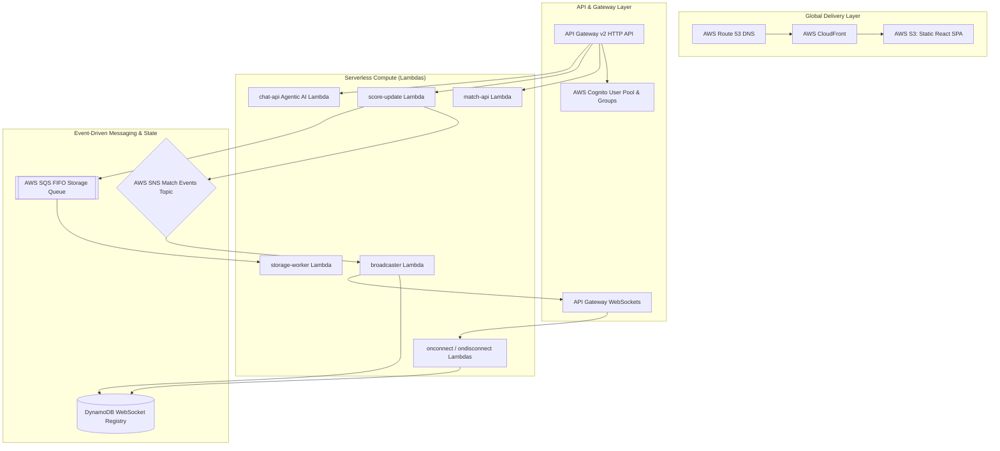

# 🏗️ CricScore Terraform Infrastructure Guide & Tutorial

This document is a comprehensive step-by-step tutorial and reference guide for managing CricScore's Infrastructure as Code (IaC) using **Terraform**.

CricScore's AWS application infrastructure is managed with Terraform. Account setup and external services still require configuration outside Terraform; see the deployment guide.

---

## 🎯 Infrastructure Overview

CricScore uses Terraform to provision and manage:


```mermaid
graph TD
    subgraph CDN ["Global Delivery Layer"]
        CF[AWS CloudFront] --> S3[AWS S3: Static React SPA]
        R53[AWS Route 53 DNS] --> CF
    end

    subgraph API ["API & Gateway Layer"]
        HTTP_GW[API Gateway v2 HTTP API]
        WS_GW[API Gateway WebSockets]
        COG[AWS Cognito User Pool & Groups]
        HTTP_GW --> COG
    end

    subgraph COMPUTE ["Serverless Compute (Lambdas)"]
        L_MATCH[match-api Lambda]
        L_SCORE[score-update Lambda]
        L_WORKER[storage-worker Lambda]
        L_BROAD[broadcaster Lambda]
        L_SESS[onconnect / ondisconnect Lambdas]
        L_CHAT[chat-api Agentic AI Lambda]
    end

    subgraph MSG ["Event-Driven Messaging & State"]
        SNS{AWS SNS Match Events Topic}
        SQS[[AWS SQS FIFO Storage Queue]]
        DDB[(DynamoDB WebSocket Registry)]
    end

    HTTP_GW --> L_MATCH
    HTTP_GW --> L_SCORE
    HTTP_GW --> L_CHAT
    WS_GW --> L_SESS
    L_SESS --> DDB
    L_SCORE --> SNS
    L_SCORE --> SQS
    SQS --> L_WORKER
    SNS --> L_BROAD
    L_BROAD --> DDB
    L_BROAD --> WS_GW
```

---

## 📁 Terraform File Directory Layout

| File                          | Responsibilities & Resources Defined                                                                                                                                                              |
| :---------------------------- | :------------------------------------------------------------------------------------------------------------------------------------------------------------------------------------------------ |
| **`providers.tf`**            | Configures the S3 remote backend with native S3 state locking and dual AWS provider aliases (`us-east-1` for CloudFront ACM SSL certificates).                                                    |
| **`variables.tf`**            | Declares input parameters (`environment`, `domain_name`, `database_url`, `llm_api_key`, etc.).                                                                                                    |
| **`outputs.tf`**              | Exports runtime endpoints (API Gateway URLs, Cognito Pool IDs, S3 bucket names) for consumption by deploy scripts and frontend builds.                                                            |
| **`lambda.tf`**               | Defines the ZIP-based application Lambda functions and the container-image prediction Lambda, including memory, timeouts, tracing, and environment variables.                                     |
| **`apigateway_http.tf`**      | Configures API Gateway v2 HTTP API routes (`/matches`, `/chat`, `/rules/upload`) and Cognito JWT Authorizers.                                                                                     |
| **`apigateway_websocket.tf`** | Configures WebSocket API Gateway (`$connect`, `$disconnect`, `$default`), routes, and WebSocket deployment stages.                                                                                |
| **`messaging.tf`**            | Configures the SNS match-events topic, FIFO SQS storage queue, and SNS subscription. The score-update Lambda also sends persistence messages directly to SQS; no dead-letter queue is configured. |
| **`cognito.tf`**              | Provisions an AWS Cognito User Pool, app client, `Admin` user group, and user-pool domain.                                                                                                        |
| **`frontend.tf`**             | Provisions S3 Bucket for React static hosting, CloudFront CDN distribution, ACM SSL Certificates, and Route 53 A records.                                                                         |
| **`iam.tf`**                  | Defines a shared Lambda execution role and attached policies for the application's AWS service integrations.                                                                                      |
| **`cost_budget.tf`**          | Configures the monthly AWS cost budget and actual-cost email notification.                                                                                                                        |
| **`kms_and_logging.tf`**      | Configures the S3 access-logging bucket and its public-access block.                                                                                                                              |
| **`xray.tf`**                 | Configures an AWS X-Ray sampling rule. Lambda tracing is configured in the Lambda resources.                                                                                                      |
| **`environments/`**           | Contains environment-specific variable configurations (`dev.tfvars` and `prod.tfvars`).                                                                                                           |

---

## 🛠️ Step-by-Step Hands-On Tutorial

### Prerequisites

Before running Terraform commands, ensure you have:

1. **Terraform CLI** installed: the configuration requires `>= 1.10.0`; the repository's CI and deployment workflows use Terraform `1.10.x`.
2. **AWS CLI v2** configured with IAM deployment credentials: `aws sts get-caller-identity`
3. **Aiven PostgreSQL** connection string ready for `database_url`.

---

### Step 1: Initialize Terraform with Remote Backend

CricScore stores state in S3 and uses the S3 backend's native lock file (`use_lockfile = true`). Initialize Terraform with the desired environment state key:

```bash
cd infra/terraform

# Initialize for DEV environment
terraform init -backend-config="key=cricscore/dev/terraform.tfstate"
```

_(For PROD, use `key=cricscore/prod/terraform.tfstate`)_.

---

### Step 2: Validate Syntax & Code Formatting

Ensure HCL code syntax and formatting conform to Terraform standards:

```bash
# Check formatting recursively
terraform fmt -check -recursive

# Validate code syntax and internal module wiring
terraform validate
```

---

### Step 3: Run Static Security Analysis (Checkov & Trivy)

Scan the Terraform files for security misconfigurations before planning:

```bash
# Run Checkov IaC security scanner
checkov -d . --config-file .checkov.yaml
```

---

### Step 4: Generate an Execution Plan (`terraform plan`)

Preview the infrastructure changes Terraform will make against AWS without modifying resources:

```bash
# Plan for DEV environment using dev.tfvars
terraform plan -var-file="environments/dev.tfvars" -out=tfplan
```

Review the output:

- `+ create` — New resources to be created.
- `~ update` — Existing resources to be modified in-place.
- `- destroy` — Resources to be deleted.

---

### Step 5: Apply Infrastructure Changes (`terraform apply`)

Apply the saved execution plan to provision resources in AWS:

```bash
terraform apply tfplan
```

---

### Step 6: Inspect Deployed Outputs

View the exported Terraform outputs (API Gateway IDs, Cognito Client IDs, CloudFront Distro IDs):

```bash
terraform output
```

Output example:

```hcl
api_gateway_id       = "a1b2c3d4e5"
ws_api_gateway_id    = "w9x8y7z6v5"
cognito_user_pool_id = "us-east-1_AbCdEfGh"
cloudfront_domain    = "d123456789.cloudfront.net"
```

---

## 🔒 State Management & Locking

### How State Locking Works

To prevent simultaneous deployments from corrupting the Terraform state file, Terraform creates a `.tflock` object beside the state file in S3 during operations such as `plan` and `apply`. The AWS identity running Terraform needs permission to get, put, and delete that lock object.

### How to Force Unlock (Emergency Cleanup)

If a CI/CD job crashes or the network drops mid-deployment, the lock may remain active. You can unlock the environment with Terraform's force-unlock workflow:

1. Navigate to the GitHub repository **Actions** tab.
2. Select the **Terraform Force Unlock** workflow on the left.
3. Click **Run workflow**, select the stuck environment (`dev` or `prod`), and paste the **Lock ID** from the error logs.
4. Click **Run workflow** to execute the unlock. The workflow uses the matching environment state key and removes the stale S3 lock file.

_(Alternatively, from `infra/terraform`, run `terraform init -backend-config="key=cricscore/dev/terraform.tfstate"` (or use the `prod` key), then `terraform force-unlock <lock-id>`. Verify the lock is stale first; force-unlocking an active operation can cause state conflicts. Do not manually delete the `.tflock` object.)_

---

## 🔄 Environment Isolation (`dev` vs `prod`)

CricScore separates the `dev` and `prod` configurations with **distinct S3 state keys and variable files** (not Terraform workspaces):

Both environments store their state in the same S3 bucket configured in `infra/terraform/providers.tf` (`venky-2026-terraform-state`). Their different state keys also give them separate lock objects; for example, dev uses `cricscore/dev/terraform.tfstate.tflock` and prod uses `cricscore/prod/terraform.tfstate.tflock`.

| Environment | State Key                          | Lock Object                               | Variable File              | Domain Name                             |
| :---------- | :--------------------------------- | :---------------------------------------- | :------------------------- | :-------------------------------------- |
| **Dev**     | `cricscore/dev/terraform.tfstate`  | `cricscore/dev/terraform.tfstate.tflock`  | `environments/dev.tfvars`  | `cricscoredev.venkateshsingamsetty.com` |
| **Prod**    | `cricscore/prod/terraform.tfstate` | `cricscore/prod/terraform.tfstate.tflock` | `environments/prod.tfvars` | `cricscore.venkateshsingamsetty.com`    |

Both environments use the same Terraform configuration files, with separate state, lock objects, and environment-specific values. Terraform only locks the state key being operated on, so dev and prod do not contend for one shared lock; concurrent runs targeting the same environment do contend for that environment's lock.

---

## ⚡ Helper Script: Automated Deployment

Instead of manually running individual Terraform steps, use the canonical deployment script:

```bash
# Installs dependencies, applies Terraform, builds and uploads the frontend, then invalidates CloudFront
./infra/scripts/deploy.sh --env dev

# For PROD
./infra/scripts/deploy.sh --env prod
```

The local script does not run database migrations. Run the migration script separately with the correct environment and database URL; the CI deployment workflows run migrations as part of their deployment jobs.

---

## 📖 Useful Terraform Operational Commands

```bash
# Force replace a single resource (e.g., recreate match-api Lambda)
terraform apply -var-file="environments/dev.tfvars" -replace="module.match_api.aws_lambda_function.this"

# Preview changes detected by refreshing state from AWS
terraform plan -refresh-only -var-file="environments/dev.tfvars"

# Targeted plans are for exceptional recovery/debugging, not routine deployments
terraform plan -var-file="environments/dev.tfvars" -target="aws_cognito_user_pool.pool"
```

---

© 2026 CricScore Infrastructure & DevOps. 🏎️🏁🚀
