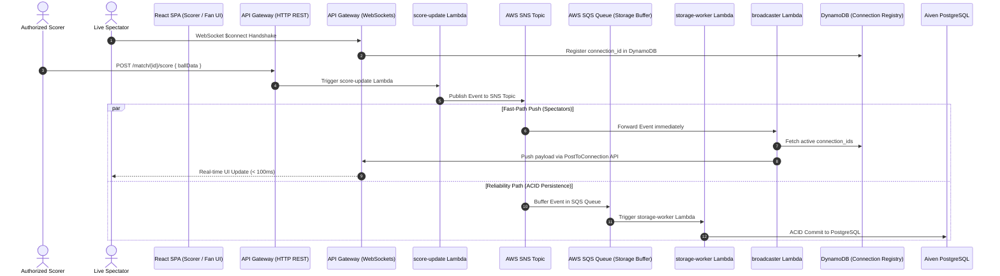

# ⚡ Real-Time WebSockets & Event Fan-Out Tutorial (SNS + SQS)

This tutorial provides a hands-on architectural walkthrough of CricScore's **Real-Time Event-Driven Engine**.

CricScore streams ball-by-ball score updates to thousands of concurrent spectators with sub-second latency using an **AWS SNS Fan-Out Architecture** combined with **API Gateway WebSockets** and **DynamoDB Connection Tracking**.

---

## 🎯 Architecture & Data Flow



---

## 🚀 Key Components

### 1. Dual-Path Architecture (Fast-Path vs Reliability Path)

To guarantee sub-second delivery while ensuring zero data loss during high load:

- **Fast-Path (Spectator Delivery)**: `score-update` -> `SNS` -> `broadcaster` -> `WebSocket API Gateway` -> `Spectators`. Updates spectators in **< 100ms** by bypassing database writes entirely during the push.
- **Reliability Path (Persistence Buffer)**: `score-update` -> `SNS` -> `SQS Queue` -> `storage-worker` -> `Aiven PostgreSQL`. SQS buffers incoming events during traffic spikes. If the database experiences transient slowness, SQS safely retains events for up to 14 days with Dead Letter Queue (DLQ) retry logic.

---

### 2. WebSocket Connection Lifecycle (DynamoDB Tracking)

Live spectator connection IDs are managed by serverless session Lambdas (`onconnect/` and `ondisconnect/`):

#### On Connection (`$connect`):

1. Spectator opens WebSocket connection: `wss://<ws-id>.execute-api.us-east-1.amazonaws.com/prod`.
2. API Gateway invokes `onconnect` Lambda.
3. `onconnect` writes the connection ID to DynamoDB:
   ```json
   {
     "connection_id": "conn-12345",
     "connected_at": 1774343400000,
     "ttl": 1774429800
   }
   ```

#### On Disconnection (`$disconnect`):

1. Spectator closes browser tab or loses connection.
2. API Gateway invokes `ondisconnect` Lambda.
3. `ondisconnect` deletes `connection_id` from DynamoDB.

#### Stale Connection Pruning (`GoneException`):

If a connection drops ungracefully (e.g. abrupt network disconnect):

- When `broadcaster` Lambda attempts `ApiGatewayManagementApi.postToConnection()`, API Gateway returns a `410 GoneException`.
- `broadcaster` catches `GoneException` and immediately deletes the dead `connection_id` from DynamoDB to keep the connection pool clean.

---

## 💻 Code Walkthrough

### 1. Publishing an Event (`score-update/index.js`)

```javascript
import { SNSClient, PublishCommand } from "@aws-sdk/client-sns";

const snsClient = new SNSClient({ region: process.env.AWS_REGION });

export const handler = async (event) => {
  const ballData = JSON.parse(event.body);

  // Publish ball event to SNS Fan-Out Topic
  await snsClient.send(
    new PublishCommand({
      TopicArn: process.env.MATCH_EVENTS_TOPIC,
      Message: JSON.stringify({
        type: "LIVE_SCORE_UPDATE",
        matchId: ballData.matchId,
        data: ballData,
      }),
    }),
  );

  return { statusCode: 200, body: JSON.stringify({ success: true }) };
};
```

---

### 2. Broadcasting to WebSockets (`broadcaster/index.js`)

```javascript
import {
  ApiGatewayManagementApiClient,
  PostToConnectionCommand,
} from "@aws-sdk/client-apigatewaymanagementapi";
import {
  DynamoDBClient,
  ScanCommand,
  DeleteItemCommand,
} from "@aws-sdk/client-dynamodb";

export const handler = async (event) => {
  // Extract SNS payload
  const snsMessage = event.Records[0].Sns.Message;

  // Fetch active WebSocket connection IDs from DynamoDB
  const connections = await ddbClient.send(
    new ScanCommand({ TableName: process.env.CONNECTIONS_TABLE }),
  );

  // Push to all active spectators in parallel
  await Promise.all(
    connections.Items.map(async (item) => {
      const connectionId = item.connection_id.S;
      try {
        await wsApiClient.send(
          new PostToConnectionCommand({
            ConnectionId: connectionId,
            Data: Buffer.from(snsMessage),
          }),
        );
      } catch (err) {
        if (err.name === "GoneException") {
          // Remove stale connection from DynamoDB
          await ddbClient.send(
            new DeleteItemCommand({
              TableName: process.env.CONNECTIONS_TABLE,
              Key: { connection_id: { S: connectionId } },
            }),
          );
        }
      }
    }),
  );
};
```

---

## 🧪 Testing WebSockets Locally & Interactively

### 1. Connecting via CLI (`wscat`)

You can test real-time WebSocket pushes from your terminal using `wscat`:

```bash
# Install wscat
npm install -g wscat

# Connect to the live production WebSocket endpoint
wscat -c wss://<ws-api-id>.execute-api.us-east-1.amazonaws.com/prod
```

Once connected:

- Trigger a ball event via the Scorer UI or POST endpoint.
- You will see the live JSON score payload streamed directly into your `wscat` terminal in real time!

---

## 🛡️ Reliability & Scale Characteristics

- **Zero-Downtime Fan-Out**: Adding more spectators scales automatically via API Gateway WebSockets and Lambda concurrency.
- **Dead Letter Queue (DLQ)**: Failed database persistence jobs are sent to `cricscore-{env}-storage-dlq` for inspection and replay without losing ball events.
- **DynamoDB Time-To-Live (TTL)**: Stale connection IDs automatically expire after 24 hours if not pruned manually.

---

© 2026 CricScore Real-Time Engineering. 🏎️🏁🚀
